# Evolving Cooperative Search in Changing Environments

**Can native ShinkaEvolve improve a published multi-swarm optimizer under matched conditions and evaluation budgets?**

[Corrected 200-peak campaign](docs/studies/book_mpso_population_200_v2/REPORT.md) · [200-peak runtime stop](docs/studies/book_mpso_population_200_v1/REPORT.md) · [Population study](docs/studies/book_mpso_population_v1/REPORT.md) · [Chapter schedule comparison](docs/studies/book_mpso_schedule_v1/REPORT.md) · [Source fidelity](docs/book_mpso_source_record.md) · [Programs and data](artifacts/README.md) · [Native ShinkaEvolve](docs/shinkaevolve.md)

## Abstract

We ask whether native ShinkaEvolve can improve Blackwell, Branke and Li's multi-swarm optimizer
under matched dynamic landscapes and counted objective budgets. A chapter-aligned reconstruction
implements MPSO **5+0 and 5+1**. The preceding search found no better temporary-conversion schedule;
we retain that response and investigate the chapter's proposed future direction of changing particle
numbers within subswarms. One native search evaluated **six valid population-rule descendants** on
eight reused five-dimensional, ten-peak histories of **500,000 queries** each. **None improved the
reconstructed 5+1 seed's mean development error, 1.744569.** Fixed targets three and seven scored
1.806340 and 1.871657. The closest descendant was the simple constant target six, at **1.776112**:
paired difference **+0.031543 [−0.185736,+0.250921]**, descriptive 95%, with three wins/five losses.
Conditional shrinking and growth changed actual population and query allocation but did not improve
the mean. We retain five in that ten-peak study; its fresh-comparison trigger was not met. These results establish neither
optimality nor equivalence, and reused development data do not establish generalization. Earlier
relocation and retention studies remain cumulative evidence, including V3's null result.
A subsequent **200-peak, severity-one continuation stopped at runtime assessment before native
search**: its first planned reference case completed 500,000 queries, but even the smallest
reserved search/fresh-comparison design did not fit the 120-minute ceiling. That partial
reference stage supplies no evolutionary performance finding.

A versioned continuation corrects neutral-only enclosing-ball convergence and
adds durable native meta-memory resume. Its **200-peak campaign is still open**:
Session 1's leading conditional rule obtains **1.928740** mean error on four
development histories, versus **2.191283** for corrected 5+1 and **2.091593** for
constant target three. These interim results are separate from the completed
ten-peak studies. No fresh comparison or final campaign selection has occurred.

## 1. Introduction

**Cooperation and collective search in changing environments** motivate this project. A useful
optimizer must exploit discoveries without sending every searcher to the same place, and recover
when yesterday's useful information becomes stale. Blackwell, Branke and Li's multi-swarm particle
optimizer supplies a concrete, human-designed solution: particles share discoveries within small
subswarms, while exclusion and the creation and removal of swarms distribute search effort between
promising regions. A short burst of exploratory sampling follows detected environmental change.

Our central empirical question is **whether native ShinkaEvolve can improve the chapter’s
multi-swarm optimizer under matched dynamic-optimization conditions and objective budgets**. We investigate improvements to an existing cooperative
optimizer; this study does not separately establish cooperation's causal advantage over independent
search. Communication topology and the landscape remain fixed. After a negative search over temporary
conversion schedules, the present study changes only how many ordinary particles each subswarm maintains.

Three distinctions organize the evidence. A faithful reconstruction must first implement and count
the intended operations. A useful evolved program must then improve optimizer performance under
matched budgets. An explanation must finally describe its executed behavior without confusing a
conditional expression, source correction or functioning pipeline with scientific discovery.
Development fitness and fresh-case evidence remain separate.


*Figure 1. A separate **two-dimensional illustration** from saved positions and landscape snapshots.
Colored subswarms redistribute their search. This simplified configuration is neither a measured
five-dimensional result nor information available to an evolved program. Every comparison in the
new chapter-aligned study uses five dimensions.*

## 2. Related Work

[*Particle Swarms for Dynamic Optimization Problems*](https://doi.org/10.1007/978-3-540-74089-6_6)
(Blackwell, Branke and Li, 2008) develops multi-swarm PSO (MPSO) and speciation-based PSO (SPSO) for
tracking moving optima. Ordinary particles use remembered personal and shared best positions to
converge. The chapter's “quantum” particles instead sample spatially around the swarm best; the
term denotes a probability distribution, not quantum hardware. MPSO combines cooperation within
subswarms with diversity between them. We first studied its temporary particle-conversion schedule and now investigate population
allocation within subswarms, without comparing all of the chapter’s algorithm families.

The chapter proposes converting all neutral particles to quantum sampling for one iteration
following detected change. This may reduce the permanent exploratory population while retaining
fast local convergence. Its configurations **5+0** and **5+1** both have five neutral-role particles;
5+1 adds a sixth particle that samples every iteration. These permanent roles matter: a neutral
particle remains structurally neutral when its movement temporarily changes.

| Historical Table 3 reference, `nexcess=1` | Published offline error | Published standard error | Original protocol |
|---|---:|---:|---|
| MPSO 5+0 | 1.80 | 0.08 | 50 runs × 500,000 evaluations |
| MPSO 5+1 | 1.73 | 0.08 | 50 runs × 500,000 evaluations |

*These are printed historical values, not measurements from this repository or scores to which the
implementation was fitted. The chapter also studies other excess-swarm settings, particle counts
and SPSO. We do not label 5+1 / `nexcess=1` its best overall setting.*

Our cumulative studies used pinned DEAP source to examine memory response, relocation count and
radius, velocity retention, and trajectory continuation. They provide implementation and empirical
lessons, including a substantial V3 null result. The preceding chapter comparison added the previously missing
permanent quantum particle and found no better conversion schedule. The present study retains
that published schedule and investigates the authors’ stated future direction on printed p.215:
adapting particle numbers within an MPSO subswarm. This does not conserve an overall particle
budget or transfer particles between groups. The objective-query budget remains matched. Earlier
findings remain reported below under their original conditions.

## 3. Method

### 3.1 A separate, chapter-aligned reference path

The new [`book_mpso.py`](src/adaptive_swarms/book_mpso.py) path reconstructs the chapter's MPSO
schedule and Algorithm 3 ordering. It shares the pinned Moving Peaks landscape, numerical utilities,
counted-query measurement and checkpoint infrastructure with the historical studies. The earlier
simulator and completed research remain intact; the new comparisons do not substitute their
results for historical baselines.

| Mechanism | Reconstructed MPSO 5+0 | Reconstructed MPSO 5+1 / preceding schedule study |
|---|---|---|
| Designated neutral particles | Five | Five |
| Permanent quantum particles | None | One additional particle |
| Published temporary conversion | All five for the detected-change update | All five for the detected-change update |
| Published behavior between detected changes | Ordinary neutral PSO | Ordinary neutral PSO plus permanent quantum sampling |
| Evolvable decision | External fixed reference | Temporary quantum count, 0 through 5, each subswarm update |

A quantum update samples uniformly by volume inside a ball centered at the current shared best,
with radius `rcloud = 0.5 × movement severity`. In five dimensions its sampled radial distance is
`rcloud × U**(1/5)`, with a direction from a normalized isotropic Gaussian. It **replaces ordinary
PSO movement for that update**. Neutral velocities survive for later ordinary updates; a sampled
particle does not immediately take an additional PSO step. Permanent quantum discoveries can
improve both personal and shared memories.

Counted reevaluation of each swarm's shared best detects changes; the optimizer receives no oracle
change signal. After detection, it reevaluates every particle's personal-best memory, including
that of the permanent quantum particle. All memories survive. Each particle's evaluation can
update the attractor before the next particle moves. The benchmark supplies the environmental
scale through the known default radius; adaptation to unknown severity is a different experiment.

Algorithm 3 applies exclusion **after each subswarm update**. The new path follows that ordering;
the historical simulator applied it after all swarms. Neutral roles are processed first in their
fixed order, followed by the permanent quantum role. A new or excluded swarm receives counted
initialization before it becomes an evaluated attractor. Convergence uses only the five designated
neutral positions, excluding the permanent quantum particle.

The source defines convergence using a smallest enclosing ball. The historical schedule and
population studies retained the documented DEAP approximation based on maximum pairwise neutral distance, with a swarm free above `2 × rexcl` and
`rexcl = domain_width / (2 × swarm_count**(1/dimension))`. This is **not an exact enclosing-ball
calculation**. Other conventions include DEAP initialization, asynchronous attractor updates,
unclipped particle positions and stopping at the exact query budget even within an operation.
The [source-to-implementation record](docs/book_mpso_source_record.md)
separates chapter mechanisms from reconstruction conventions. No convention was tuned to recover
the historical ranking or printed means.

The pinned upstream `convertQuantum` accidentally overwrote its distribution argument, making
its intended branches unreachable. That historical correction belongs to the baseline. Adding
the 5+1 reference and correcting update ordering are likewise implementation work, not discoveries
made by evolution.

The versioned [200-peak campaign continuation](docs/book_mpso_population_200_v2_protocol.md)
repairs convergence with an accurate neutral-only enclosing-ball predicate. A triangle with side
1.9 times the radius passes the old diameter rule but needs a larger enclosing ball. The new
engine uses valid quick certificates and solves ambiguous configurations, with relative boundary
tolerance 1e-12 and no objective/RNG calls. Its corrected controls are measured anew on the same
four development histories; the old one-case score cannot be reused. This is a source-fidelity
repair, never an evolutionary improvement. The [versioned source record](docs/book_mpso_population_200_v2_source_record.md)
leaves the original hashed source record and historical engines intact. Table 6's printed MPSO
score 2.18 conflicts with 2.12 in adjacent prose; neither is an exact reproduction target.

### 3.2 Retaining the published response; evolving population allocation

The separate task [`book_mpso_population_v1`](tasks/book_mpso_population_v1) evolves only:

```python
def choose_neutral_count(observation) -> int:
    return 5
```

Here **neutral count means structural ordinary-particle population**, not the relocation count
used by earlier recovery studies. The published response converts all current neutrals after detection.
The returned target is an integer from **two through eight**. Every newborn or excluded-and-reinitialized
subswarm starts with **five neutrals plus one permanent quantum particle**. The population policy is called
only after a counted best-point check detects change and every existing personal memory has been
reevaluated. Before movement, the adapter changes the neutral population by at most one toward the target.
This target-five seed reproduces the reconstructed chapter 5+1 algorithm; requesting five at five performs
no population mutation or extra random draw.

Shrinking removes the neutral with the worst freshly reevaluated personal-best fitness, breaking ties by
its last current neutral position in the update order. The permanent quantum particle is ineligible.
The shared best is rebuilt from surviving initialized memories. Growing inserts one neutral immediately
before the permanent quantum particle. Its velocity follows the existing uniform initialization convention;
its first position and fitness come from the ensuing counted quantum-response move, without a copied
fitness or an extra initialization evaluation. Surviving positions, velocities, memories and order persist.

All current neutrals receive quantum movement on the detected-change update and ordinary PSO otherwise;
the permanent quantum particle always samples. Radius, memory handling, PSO coefficients, birth/removal,
exclusion and accounting remain fixed. Convergence uses all current neutrals and excludes the permanent
quantum particle, retaining the documented pairwise-diameter approximation.

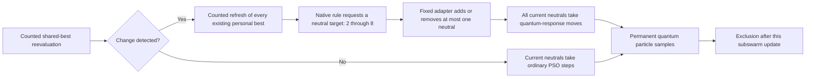

*Mechanism schematic, not measured data. Every movement is counted; all retained personal memories
remain active. Population adaptation is within a subswarm, not a redistribution of a conserved total.*

The immutable public observation is captured **after refresh and before resizing or movement**. It includes
current neutral count, spread and motion, measured fitness deterioration, recent improvement, current
swarm and total particle counts, previous requested target and known default radius. It contains no hidden
peak locations/counts, optimum, benchmark error, future changes, seeds or protected outcomes. The
[task prompt](tasks/book_mpso_population_v1/task_prompt.txt) defines timing, signs and normalization.
The checker admits its documented pure numerical expressions and math operations. Constants are valid;
fitness contains no reward for complexity, conditional branches or population variability.

The older schedule engine and every historical experiment remain preserved. Compatible target-five
outcomes are reused only after numerical/RNG-order checks; known fixed-five diagnostic fields are derived
explicitly from their archived traces rather than represented as new measurements.

### 3.3 Native evolution and measured feedback

Pinned ShinkaEvolve `9912af12d423504b8d580f4179fd15f5f88b8c50` controls parent selection,
archive/top inspiration, mutation, novelty decisions and lineage. The existing research profile
uses weighted parents, archive/top inspirations, diff/full/crossover mutation, local code embeddings plus
native LLM novelty judging, and meta-memory at the five-program interval. This short population batch uses
one island: the preceding two-island novelty pool missed a cross-island duplicate. A single island removes
that separation, but does not guarantee behavioral novelty; migration is inactive. Shinka islands partition candidate programs; they are
not the optimizer subswarms inside a simulation. Prompt co-evolution stays off; a fixed mutation model is not
an adaptive model ensemble. Evidence comes from actual prompts, database records and model receipts.

Feedback reports paired development differences from **target five and fixed targets three/seven**, all
case errors, requested/realized population distributions, additions/removals, objective-query shares and
favorable/unfavorable recovery episodes. It offers competing explanations without prescribing a useful
population size. Actual parent/inspiration source inclusion and meta-recommendation insertion are verified
from saved prompts; configuration alone is not evidence that a mechanism ran.

All internal roles use the authorized subscription-backed Codex route with `gpt-6-astra`, without
paid fallback. Actual CLI invocation verifies task-local **xhigh**, the strongest effort supported by the pinned
route; inner Ultra is unsupported. Model-role counts are reported with the completed study. Requested supervising Astra/Ultra is recorded separately from inner settings;
provider-internal retries and supervising usage are not observable in native logical receipts.

## 4. Experimental Design

| Quantity | Chapter-aligned comparison |
|---|---|
| Landscape | Pinned DEAP Moving Peaks; ten conical peaks |
| Domain and dimensions | Peak positions in `[0,100]^5`; five dimensions |
| Changes | Severity 1, every 5,000 counted queries, movement correlation zero |
| Heights and widths | Heights `[30,70]`, widths `[1,12]`; change severities 7 and 1 |
| Initialization convention | Initial heights 50; widths and positions sampled as in pinned DEAP |
| Swarm allocation | Start five neutrals + one permanent quantum per subswarm; neutral target 2–8, step at most one on detected change; `nexcess=1` |
| Per-case horizon | Exactly 500,000 objective queries, matching the chapter's horizon |
| Development | Reuse all eight prior chapter-schedule seed pairs; explicitly development data |
| Native search | Exact target-five seed plus at most six descendant slots; one island |
| Independent comparison | Eight fresh pairs only if a distinct native winner beats target five and the best tested fixed target |
| Selection / fitness | Lowest mean error; `combined_score = 1 / (1 + mean_offline_error)` |
| Descriptive uncertainty | 20,000 independent paired-case bootstrap resamples, seed 2026091609, 95% intervals |

Offline error averages, over **every counted query**, the gap between the current optimum and the
best value discovered since the latest environmental change. Initialization, change detection,
memory refresh, ordinary movement, quantum sampling, birth and exclusion consume the same budget.
A boundary query belongs to the environment it evaluated; a final boundary may generate a new
landscape that receives no subsequent query.

Environment randomness is independent of optimizer and subset-selection randomness. Shared seeds
and saved landscape hashes establish matching environmental histories; they do not imply identical
later particle perturbations or decision states. Effects compare complete closed-loop methods.

Three controls request fixed targets **three, five and seven**. All start at five and use the same
step-one adapter; targets three/seven are not historical variants initialized at those sizes. They help
separate size tuning from conditional allocation, but do not exhaust constant targets or policies.

Prospective implementation, reused suite identities, analysis and resolved settings were committed before
new outcomes. The bounds are **six descendant slots, 36 requested native logical responses, 96 new full
executions / 48 million queries, and 120 minutes including publication**. Certified target-five reuse lowers
the physical numerical ceiling to 88 / 44 million. Native seed reuse adds no queries. Failed terminal slots
consume their allocation; partial programs cannot enter selection. Small implementation fixtures are
counted separately. The model counter excludes supervising usage and unexposed provider retries.

Selection includes the seed and ranks complete valid programs by mean error, then earlier generation and
source hash. The best fixed target is chosen by mean error and then lower numeric target. Only a distinct
native candidate with a development advantage over **both** target five and the best tested fixed control
triggers fresh evaluation. Sources, comparator and paired-bootstrap settings are frozen before generating
fresh identities, with existing identical methods executed once. No fresh outcomes return to evolution.

This is a **chapter-aligned reconstruction and comparison**, not reproduction of all of Table 3.
It preserves the core scenario and horizon but uses eight paired repetitions rather than 50,
new seeds and declared implementation conventions. New scores are compared against contemporaneous
matched references, never against unmatched printed values as a claim to have “beaten the book.”

### 4.1 Chapter-condition coverage

| Peaks | Movement severity | Chapter-aligned evidence |
|---:|---:|---|
| 10 | 1 | Completed schedule and population searches; eight development cases each |
| 200 | 1 | Historical one-case runtime stop; corrected enclosing-ball continuation now has paired controls and an interim native campaign on four development histories |
| 10 | 5 | Still untested by the chapter-aligned search |
| 200 | 5 | Still untested by the chapter-aligned search |

The corrected 200-peak continuation retains the four identities registered by the
[bounded-stop study](docs/studies/book_mpso_population_200_v1/REPORT.md), the 5D,
500,000-query horizon and population interface. Every corrected score is measured
with the new enclosing-ball engine; the old single-case score is historical only.
This is a small MPSO extension, not complete reproduction of the chapter or an SPSO
comparison. The two severity-five conditions remain untested.

Its [prospective campaign](docs/book_mpso_population_200_v2_protocol.md) spans 50
descendant slots, with the seed included in final selection and all seven constant
targets 2..8 compared on development data before that selection. Session 1 measures
controls three/five and admits at most six descendants within 180 minutes. Later
sessions require another user launch. Evolutionary feedback remains against
three/five throughout. A distinct final native winner improving on seed permits a
later frozen comparison on 50 new paired histories; interim rankings cannot trigger
fresh testing. The [registered analysis](docs/studies/book_mpso_population_200_v2/analysis_specification.json)
tests the primary comparison against corrected 5+1 before interpreting the secondary
comparison against the development-selected constant, with whole-history paired
bootstrap intervals. This design supersedes the old continuation's short-batch
limits through a new identity; historical manifests remain unchanged.

## 5. Results

### 5.1 Population adaptation did not improve the reference in this batch

**The selected program is still the human-designed target five.** Native evolution explored a
neighboring constant and conditional shrink/grow rules; none improved its mean development error.
The exact selected executable remains:

```python
def choose_neutral_count(observation) -> int:
    return 5
```

This source aliases reconstructed MPSO 5+1. It is a retained reference, not a newly discovered
collective mechanism. [The completed population report](docs/studies/book_mpso_population_v1/REPORT.md)
contains every case, exact sources, native lineage, response behavior and accounting.

| Method, all starting at five neutrals | Mean error ↓ | Method − target five | Descriptive 95% interval | Wins / losses |
|---|---:|---:|---|---:|
| Fixed target three | 1.806340 | +0.061772 | [−0.092645,+0.257007] | 4 / 4 |
| **Target five / selected seed** | **1.744569** | Execution reference | — | — |
| Fixed target seven | 1.871657 | +0.127089 | [−0.058890,+0.296543] | 2 / 6 |
| Best native descendant: constant target six | 1.776112 | +0.031543 | [−0.185736,+0.250921] | 3 / 5 |

All comparisons use the same **eight reused development histories**. The native winner includes the
seed, so the closest descendant is not promoted to the selected method. No distinct winner beat
both target five and the best tested fixed control; **no fresh identities or evaluation were generated**.
The intervals are descriptive and do not remove selection bias or establish equivalence.

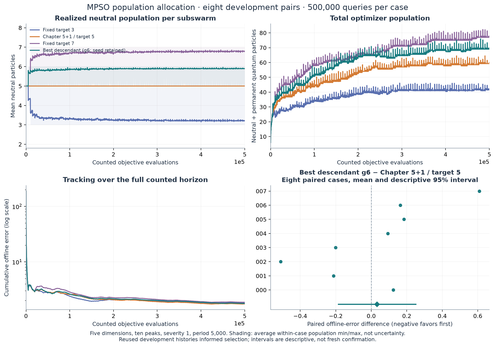

*Figure 2. Measured **5D development** trajectories over counted objective evaluations. Target
six is shown as the best tested descendant, while target five remains selected. Bands give mean
within-case population minima/maxima, not uncertainty. The paired panel retains all eight target-six
minus target-five effects. Tracking uses a logarithmic error axis to retain both initialization and
late behavior; no horizon or unfavorable case is omitted.*

Generation six simply returns `6`. Each newborn or excluded-and-reinitialized swarm starts at five;
its first detected change adds one neutral, and subsequent requests leave it at six. Across eight
cases this produced **789 additions, zero removals**, with six neutrals on **86.72%** of subswarm
updates. It requested six on all **6,676** detected decisions. About **97.22%** of saved query-grid
points nevertheless contain both five- and six-neutral swarms, because their birth/exclusion and
detection times differ. That variation is an effect of the fixed adapter, not learned conditionality.

| Measured allocation | Target three | Target five | Target seven | Native target six |
|---|---:|---:|---:|---:|
| Mean total particles at saved query grid | 37.48 | 51.63 | 64.91 | 59.66 |
| Mean subswarms | 8.800 | 8.605 | 8.393 | 8.672 |
| Ordinary movement share | 58.58% | 67.51% | 72.81% | 70.49% |
| Permanent quantum share | 18.05% | 13.67% | 11.03% | 12.19% |
| Detection share | 18.05% | 13.67% | 11.03% | 12.19% |
| Memory-refresh share | 0.72% | 0.99% | 1.25% | 1.15% |

More neutrals spent more of the common budget on ordinary PSO and less on permanent sampling and
detection cycles. Mean swarm counts stayed similar for targets five/six. Complete trajectories,
memory content after removals and birth/removal opportunities also differ; these measurements do
not identify one pathway as the cause of a performance change.

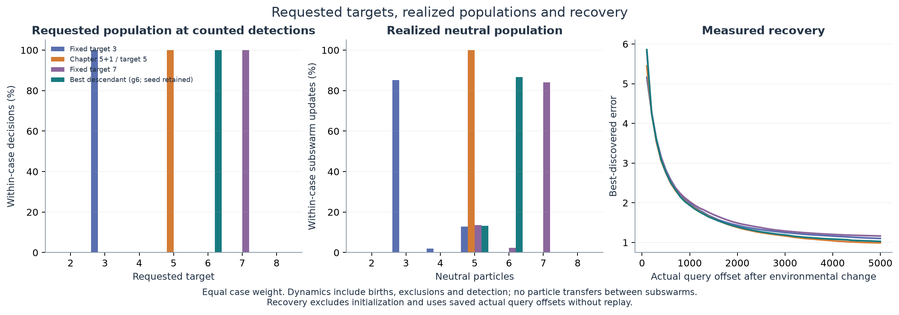

*Figure 3. Requested targets at counted changes, actual populations over subswarm updates,
and recovery at saved query offsets. Cases receive equal weight. Initial environment is excluded
from recovery averages, and unrecorded immediate error is not interpolated. All methods retain
the published quantum response and the known-scale radius.*

The best descendant's small positive mean hides opposing effects. Case 007's **+0.609107** loss
contributes **+0.076138** to the mean; the other seven average **−0.050966**. Its median is
**+0.109155** and paired SD **0.336846**. Every history remains included. The predetermined
quarter-budget example in case 000 reaches query **125,014** already at six, with no resize;
recorded errors at environment offsets 100/500/1,000 are **3.3561/0.8849/0.6924**, versus
five's **2.0909/1.1581/0.4326**. A fixed target does not imply a uniformly better trajectory.

The frozen extreme-episode rule finds both a large benefit—case 001/environment 88, mean difference
**−14.405564**—and a large loss—case 000/environment 14, **+13.345129**. These are explicitly post hoc
examples of whole closed-loop histories, not isolated effects of an individual added particle. The
report retains their complete measured recovery and the prospective examples from every case.

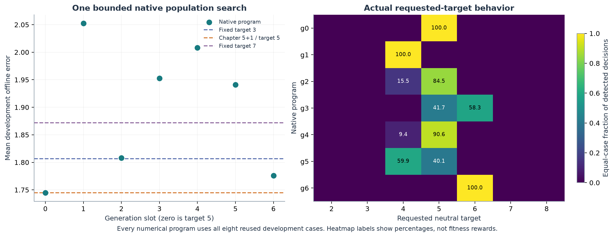

*Figure 4. Every native program uses all eight full-horizon development cases. The right panel
shows actual requested-target frequencies, with percentages printed in nonzero cells. Only targets
four, five and six appeared in accepted native programs; the available response space was larger.
Complexity and population variability earn no fitness bonus.*

The conditional programs were materially active. Generation two shrank compact, slow swarms only
after a non-deteriorating checked best (four requested on **15.51%** of detections); generation three
grew compact, slow swarms after a refreshed-best loss above 5% (six on **58.25%**). Generations four
and five narrowed the improvement gate or reversed the loss response toward shrinking. They all
had higher mean error than five. These rules repeatedly added and removed particles; a selective
looking source condition was sometimes common in execution. Fitness deterioration is not the
benchmark's movement severity, which stayed one.

Generation six descends from **seed 0**, with **generation 4 as archive inspiration and generation 2
as top inspiration**. Native meta-memory's recommendation to try the neighboring constant six is
present in its actual prompt, alongside the complete parent/inspiration sources and measured
feedback. It was a native proposal. That confirms machinery execution, not a causal performance
benefit from meta-memory. Novelty rejected two exact repeats before numerical evaluation; all
attempts remain recorded. One island removes the earlier cross-island separation without
promising perfect behavioral deduplication.

The population study completed **64 new full executions / 32 million objective queries**, plus
**16 cache uses of the same eight prior target-five cases** for control and native seed. There
were seven valid terminal slots, six valid descendants and no failed/partial numerical cases.
The **27 requested native logical responses** comprise eight mutation, eight novelty and eleven
meta responses, including proposal retries. Small focused fixtures used **23,756 additional
queries**. No fresh comparison or follow-on campaign was added; the broader response space and
fresh-history performance remain unresolved.

### 5.2 The preceding chapter schedule search retained its seed

**None of the eight evaluated descendants improved on the published 5+1 seed or the matched
5+0 reference in mean development error.** The simplest relevant executable remains:

```python
def choose_temporary_quantum_count(observation) -> int:
    return 5 if observation["change_detected"] else 0
```

The [exact frozen program](artifacts/book_mpso_schedule_v1/20260916T154109Z/programs/selected.py)
is the original native seed, not an evolved discovery. It makes all five neutral particles sample
on the detected-change update and resumes their ordinary PSO afterward. The additional permanent
quantum particle samples throughout. Selection did not discard the seed to manufacture a winner.

| Matched development method | Mean offline error ↓ | Median case error | Status |
|---|---:|---:|---|
| Reconstructed MPSO 5+0 | 1.743485 | 1.786711 | External reference |
| Reconstructed MPSO 5+1 | 1.744569 | 1.794818 | Native seed and selected program |

The 5+1-minus-5+0 paired mean is **+0.001084**, median **+0.032693**, SD **0.453496**,
with descriptive 95% interval **[−0.306345,+0.285559]** and **four wins/four losses**.
This near-zero mean reflects opposing case effects, not identical behavior: differences range from
**−0.707216 to +0.519055**. Leaving out one case at a time changes the mean from **−0.072912
to +0.102270**. Both references and every unfavorable case remain in the analysis. These eight
new histories neither recover the historical ranking convincingly nor establish equivalence.

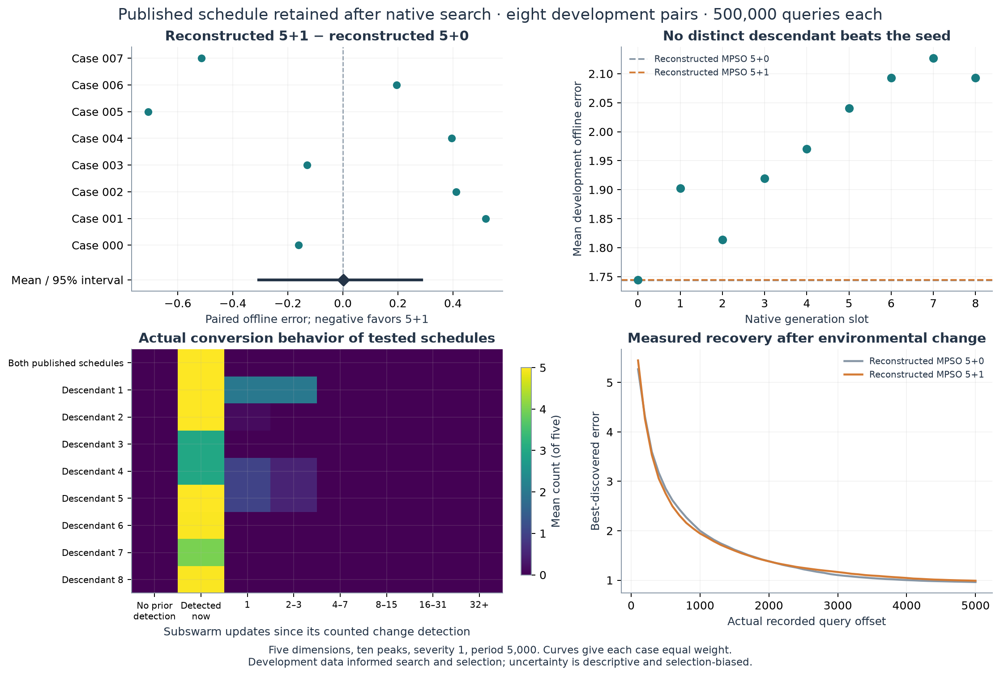

*Figure 5. **Measured 5D development results**, eight paired 500,000-query histories. The upper-left
panel compares contemporaneous references; the native search and heatmap retain every evaluated
program. Both published temporary schedules coincide, though only 5+1 has a permanent quantum
particle. Generation 8 repeats generation 6's behavior. Recovery uses actual saved query offsets,
averaging environments within each case and then cases equally. The interval resamples independent
case pairs, not particle updates. There is no distinct evolved winner or fresh-stage result.*

| Native descendant | Executed temporary-conversion rule | Mean error ↓ | Difference from 5+1 |
|---|---|---:|---:|
| 1 | 5 on detection; 2 for the next three updates | 1.902573 | +0.158004 |
| 2 | 5 on detection; 2 on the next update only after no improvement | 1.813739 | +0.069170 |
| 3 | 3 on detection; 0 otherwise | 1.919122 | +0.174553 |
| 4 | 3 on detection; 1 for the next two updates | 1.970515 | +0.225946 |
| 5 | 5 on detection; 1 for the next two updates | 2.040693 | +0.296124 |
| 6 | 4 for absolute relative observed change ≤1%, otherwise 5; detection only | 2.092992 | +0.348423 |
| 7 | 4 on detection; 0 otherwise | 2.126656 | +0.382088 |
| 8 | Same decisions as generation 6; reordered guard | 2.092992 | +0.348423 |

The first four programs tested extended sampling, a rare stagnation-gated extension, a weaker
initial burst and redistribution across updates. Their [interim review](docs/studies/book_mpso_schedule_v1/INTERIM.md)
continued only the remaining original slots to resolve concrete intensity/trigger questions.
Native meta-memory subsequently proposed reducing the burst for small **observed fitness changes**;
this is not a change in environmental severity, which was one in every case. Generation 6 used
count four on **3.30% of detected-change decisions**, mostly leaving the original rule intact,
yet its mean was worse. The gate did not preferentially select negative-quality states in these
saved data. Source appearance alone would overstate its behavioral novelty.

Native novelty rejected an exact count-four duplicate in slot 8 before evaluation, then accepted
a differently written program equivalent to generation 6. The retry's novelty pool was local to
its parent island and excluded generation 6 on the other island. All eight repeated full outcomes match
exactly. This limitation is recorded alongside the successful rejection; it is not hidden as eight
new behaviors. Parent selection, inspiration, novelty and meta-memory remained native throughout.

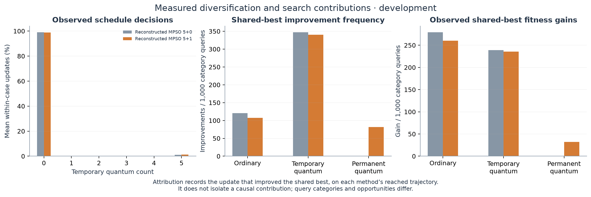

*Figure 6. Saved query-normalized shared-best improvements for the two reconstructed references.
The selected program aliases 5+1 and is not shown as a third method. Temporary conversion accounts
for 1.04% and 1.21% of neutral updates in 5+0 and 5+1, respectively. The permanent role in 5+1
used 546,686 queries and supplied 44,666 shared-best improvements across eight cases. Attribution
identifies which update improved the best on its reached trajectory; it does not isolate a causal
advantage for that particle type or include memory refresh as movement discovery.*

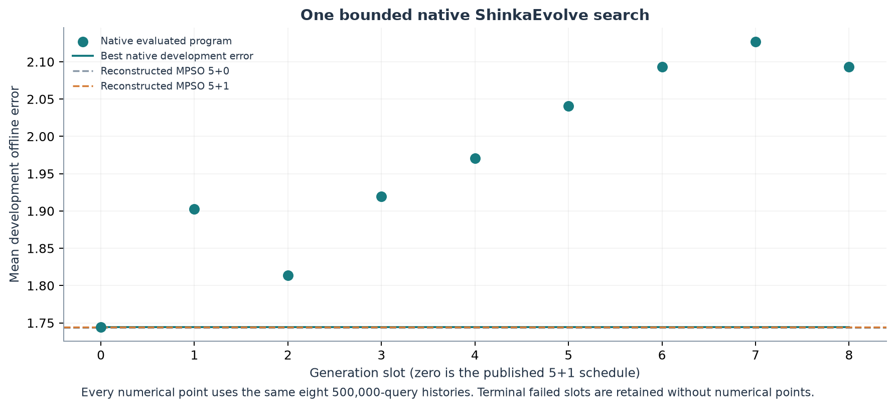

*Figure 7. One native seed plus eight valid descendants. The seed's eight cases were reused
exactly; generation 8 repeated generation 6's decisions and outcomes but consumed eight new
executions. Native parent/inspiration identities and the actual supplied feedback are retained in
the [complete report](docs/studies/book_mpso_schedule_v1/REPORT.md) and archive.*

The numerical study completed **80 new full executions / 40 million objective queries**, including
**eight repeated executions / four million queries**, plus eight cached seed records. All nine
native slots were valid; seven descendant behaviors were distinct. Because the original seed
remained best, the predeclared fresh-comparison condition was not met. No duplicate independent
comparison, replacement slot, new regime or follow-up campaign was added.


### 5.3 Cumulative evidence from earlier studies

#### Particle retention: a development-only discovery

**Native evolution found an inspectable candidate, with a strong regime qualification.** Generation 7
minimizes distance to the refreshed swarm best plus one half of current speed, both normalized by
the known default radius. It does not use personal-best rank or require conditional branches.
The exact selected function is:

```python
def retention_priority(particle_features, swarm_features) -> float:
    """Favor proximity with a reduced penalty on retained speed."""
    distance = particle_features["distance_to_best_normalized"]
    speed = particle_features["speed_normalized"]
    speed_weight = 0.5
    return 1.0 / (1.0 + distance + speed_weight * speed)
```

The highest-scoring particle takes its ordinary PSO step; the other four relocate. The
[frozen source](artifacts/particle_retention_v1/20260916T132022Z/programs/selected.py) preserves the
original file, including its stale seed-level module description; the function above describes
its actual behavior. Native ancestry is **heuristic seed 0 → generation 2 → generation 7**.
Generation 2 used equal distance/speed weights; generation 7 reduced the speed penalty and also
received the seed as archive inspiration. These were native proposals, not manually inserted rules.

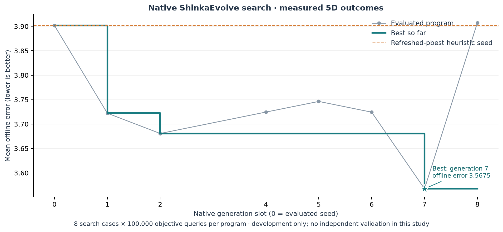

*Figure 8. Eight valid numerical programs: the seed and seven descendants, each scored on the same
eight **5D development histories**. Generation 3 consumed a terminal slot but failed static checking
before objective execution, so it has no numerical point; its source and lineage remain in the
native database. Generation 1 rediscovered the random reference and its repeated work stays counted.*

| Method | Mean offline error ↓ | Selected − method | Descriptive 95% interval | Selected wins/losses |
|---|---:|---:|---:|---:|
| Random retention | 3.722188 | −0.154688 | [−0.305334, −0.006405] | 4 / 4 |
| Strongest refreshed-pbest heuristic | 3.901685 | −0.334185 | [−0.525500, −0.142869] | 6 / 2 |
| Selected generation 7 | **3.567500** | — | — | — |

These intervals summarize **selected development data**, using 2,000 paired, within-regime bootstrap
resamples with equal regime weights. They do not establish independent improvement. Against random,
the paired SD is **0.4081** and median **−0.0362**; case 002's **−0.9936** effect contributes about
80% of the net mean benefit. All four period-5,000 cases improve, while all four period-2,500 cases
worsen. Against the heuristic, paired SD is **0.4972**; both severity-three/period-2,500 cases worsen.
Every case is retained in the table and figures in the [full report](docs/sprints/particle_retention_20260916/REPORT.md).

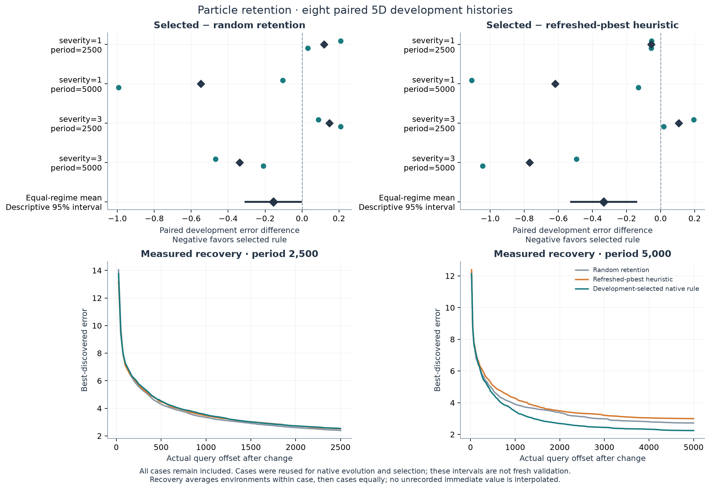

*Figure 9. All eight paired effects, regime means and measured recovery curves. Error differences
are selected minus comparator; negative values favor the selected rule. Recovery uses actual saved
query offsets, averaging environments within each case and then cases. No immediate, unrecorded
recovery value is interpolated. The longer-period advantage is a development observation.*

The selected rule agrees with the refreshed-pbest heuristic on **33.89%** of decisions, with equal
case weight. It retains ranks one through five on **33.89%, 21.70%, 20.35%, 16.14%, 7.92%** of
decisions. Mean selected distance/default-radius is **4.5944**, speed/default-radius **10.7600**,
and velocity alignment toward the refreshed best **−0.1548**. These describe its reached states;
they neither imply positive alignment nor isolate a causal benefit of any one feature.

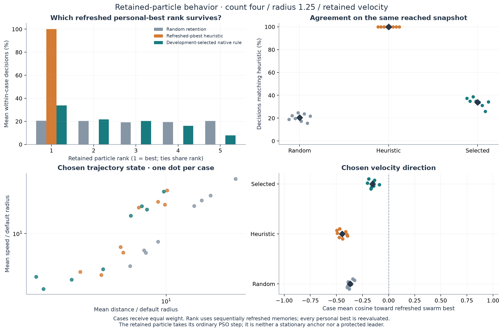

*Figure 10. Choice frequencies and state characteristics from saved decisions. Dots summarize cases,
not independent particle-level replications. Agreement uses a counterfactual heuristic choice on
the same reached snapshot and tie permutation. All memories are reevaluated under every method.*

Prospective examples prevent a narrative built only from good recoveries. In case 000, the first
completed decision at query **2,506** retains rank two; the first at or after 50,000 queries occurs
at **50,011** and retains rank four. Both differ from the heuristic. The saved examples include all
five particle states, priorities, actual movement and subsequent errors at the first recorded
offsets meeting the 25/100/500-query requests; all sixteen selected-method examples are preserved.
The [complete post hoc recovery episodes](assets/particle_retention_v1/recovery_episode_extremes.png)
show both a large benefit (case 003/environment 12: **−13.8041** environment mean error) and a
clear loss (case 002/environment 19: **+3.3405**). They compare whole closed-loop trajectories,
not the isolated effect of one particle choice.

The batch completed **72 new full executions / 7.2 million queries**, plus eight exact cached seed
records. Native roles requested **29 logical responses**: eight mutation, eight novelty and thirteen
meta. The archive records nine terminal slots and seven valid descendants; no migration occurred
before the ten-generation interval. One failed slot used zero objective queries. Its function-local math import was rejected
by a restriction not explicit in the task prompt; this is an admission limitation, not a poor
numerical outcome for its proposed idea. The [prospective protocol](docs/particle_retention_v1_protocol.md),
[four-slot interim](docs/sprints/particle_retention_20260916/INTERIM.md) and final report preserve
the fixed settings, decision to continue, exact sources and model-role receipts. No fresh validation
or repeated search was added.

#### What earlier studies establish—and leave open

| Study | Comparison and independent evidence | Finding |
|---|---|---|
| V1: broad recovery program | Selected − corrected baseline; 8 fresh paired histories | +0.0627, descriptive 95% interval [−0.1470,+0.2724]; no established advantage |
| V2: exact count at radius 2 | Selected − validation-selected count two; 40 fresh histories | −0.4265 [−0.6903,−0.1829]; improved that comparator, not a demonstrated conditional mechanism |
| V3: joint count and radius | Overall winner − baseline/selected fixed pair; 80 fresh histories | +0.0227, predeclared 97.5% interval [−0.2044,+0.2368]; both control labels coincide |
| Radius/velocity sprint | Constant count4/radius1.25 − original baseline; 8 fresh pilot histories | −0.6303, descriptive 95% interval [−1.4721,+0.2241]; inconclusive and influenced by a large retained benefit |

Intervals and study designs differ. These rows are cumulative evidence, not a common leaderboard;
their means come from different histories. None establishes a causal benefit from a particular
engine feature, and inconclusive contrasts do not establish equivalence.

#### V3: preserving the null result

V3 ran three 30-slot native searches, jointly evolving exact count and radius. Frozen validation
selected three search winners and a fixed pair before 80 fresh final histories were generated.
The baseline and selected fixed pair both used count five/radius one, with mean error **3.4779**.
The overall winner scored **3.5006**; all three search winners had higher mean error than baseline.
Its count-three branch applied when relative fitness loss was at most 0.075 and diameter exceeded
three times default radius; otherwise it chose four. Radius was always 1.5.


*Figure 11. **5D final comparison** on 80 fresh histories. Dots are independent paired cases;
intervals use 20,000 within-regime bootstrap resamples with equal regime weights. The two primary
control labels share one execution class, so they do not provide independent corroboration.
All cases, including large losses, are included.*

Component substitutions and a frozen joint-action sampler likewise did not establish useful
current-state dependence. V3 completed **2,960 executions / 296 million queries**; its
[full report](docs/joint_relocation_v3.md) preserves selection chronology, sources, recovery,
uncertainty and documented amendments. [V1](docs/comparison.md) and
[V2](docs/relocation_allocation_v2.md) retain their original analyses. In particular, V2's evolved
method had higher mean error than the original corrected baseline despite beating its selected
constant, and its state-free allocation control did not establish a conditional advantage.

#### Radius and retained velocity: a bounded follow-up

Blackwell, Branke and Li, printed p.215, suggest retained velocity as an explanation for relocation
overshoot and preferred sampling radius. We treated it as a hypothesis. Six methods on eight reused
development histories tested count-four radii 1/1.5 crossed with velocity retention/reset, alongside
the original baseline and exact frozen V3 policy. The paired radius-by-velocity interaction was
**−0.043961**, SD **0.836208**, range **[−1.815428,+0.930971]**. Opposing regime effects dominated
the small mean; no overshoot mediator was measured.

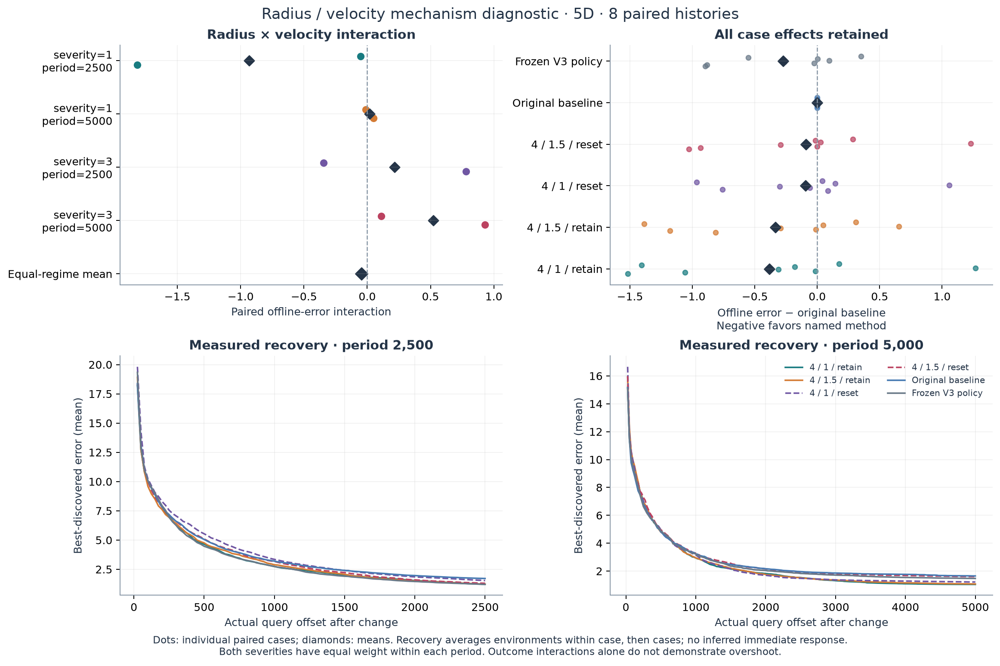

*Figure 12. **5D development diagnostic**; six methods share eight recorded histories. Recovery
uses actual saved query offsets, excluding the initial environment and averaging environments
within each case before cases. There is no interpolation of unrecorded immediate recovery.*

The direct constant **count four/radius 1.5/retain** scored **3.089088**, versus **3.152140** for
V3's exact selected rule: paired difference **+0.063052**, SD **0.391413**. V3 chose count three
on 7.26% of responses with equal case weighting. That reused subset clarifies the nearly constant
behavior but does not confirm the constant's superiority or replace V3's final comparison.

One 13-slot native search selected the constant count-four/radius-1.25/retain rule, development
error **2.886761**, from parent generation 0 with generation 2 as archive inspiration. Its frozen
pilot averaged **3.562580** against baseline **4.192856**, with four wins and four losses. A
**−6.197993** difference in one retained case materially influenced the mean. The sprint used
**160 new executions / 16 million queries** and **45 requested native logical responses**;
eight seed cases were reused and eight repeated descendant evaluations remained counted.
The [report](docs/sprints/radius_velocity_20260916/REPORT.md) preserves exact sources, behavioral
contrasts, native recommendations and uncertainty. An isolated radius-one versus radius-1.25 comparison and independent testing of the retention
score remain unexecuted questions. Neither was automatically chained into the present chapter study.


### 5.4 The original reconstruction record


*Figure 13. Historical **5D reconstruction measurements**, retained without rerunning them: three
500,000-query histories, cumulative offline error and active swarm count. Their mean error was
1.7024 (sample SD 0.7896). Those seeds and the older simulator path differ from this new matched
chapter comparison; this figure is neither an evolved-versus-reference contrast nor numerical
replication of the printed table.*

### 5.5 The 200-peak continuation stopped before evolution

**That initial 200-peak continuation obtained no evolutionary result.** The first already-planned
fixed-target-five case completed its full 500,000 queries in **149.15 monotonic seconds /
175.55 UTC seconds**. The discrepancy is unresolved; the larger observed duration informs
the UTC ceiling. With 20% numerical variation, prior native latency, all twelve possible
fresh executions and publication reserved, even two descendants required **127.80 further
minutes** against **105.11 remaining**. The explicit runtime contingency therefore stopped
work before any native seed or descendant, without running the other controls or changing
the frozen four-case suite.

Only the reference `choose_neutral_count(observation): return 5` executed. Its single-case
offline error was **2.586443**, with **3,422** target-five requests, no additions/removals,
mean **209.63 total particles** and **34.94 subswarms** on the 100-query grid. Ordinary
movement used **64.59%** of queries, permanent sampling **13.60%**, detection **13.60%**,
memory refresh **4.11%**, and temporary sampling **3.42%**. These describe one trajectory;
that archive has no target-three contrast, development mean over four cases, selected program,
fresh outcome or evidence for/against adaptation. Subswarm count does not measure peak coverage.

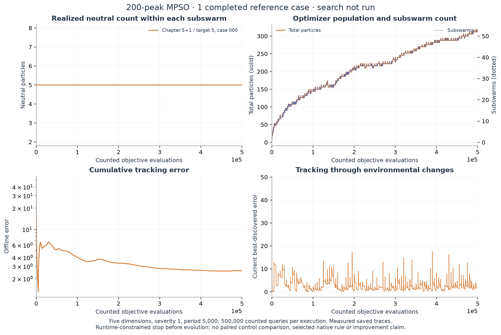

*Figure 14. One measured **5D, 200-peak target-five reference case**, unranked and shown over
the complete counted-query horizon. Population changes reflect unchanged swarm management;
neutral counts remain five. This is not a completed method comparison or evolutionary result.*

The bounded continuation consumed **one full execution / 500,000 objective queries**,
**zero native slots or model responses**, and **zero numerical fixture queries**; 25 focused
synthetic checks passed. New task/context, all four seed pairs, exact reference source,
checkpoint, timing, analysis and [complete report](docs/studies/book_mpso_population_200_v1/REPORT.md)
are preserved. At that stop, the next decision was whether to arrange a longer execution window.
The subsequently authorized versioned campaign below repairs convergence and measures controls
anew; this historical diameter-engine case is not reused as a corrected control.

### 5.6 Corrected 200-peak campaign: an interim conditional improvement

The [versioned continuation](docs/studies/book_mpso_population_200_v2/REPORT.md)
corrects the enclosing-ball source mismatch and preserves native meta-memory at
session boundaries. **Six of the prospective 50 descendant slots are complete**;
all six are valid. Generation four is the interim best, with seed included in the
ranking. This is an open campaign with an improving development result, not a
completed six-slot study or a fresh confirmation.

The [exact native source](artifacts/book_mpso_population_200_v2/20260917T065325Z/session_001/evolution/search_seed_670001/gen_4/main.py)
uses positive relative fitness deterioration divided by `1 + (N + M)/160`, where
N is total particles and M is subswarms at the decision. It requests **three** when
that pressure exceeds **0.04 if the preceding target was three, or 0.08 otherwise**;
it requests **two** below the threshold. This hysteresis uses the existing public
previous-target field. N+M is a workload proxy; it does not include every refresh,
birth or exclusion query. The unchanged adapter starts groups at five and moves
one particle toward the target only after detected change and memory refresh.

| Method | Mean development error | Difference from corrected 5+1 | Paired wins/losses |
|---|---:|---:|---:|
| Corrected 5+1 / target five | 2.191283 | 0 | — |
| Constant target three | 2.091593 | −0.099690 | 3 / 1 |
| Native constant target two | 2.080392 | −0.110892 | 3 / 1 |
| **Generation four: conditional targets two/three** | **1.928740** | **−0.262543** | **3 / 1** |

All seven constant targets 2..8 completed development evaluation in this session.
Their means are 2.080392, 2.091593, 2.181443, 2.191283, 2.349997, 2.352424 and
2.586811 respectively. Target two leads these constants; generation four improves
on it in all four histories, by 7.29% on average. This does not isolate adaptation's
causal contribution or establish fresh generalization.

The leading rule lowers mean error by **11.98%** against corrected 5+1 and **7.79%**
against target three. The primary paired differences are −0.594850, +0.017667,
−0.157189 and −0.315800. Their descriptive 95% bootstrap interval is
[−0.485435, −0.065700], resampling whole histories. Case 000 contributes 56.64%
of the net gain, although every leave-one-history-out mean remains negative.
Four selected development histories cannot substitute for the registered later
50-history comparison. No significance-based stopping or fresh testing occurred.

The other descendants were constant three, two and four, then two conditional
variants with means 1.989777 and 2.057724. The latter variants did not improve on
generation four. Native lineage and saved prompts verify weighted parent sampling,
archive/top inspirations, three diff, two full and one crossover mutations,
embedding-plus-LLM novelty and one interval-five meta update. One recommendation
is present verbatim in generation six's prompt; native crossover omits that section
in generation five. These observations establish machinery use, not an isolated
causal contribution to performance.

The rule requests two/three in 63.27%/36.73% of decisions and repeatedly resizes:
1,582 additions, 2,503 removals and 2,921 direction reversals across four histories.
It uses workload and history fields that the preceding ten-peak descendants left
unused. Average total particles fall from 215.48 to 93.26 and subswarms from 35.91
to 26.41. Movement uses 75.62% of queries versus 81.49% for 5+1; detection plus
memory uses 23.09% versus 17.82%. Births, convergence, exclusion and movement
trajectories change together. Subswarm counts do not establish distinct-peak coverage.

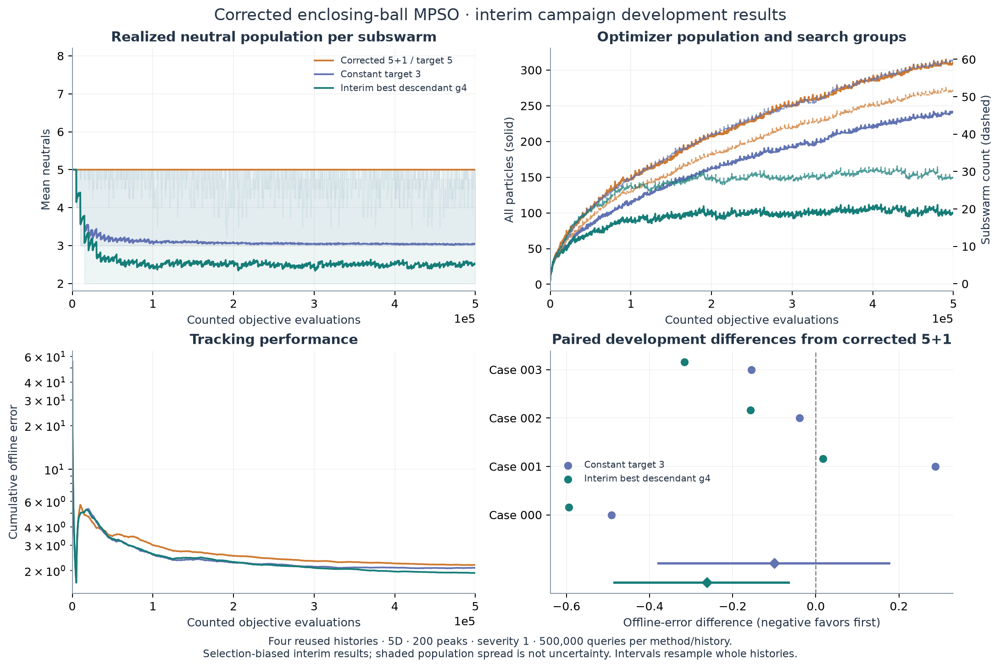

*Figure 15. **Interim 5D, 200-peak development evidence**, four paired 500,000-query
histories. Population and tracking use counted evaluations. Solid population lines
count particles and dashed lines count subswarms on the right axis. Neutral bands
show population spread; the paired intervals are descriptive and selection-biased.*

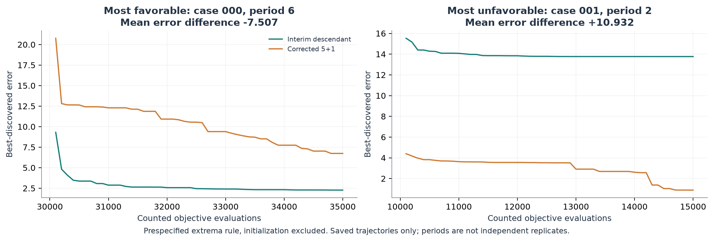

*Figure 16. Saved favorable and unfavorable recovery episodes chosen by the
registered largest-contribution rule, initialization excluded. Case 000/period 6
favors the rule by 7.506815 mean-error units; case 001/period 2 favors 5+1 by
10.931851. These extrema are not independent replications or typical-effect
estimates. No simulation replays were run for either figure.*

Session 1 used **44 physical full-case executions / 22 million queries**, twelve
case-label reuses, 401 separate fixture queries and 19 logical native responses
(six mutation, six novelty, seven meta). Inner calls used subscription
**gpt-6-astra/xhigh**, with no paid API fallback; client-selected outer effort was
not programmatically exposed. The native pause retains five processed and two
pending meta programs. A killed aggregate-analysis process was recovered by
processing saved methods sequentially, with identical prior statistics and no
simulation replay.

The [session report](docs/studies/book_mpso_population_200_v2/REPORT.md) preserves
all paired cases, constant controls, actual population diagnostics, accounting,
source hashes and the drained database/meta checkpoint. The campaign continues
only through a [new user-launched session](docs/studies/book_mpso_population_200_v2/RESUME.md).
The enclosing-ball repair is source-fidelity work; the evolutionary comparison
uses the corrected engine for every method.

## 6. Discussion and Limitations

The completed ten-peak population search found **no development improvement over reconstructed 5+1**,
and the preceding schedule search likewise retained its seed. Its decision was to keep **five neutrals,
one permanent quantum particle and the published change response** in this setting. This is a
negative result for the tested programs, not proof that either human choice is optimal or that
conditional population allocation cannot help. The two searches reuse the same eight development
histories and must not be counted as independent fresh confirmation.

Population measurements clarify the intervention. More neutral trajectories shift queries away
from permanent sampling and detection; conditional rules can induce repeated removal/regrowth.
The closest descendant was constant six and therefore ordinary size tuning. Its mixed case effects
and higher mean did not meet the fresh-comparison trigger. Population heterogeneity alone is not
evidence of learned adaptation: even a uniform target produces different realized sizes because
new swarms start at five. None of the accepted rules used the available global workload or
previous-target fields, so the search did not exhaust the documented response space.

The ten-peak result motivated the **200-peak condition with matched constant-target controls**,
where the authors' convergence/coverage tradeoff may differ. The first 200-peak attempt stopped
before evolution; the corrected continuation is now an explicitly resumable campaign. Its interim
selection does not authorize fresh testing or establish generalization. The ten-peak negative
result remains limited to its tested rules, condition and known-scale radius.
Convergence geometry also changed in the corrected continuation; cross-study
differences cannot be attributed solely to the number of peaks.

The cumulative studies support explicit competent controls and behavior inspection. V2 improved a
selected constant yet did not improve the corrected original baseline on average; V3's larger
frozen comparison did not establish useful state dependence. The radius/velocity pilot remained
inconclusive, and retention's apparent improvement is still development-only. These results do
not become positive evidence merely because the organizing question has returned to the chapter.
They motivate inspecting executed behavior and testing against competent, matched controls rather than
reading sophisticated collective behavior into source-code complexity.

These bounded native searches cannot establish that ShinkaEvolve is superior to another search
method, that any single engine feature caused a gain, or that adaptive branching is necessary.
The chapter includes other MPSO settings and SPSO; none was silently replaced by our two references.
Known severity, the studied synthetic conditions, small development suites and reconstruction
conventions constrain transfer. The two severity-five conditions remain untested by chapter-aligned search. Particle positions are not bounded by the peak domain. A shared-best
improvement attributed to an update records its immediate occurrence, not an isolated causal value
for that particle type. Conversion and population changes alter later trajectories, query allocation, swarm birth/removal
opportunities and the relative cost of detection and memory. The population experiment does not isolate
those pathways, establish an advantage over every constant size, or compare Shinka with another search method.

## 7. Reproducibility

The [population report](docs/studies/book_mpso_population_v1/REPORT.md),
[population protocol](docs/book_mpso_population_v1_protocol.md),
[population analysis specification](docs/studies/book_mpso_population_v1/analysis_specification.json),
and preceding [schedule report](docs/studies/book_mpso_schedule_v1/REPORT.md),
[prospective protocol](docs/book_mpso_schedule_v1_protocol.md),
[source-to-implementation record](docs/book_mpso_source_record.md) and
[frozen analysis specification](docs/studies/book_mpso_schedule_v1/analysis_specification.json)
provide the resolved settings, exact selected program, all case outcomes, actual native lineage,
feedback, limits and accounting. [The artifact inventory](artifacts/README.md) indexes historical
and current sources, checkpoints, SQLite databases, model receipts and measured figures.

Dependencies remain pinned in `uv.lock`; [reproduction.md](docs/reproduction.md) describes setup
and numerical conventions. Each completed case is checkpointed. The current wrapper preserves
finished cases and terminal slots across recovery, but does not restore native proposal RNG state
after a process restart. Persistent JSONL events and timestamped logs distinguish active evaluation,
proposal waiting, errors and completed work. Native logical receipts do not expose provider-internal
retries, hidden reasoning or supervising usage.

```bash
# Recreate the new measured figures from saved cases, without objective or model calls.
source .venv/bin/activate
python scripts/analyze_book_population.py \
  --run artifacts/book_mpso_population_v1/20260916T183731Z \
  --phase development --output /tmp/book-mpso-population

```

Operational WebUI/browser and crash-recovery instructions live in the individual report,
[native integration](docs/shinkaevolve.md) and [recovery record](docs/recovery.md), separate from
scientific conclusions. The native viewer exposes actual candidate source and ancestry; its
appearance and a passing test suite do not constitute an evolutionary discovery.

## References

- Blackwell, T., Branke, J., & Li, X. (2008). [Particle Swarms for Dynamic Optimization Problems](https://doi.org/10.1007/978-3-540-74089-6_6). In C. Blum & D. Merkle (Eds.), *Swarm Intelligence: Introduction and Applications*, pp.193–217. Springer. [Author-hosted chapter](https://titan.csit.rmit.edu.au/~e46507/publications/si-chaper-dynamic-blackwell-li.pdf).
- Blackwell, T., & Branke, J. (2006). [Multiswarms, exclusion, and anti-convergence in dynamic environments](https://doi.org/10.1109/TEVC.2005.857074). *IEEE Transactions on Evolutionary Computation*, 10(4), 459–472.
- DEAP contributors. [Pinned multi-swarm example](https://github.com/DEAP/deap/blob/8a96fd3a75026f7b30e835f595a5199c75634ddf/examples/pso/multiswarm.py) and [Moving Peaks source](https://github.com/DEAP/deap/blob/8a96fd3a75026f7b30e835f595a5199c75634ddf/deap/benchmarks/movingpeaks.py). Original licensing and notices apply.
- Sakana AI. [ShinkaEvolve](https://github.com/SakanaAI/ShinkaEvolve), pinned revision `9912af12d423504b8d580f4179fd15f5f88b8c50`. Citation metadata for this project: [CITATION.cff](CITATION.cff).
