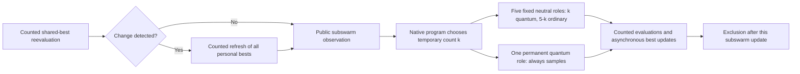

# Evolving Cooperative Search in Changing Environments

**Can native ShinkaEvolve improve the diversification schedule of a published multi-swarm optimizer?**

[Matched chapter comparison](docs/studies/book_mpso_schedule_v1/REPORT.md) · [Source fidelity](docs/book_mpso_source_record.md) · [Programs and data](artifacts/README.md) · [Native ShinkaEvolve](docs/shinkaevolve.md)

## Abstract

We ask whether native ShinkaEvolve can improve the human-designed diversification schedule of
Blackwell, Branke and Li's multi-swarm optimizer. A separate chapter-aligned reconstruction
implements both **MPSO 5+0 and 5+1**, including permanent quantum sampling, temporary conversion
and exclusion after each subswarm update. One bounded native search evaluated eight descendants
on eight shared five-dimensional, ten-peak histories of **500,000 objective queries** each.
**No distinct evolved schedule improved either reference's mean development error.** The published
5+1 seed remained best among native programs, at **1.744569**, versus **1.743485** for 5+0;
their paired difference was **+0.001084 [−0.306345,+0.285559]** (descriptive 95%).
Longer, weaker and locally gated conversion schedules were worse in this batch. One descendant
repeated an earlier behavior and its numerical work remains counted. The fresh-comparison trigger
was not met, so no duplicate validation was launched. This negative discovery result supports
retaining the published schedule for now; it does not establish optimality, equivalence of the
references or superiority of any search method. Earlier relocation and retention studies remain
cumulative evidence, including V3's null result.

## 1. Introduction

**Cooperation and collective search in changing environments** motivate this project. A useful
optimizer must exploit discoveries without sending every searcher to the same place, and recover
when yesterday's useful information becomes stale. Blackwell, Branke and Li's multi-swarm particle
optimizer supplies a concrete, human-designed solution: particles share discoveries within small
subswarms, while exclusion and the creation and removal of swarms distribute search effort between
promising regions. A short burst of exploratory sampling follows detected environmental change.

Our central empirical question is **whether native ShinkaEvolve can improve that diversification
schedule under matched dynamic-optimization conditions**. We investigate improvements to an existing cooperative
optimizer; this study does not separately establish cooperation's causal advantage over independent
search. Communication topology, swarm membership rules and the landscape remain fixed.

Three distinctions organize the evidence. A faithful reconstruction must first implement and count
the intended operations. A useful evolved program must then improve optimizer performance under
matched budgets. An explanation must finally describe its executed behavior without confusing a
conditional expression, source correction or functioning pipeline with scientific discovery.
Development fitness and fresh-case evidence remain separate.


*Figure 1. A separate **two-dimensional illustration** from saved positions and landscape snapshots.
Colored subswarms redistribute their search. This simplified configuration is neither a measured
five-dimensional result nor information available to an evolved program. Every comparison in the
new chapter-aligned study uses five dimensions.*

## 2. Related Work

[*Particle Swarms for Dynamic Optimization Problems*](https://doi.org/10.1007/978-3-540-74089-6_6)
(Blackwell, Branke and Li, 2008) develops multi-swarm PSO (MPSO) and speciation-based PSO (SPSO) for
tracking moving optima. Ordinary particles use remembered personal and shared best positions to
converge. The chapter's “quantum” particles instead sample spatially around the swarm best; the
term denotes a probability distribution, not quantum hardware. MPSO combines cooperation within
subswarms with diversity between them. We study its temporary particle-conversion schedule,
without implementing a comparison across the chapter's algorithm families.

The chapter proposes converting all neutral particles to quantum sampling for one iteration
following detected change. This may reduce the permanent exploratory population while retaining
fast local convergence. Its configurations **5+0** and **5+1** both have five neutral-role particles;
5+1 adds a sixth particle that samples every iteration. These permanent roles matter: a neutral
particle remains structurally neutral when its movement temporarily changes.

| Historical Table 3 reference, `nexcess=1` | Published offline error | Published standard error | Original protocol |
|---|---:|---:|---|
| MPSO 5+0 | 1.80 | 0.08 | 50 runs × 500,000 evaluations |
| MPSO 5+1 | 1.73 | 0.08 | 50 runs × 500,000 evaluations |

*These are printed historical values, not measurements from this repository or scores to which the
implementation was fitted. The chapter also studies other excess-swarm settings, particle counts
and SPSO. We do not label 5+1 / `nexcess=1` its best overall setting.*

Our cumulative studies used pinned DEAP source to examine memory response, relocation count and
radius, velocity retention, and trajectory continuation. They provide implementation and empirical
lessons, including a substantial V3 null result. The present comparison adds the previously missing
permanent quantum particle and restores the original schedule as the unit of evolution. Earlier
findings remain reported below under their original conditions.

## 3. Method

### 3.1 A separate, chapter-aligned reference path

The new [`book_mpso.py`](src/adaptive_swarms/book_mpso.py) path reconstructs the chapter's MPSO
schedule and Algorithm 3 ordering. It shares the pinned Moving Peaks landscape, numerical utilities,
counted-query measurement and checkpoint infrastructure with the historical studies. The earlier
simulator and completed research remain intact; the new comparisons do not substitute their
results for historical baselines.

| Mechanism | Reconstructed MPSO 5+0 | Reconstructed MPSO 5+1 and evolved schedules |
|---|---|---|
| Designated neutral particles | Five | Five |
| Permanent quantum particles | None | One additional particle |
| Published temporary conversion | All five for the detected-change update | All five for the detected-change update |
| Published behavior between detected changes | Ordinary neutral PSO | Ordinary neutral PSO plus permanent quantum sampling |
| Evolvable decision | External fixed reference | Temporary quantum count, 0 through 5, each subswarm update |

A quantum update samples uniformly by volume inside a ball centered at the current shared best,
with radius `rcloud = 0.5 × movement severity`. In five dimensions its sampled radial distance is
`rcloud × U**(1/5)`, with a direction from a normalized isotropic Gaussian. It **replaces ordinary
PSO movement for that update**. Neutral velocities survive for later ordinary updates; a sampled
particle does not immediately take an additional PSO step. Permanent quantum discoveries can
improve both personal and shared memories.

Counted reevaluation of each swarm's shared best detects changes; the optimizer receives no oracle
change signal. After detection, it reevaluates every particle's personal-best memory, including
that of the permanent quantum particle. All memories survive. Each particle's evaluation can
update the attractor before the next particle moves. The benchmark supplies the environmental
scale through the known default radius; adaptation to unknown severity is a different experiment.

Algorithm 3 applies exclusion **after each subswarm update**. The new path follows that ordering;
the historical simulator applied it after all swarms. Neutral roles are processed first in their
fixed order, followed by the permanent quantum role. A new or excluded swarm receives counted
initialization before it becomes an evaluated attractor. Convergence uses only the five designated
neutral positions, excluding the permanent quantum particle.

The source defines convergence using a smallest enclosing ball. We retain the documented DEAP
approximation based on maximum pairwise neutral distance, with a swarm free above `2 × rexcl` and
`rexcl = domain_width / (2 × swarm_count**(1/dimension))`. This is **not an exact enclosing-ball
calculation**. Other conventions include DEAP initialization, asynchronous attractor updates,
unclipped particle positions and stopping at the exact query budget even within an operation.
The [source-to-implementation record](docs/book_mpso_source_record.md)
separates chapter mechanisms from reconstruction conventions. No convention was tuned to recover
the historical ranking or printed means.

The pinned upstream `convertQuantum` accidentally overwrote its distribution argument, making
its intended branches unreachable. That historical correction belongs to the baseline. Adding
the 5+1 reference and correcting update ordering are likewise implementation work, not discoveries
made by evolution.

### 3.2 What Shinka is allowed to change

The separate task [`book_mpso_schedule_v1`](tasks/book_mpso_schedule_v1) evolves one function:

```python
def choose_temporary_quantum_count(observation) -> int:
    return 5 if observation["change_detected"] else 0
```

This exact initial program expresses the published 5+1 temporary schedule. Its eight native seed
outcomes reuse the standalone 5+1 evaluations only after source, engine, configuration and case
identity checks. Candidates choose an integer from zero through five on **every** subswarm update,
after detection and any memory refresh and before movement. The permanent quantum particle always
samples; radius, PSO coefficients, memory processing, birth/removal, exclusion and accounting stay
fixed. Constants and conditional schedules are equally legitimate.



*Mechanism schematic, not measured data. The 5+0 comparator omits the permanent quantum role.
Quantum movement replaces PSO; ordinary movement resumes later with retained neutral velocity.*

The public observation reports the current counted detection flag, observed deterioration and recent
improvement, updates and evaluations since that swarm's last detection, neutral spread and motion,
previous count, known radius and relevant swarm state. It contains no true peak coordinates, hidden
optimum, benchmark error, future change, seed or evaluator internals. One dedicated task RNG draws
a permutation of the five neutral indices at **every** update, regardless of count; the first `k`
receive temporary quantum moves. It is independent of environment and movement RNGs. The same
arrangement applies to the references. Complete trajectories can still diverge.

### 3.3 Native evolution and measured feedback

Pinned ShinkaEvolve `9912af12d423504b8d580f4179fd15f5f88b8c50` controls parent selection,
archive/top inspiration, mutation, novelty decisions and lineage. The existing research profile
uses weighted parents, two islands, diff/full/crossover mutation, local code embeddings plus native
LLM novelty judging, and meta-memory. Shinka islands partition candidate programs; they are
not the optimizer subswarms inside a simulation. Prompt co-evolution stays off; a fixed mutation model is not
an adaptive model ensemble. Evidence comes from actual prompts, database records and model receipts.

Feedback reports paired development differences from **both** references, all case errors,
conversion intensity and its timing after detected change, ordinary and quantum shared-best
improvements, and favorable and unfavorable recovery episodes. It offers competing explanations
rather than rewarding complexity or requiring a preferred adaptive rule. The checker now permits
documented pure numerical math imports, including inside functions; external access remains
excluded. This resolves the previous retention task's undocumented function-local import rejection.

All internal roles use the authorized subscription-backed Codex route with `gpt-6-astra`, without
paid fallback. Actual CLI invocation verifies task-local **xhigh**, the strongest effort supported by the pinned
route; inner Ultra is unsupported. Model-role counts are reported with the completed study. Requested supervising Astra/Ultra is recorded separately from inner settings;
provider-internal retries and supervising usage are not observable in native logical receipts.

## 4. Experimental Design

| Quantity | Chapter-aligned comparison |
|---|---|
| Landscape | Pinned DEAP Moving Peaks; ten conical peaks |
| Domain and dimensions | Peak positions in `[0,100]^5`; five dimensions |
| Changes | Severity 1, every 5,000 counted queries, movement correlation zero |
| Heights and widths | Heights `[30,70]`, widths `[1,12]`; change severities 7 and 1 |
| Initialization convention | Initial heights 50; widths and positions sampled as in pinned DEAP |
| Swarm allocation | Five designated neutrals, `nexcess=1`; zero or one permanent quantum |
| Per-case horizon | Exactly 500,000 objective queries, matching the chapter's horizon |
| Development | Eight frozen environment/optimizer seed pairs, shared by every method |
| Native search | Published 5+1 seed plus at most eight descendant slots |
| Independent comparison | Eight fresh pairs, three frozen methods, only if a distinct descendant wins development |
| Selection / fitness | Lowest mean error; `combined_score = 1 / (1 + mean_offline_error)` |
| Descriptive uncertainty | 20,000 independent paired-case bootstrap resamples, seed 2026091608, 95% intervals |

Offline error averages, over **every counted query**, the gap between the current optimum and the
best value discovered since the latest environmental change. Initialization, change detection,
memory refresh, ordinary movement, quantum sampling, birth and exclusion consume the same budget.
A boundary query belongs to the environment it evaluated; a final boundary may generate a new
landscape that receives no subsequent query.

Environment randomness is independent of optimizer and subset-selection randomness. Shared seeds
and saved landscape hashes establish matching environmental histories; they do not imply identical
later particle perturbations or decision states. Effects compare complete closed-loop methods.

Prospective implementation, suite identities, analysis and resolved settings were committed before
evolution. A first planned full reference case measured throughput; its saved result remained in
the comparison. The bound was 104 new full executions / 52 million queries and 40 requested native
logical responses, with an overall 180-minute ceiling. Terminal failures consume descendant slots.
Selection includes the seed, with earlier generation and then source hash breaking ties. Any fresh
case identities are generated only after source and analysis freezes; fresh results never return
to mutation or meta-memory.

This is a **chapter-aligned reconstruction and comparison**, not reproduction of all of Table 3.
It preserves the core scenario and horizon but uses eight paired repetitions rather than 50,
new seeds and declared implementation conventions. New scores are compared against contemporaneous
matched references, never against unmatched printed values as a claim to have “beaten the book.”

## 5. Results

### 5.1 The chapter schedule remains the selected program

**None of the eight evaluated descendants improved on the published 5+1 seed or the matched
5+0 reference in mean development error.** The simplest relevant executable remains:

```python
def choose_temporary_quantum_count(observation) -> int:
    return 5 if observation["change_detected"] else 0
```

The [exact frozen program](artifacts/book_mpso_schedule_v1/20260916T154109Z/programs/selected.py)
is the original native seed, not an evolved discovery. It makes all five neutral particles sample
on the detected-change update and resumes their ordinary PSO afterward. The additional permanent
quantum particle samples throughout. Selection did not discard the seed to manufacture a winner.

| Matched development method | Mean offline error ↓ | Median case error | Status |
|---|---:|---:|---|
| Reconstructed MPSO 5+0 | 1.743485 | 1.786711 | External reference |
| Reconstructed MPSO 5+1 | 1.744569 | 1.794818 | Native seed and selected program |

The 5+1-minus-5+0 paired mean is **+0.001084**, median **+0.032693**, SD **0.453496**,
with descriptive 95% interval **[−0.306345,+0.285559]** and **four wins/four losses**.
This near-zero mean reflects opposing case effects, not identical behavior: differences range from
**−0.707216 to +0.519055**. Leaving out one case at a time changes the mean from **−0.072912
to +0.102270**. Both references and every unfavorable case remain in the analysis. These eight
new histories neither recover the historical ranking convincingly nor establish equivalence.


*Figure 2. **Measured 5D development results**, eight paired 500,000-query histories. The upper-left
panel compares contemporaneous references; the native search and heatmap retain every evaluated
program. Both published temporary schedules coincide, though only 5+1 has a permanent quantum
particle. Generation 8 repeats generation 6's behavior. Recovery uses actual saved query offsets,
averaging environments within each case and then cases equally. The interval resamples independent
case pairs, not particle updates. There is no distinct evolved winner or fresh-stage result.*

| Native descendant | Executed temporary-conversion rule | Mean error ↓ | Difference from 5+1 |
|---|---|---:|---:|
| 1 | 5 on detection; 2 for the next three updates | 1.902573 | +0.158004 |
| 2 | 5 on detection; 2 on the next update only after no improvement | 1.813739 | +0.069170 |
| 3 | 3 on detection; 0 otherwise | 1.919122 | +0.174553 |
| 4 | 3 on detection; 1 for the next two updates | 1.970515 | +0.225946 |
| 5 | 5 on detection; 1 for the next two updates | 2.040693 | +0.296124 |
| 6 | 4 for absolute relative observed change ≤1%, otherwise 5; detection only | 2.092992 | +0.348423 |
| 7 | 4 on detection; 0 otherwise | 2.126656 | +0.382088 |
| 8 | Same decisions as generation 6; reordered guard | 2.092992 | +0.348423 |

The first four programs tested extended sampling, a rare stagnation-gated extension, a weaker
initial burst and redistribution across updates. Their [interim review](docs/studies/book_mpso_schedule_v1/INTERIM.md)
continued only the remaining original slots to resolve concrete intensity/trigger questions.
Native meta-memory subsequently proposed reducing the burst for small **observed fitness changes**;
this is not a change in environmental severity, which was one in every case. Generation 6 used
count four on **3.30% of detected-change decisions**, mostly leaving the original rule intact,
yet its mean was worse. The gate did not preferentially select negative-quality states in these
saved data. Source appearance alone would overstate its behavioral novelty.

Native novelty rejected an exact count-four duplicate in slot 8 before evaluation, then accepted
a differently written program equivalent to generation 6. The retry's novelty pool was local to
its parent island and excluded generation 6 on the other island. All eight repeated full outcomes match
exactly. This limitation is recorded alongside the successful rejection; it is not hidden as eight
new behaviors. Parent selection, inspiration, novelty and meta-memory remained native throughout.


*Figure 3. Saved query-normalized shared-best improvements for the two reconstructed references.
The selected program aliases 5+1 and is not shown as a third method. Temporary conversion accounts
for 1.04% and 1.21% of neutral updates in 5+0 and 5+1, respectively. The permanent role in 5+1
used 546,686 queries and supplied 44,666 shared-best improvements across eight cases. Attribution
identifies which update improved the best on its reached trajectory; it does not isolate a causal
advantage for that particle type or include memory refresh as movement discovery.*


*Figure 4. One native seed plus eight valid descendants. The seed's eight cases were reused
exactly; generation 8 repeated generation 6's decisions and outcomes but consumed eight new
executions. Native parent/inspiration identities and the actual supplied feedback are retained in
the [complete report](docs/studies/book_mpso_schedule_v1/REPORT.md) and archive.*

The numerical study completed **80 new full executions / 40 million objective queries**, including
**eight repeated executions / four million queries**, plus eight cached seed records. All nine
native slots were valid; seven descendant behaviors were distinct. Because the original seed
remained best, the predeclared fresh-comparison condition was not met. No duplicate independent
comparison, replacement slot, new regime or follow-up campaign was added.


### 5.2 Cumulative evidence from earlier studies

#### Particle retention: a development-only discovery

**Native evolution found an inspectable candidate, with a strong regime qualification.** Generation 7
minimizes distance to the refreshed swarm best plus one half of current speed, both normalized by
the known default radius. It does not use personal-best rank or require conditional branches.
The exact selected function is:

```python
def retention_priority(particle_features, swarm_features) -> float:
    """Favor proximity with a reduced penalty on retained speed."""
    distance = particle_features["distance_to_best_normalized"]
    speed = particle_features["speed_normalized"]
    speed_weight = 0.5
    return 1.0 / (1.0 + distance + speed_weight * speed)
```

The highest-scoring particle takes its ordinary PSO step; the other four relocate. The
[frozen source](artifacts/particle_retention_v1/20260916T132022Z/programs/selected.py) preserves the
original file, including its stale seed-level module description; the function above describes
its actual behavior. Native ancestry is **heuristic seed 0 → generation 2 → generation 7**.
Generation 2 used equal distance/speed weights; generation 7 reduced the speed penalty and also
received the seed as archive inspiration. These were native proposals, not manually inserted rules.


*Figure 5. Eight valid numerical programs: the seed and seven descendants, each scored on the same
eight **5D development histories**. Generation 3 consumed a terminal slot but failed static checking
before objective execution, so it has no numerical point; its source and lineage remain in the
native database. Generation 1 rediscovered the random reference and its repeated work stays counted.*

| Method | Mean offline error ↓ | Selected − method | Descriptive 95% interval | Selected wins/losses |
|---|---:|---:|---:|---:|
| Random retention | 3.722188 | −0.154688 | [−0.305334, −0.006405] | 4 / 4 |
| Strongest refreshed-pbest heuristic | 3.901685 | −0.334185 | [−0.525500, −0.142869] | 6 / 2 |
| Selected generation 7 | **3.567500** | — | — | — |

These intervals summarize **selected development data**, using 2,000 paired, within-regime bootstrap
resamples with equal regime weights. They do not establish independent improvement. Against random,
the paired SD is **0.4081** and median **−0.0362**; case 002's **−0.9936** effect contributes about
80% of the net mean benefit. All four period-5,000 cases improve, while all four period-2,500 cases
worsen. Against the heuristic, paired SD is **0.4972**; both severity-three/period-2,500 cases worsen.
Every case is retained in the table and figures in the [full report](docs/sprints/particle_retention_20260916/REPORT.md).


*Figure 6. All eight paired effects, regime means and measured recovery curves. Error differences
are selected minus comparator; negative values favor the selected rule. Recovery uses actual saved
query offsets, averaging environments within each case and then cases. No immediate, unrecorded
recovery value is interpolated. The longer-period advantage is a development observation.*

The selected rule agrees with the refreshed-pbest heuristic on **33.89%** of decisions, with equal
case weight. It retains ranks one through five on **33.89%, 21.70%, 20.35%, 16.14%, 7.92%** of
decisions. Mean selected distance/default-radius is **4.5944**, speed/default-radius **10.7600**,
and velocity alignment toward the refreshed best **−0.1548**. These describe its reached states;
they neither imply positive alignment nor isolate a causal benefit of any one feature.


*Figure 7. Choice frequencies and state characteristics from saved decisions. Dots summarize cases,
not independent particle-level replications. Agreement uses a counterfactual heuristic choice on
the same reached snapshot and tie permutation. All memories are reevaluated under every method.*

Prospective examples prevent a narrative built only from good recoveries. In case 000, the first
completed decision at query **2,506** retains rank two; the first at or after 50,000 queries occurs
at **50,011** and retains rank four. Both differ from the heuristic. The saved examples include all
five particle states, priorities, actual movement and subsequent errors at the first recorded
offsets meeting the 25/100/500-query requests; all sixteen selected-method examples are preserved.
The [complete post hoc recovery episodes](assets/particle_retention_v1/recovery_episode_extremes.png)
show both a large benefit (case 003/environment 12: **−13.8041** environment mean error) and a
clear loss (case 002/environment 19: **+3.3405**). They compare whole closed-loop trajectories,
not the isolated effect of one particle choice.

The batch completed **72 new full executions / 7.2 million queries**, plus eight exact cached seed
records. Native roles requested **29 logical responses**: eight mutation, eight novelty and thirteen
meta. The archive records nine terminal slots and seven valid descendants; no migration occurred
before the ten-generation interval. One failed slot used zero objective queries. Its function-local math import was rejected
by a restriction not explicit in the task prompt; this is an admission limitation, not a poor
numerical outcome for its proposed idea. The [prospective protocol](docs/particle_retention_v1_protocol.md),
[four-slot interim](docs/sprints/particle_retention_20260916/INTERIM.md) and final report preserve
the fixed settings, decision to continue, exact sources and model-role receipts. No fresh validation
or repeated search was added.

#### What earlier studies establish—and leave open

| Study | Comparison and independent evidence | Finding |
|---|---|---|
| V1: broad recovery program | Selected − corrected baseline; 8 fresh paired histories | +0.0627, descriptive 95% interval [−0.1470,+0.2724]; no established advantage |
| V2: exact count at radius 2 | Selected − validation-selected count two; 40 fresh histories | −0.4265 [−0.6903,−0.1829]; improved that comparator, not a demonstrated conditional mechanism |
| V3: joint count and radius | Overall winner − baseline/selected fixed pair; 80 fresh histories | +0.0227, predeclared 97.5% interval [−0.2044,+0.2368]; both control labels coincide |
| Radius/velocity sprint | Constant count4/radius1.25 − original baseline; 8 fresh pilot histories | −0.6303, descriptive 95% interval [−1.4721,+0.2241]; inconclusive and influenced by a large retained benefit |

Intervals and study designs differ. These rows are cumulative evidence, not a common leaderboard;
their means come from different histories. None establishes a causal benefit from a particular
engine feature, and inconclusive contrasts do not establish equivalence.

#### V3: preserving the null result

V3 ran three 30-slot native searches, jointly evolving exact count and radius. Frozen validation
selected three search winners and a fixed pair before 80 fresh final histories were generated.
The baseline and selected fixed pair both used count five/radius one, with mean error **3.4779**.
The overall winner scored **3.5006**; all three search winners had higher mean error than baseline.
Its count-three branch applied when relative fitness loss was at most 0.075 and diameter exceeded
three times default radius; otherwise it chose four. Radius was always 1.5.


*Figure 8. **5D final comparison** on 80 fresh histories. Dots are independent paired cases;
intervals use 20,000 within-regime bootstrap resamples with equal regime weights. The two primary
control labels share one execution class, so they do not provide independent corroboration.
All cases, including large losses, are included.*

Component substitutions and a frozen joint-action sampler likewise did not establish useful
current-state dependence. V3 completed **2,960 executions / 296 million queries**; its
[full report](docs/joint_relocation_v3.md) preserves selection chronology, sources, recovery,
uncertainty and documented amendments. [V1](docs/comparison.md) and
[V2](docs/relocation_allocation_v2.md) retain their original analyses. In particular, V2's evolved
method had higher mean error than the original corrected baseline despite beating its selected
constant, and its state-free allocation control did not establish a conditional advantage.

#### Radius and retained velocity: a bounded follow-up

Blackwell, Branke and Li, printed p.215, suggest retained velocity as an explanation for relocation
overshoot and preferred sampling radius. We treated it as a hypothesis. Six methods on eight reused
development histories tested count-four radii 1/1.5 crossed with velocity retention/reset, alongside
the original baseline and exact frozen V3 policy. The paired radius-by-velocity interaction was
**−0.043961**, SD **0.836208**, range **[−1.815428,+0.930971]**. Opposing regime effects dominated
the small mean; no overshoot mediator was measured.


*Figure 9. **5D development diagnostic**; six methods share eight recorded histories. Recovery
uses actual saved query offsets, excluding the initial environment and averaging environments
within each case before cases. There is no interpolation of unrecorded immediate recovery.*

The direct constant **count four/radius 1.5/retain** scored **3.089088**, versus **3.152140** for
V3's exact selected rule: paired difference **+0.063052**, SD **0.391413**. V3 chose count three
on 7.26% of responses with equal case weighting. That reused subset clarifies the nearly constant
behavior but does not confirm the constant's superiority or replace V3's final comparison.

One 13-slot native search selected the constant count-four/radius-1.25/retain rule, development
error **2.886761**, from parent generation 0 with generation 2 as archive inspiration. Its frozen
pilot averaged **3.562580** against baseline **4.192856**, with four wins and four losses. A
**−6.197993** difference in one retained case materially influenced the mean. The sprint used
**160 new executions / 16 million queries** and **45 requested native logical responses**;
eight seed cases were reused and eight repeated descendant evaluations remained counted.
The [report](docs/sprints/radius_velocity_20260916/REPORT.md) preserves exact sources, behavioral
contrasts, native recommendations and uncertainty. An isolated radius-one versus radius-1.25 comparison and independent testing of the retention
score remain unexecuted questions. Neither was automatically chained into the present chapter study.


### 5.3 The original reconstruction record


*Figure 10. Historical **5D reconstruction measurements**, retained without rerunning them: three
500,000-query histories, cumulative offline error and active swarm count. Their mean error was
1.7024 (sample SD 0.7896). Those seeds and the older simulator path differ from this new matched
chapter comparison; this figure is neither an evolved-versus-reference contrast nor numerical
replication of the printed table.*

## 6. Discussion and Limitations

The bounded search did **not** find a better diversification schedule in this chapter setting.
This is a substantive negative result for the tested programs, not proof that the human schedule
is optimal or that conditional recovery cannot help. Every tested descendant had a higher mean
development error than both references. Some improved individual histories substantially, while
others incurred influential losses; the complete distribution matters more than a selected example.

The immediate decision is to **retain the published 5+1 schedule**. A justified next experiment
is an independent paired comparison of the reconstructed **5+0 and 5+1 references** in the same
core setting before further schedule tuning: their nearly equal development mean conceals large,
opposing case effects, leaving the value of permanent sampling uncertain. That comparison is a
recommendation, not an automatically launched campaign. No fresh results are claimed here.

The cumulative studies support explicit competent controls and behavior inspection. V2 improved a
selected constant yet did not improve the corrected original baseline on average; V3's larger
frozen comparison did not establish useful state dependence. The radius/velocity pilot remained
inconclusive, and retention's apparent improvement is still development-only. These results do
not become positive evidence merely because the organizing question has returned to the chapter.
They motivate testing an interpretable schedule against both original-style references.

This one bounded native search cannot establish that ShinkaEvolve is superior to another search
method, that any single engine feature caused a gain, or that adaptive branching is necessary.
The chapter includes other MPSO settings and SPSO; none was silently replaced by our two references.
Known severity, one ten-peak synthetic setting, eight histories per stage and reconstruction
conventions constrain transfer. Particle positions are not bounded by the peak domain. A shared-best
improvement attributed to an update records its immediate occurrence, not an isolated causal value
for that particle type. Conversion changes later trajectories, query allocation and opportunities.

## 7. Reproducibility

The [completed study report](docs/studies/book_mpso_schedule_v1/REPORT.md),
[prospective protocol](docs/book_mpso_schedule_v1_protocol.md),
[source-to-implementation record](docs/book_mpso_source_record.md) and
[frozen analysis specification](docs/studies/book_mpso_schedule_v1/analysis_specification.json)
provide the resolved settings, exact selected program, all case outcomes, actual native lineage,
feedback, limits and accounting. [The artifact inventory](artifacts/README.md) indexes historical
and current sources, checkpoints, SQLite databases, model receipts and measured figures.

Dependencies remain pinned in `uv.lock`; [reproduction.md](docs/reproduction.md) describes setup
and numerical conventions. Each completed case is checkpointed. The current wrapper preserves
finished cases and terminal slots across recovery, but does not restore native proposal RNG state
after a process restart. Persistent JSONL events and timestamped logs distinguish active evaluation,
proposal waiting, errors and completed work. Native logical receipts do not expose provider-internal
retries, hidden reasoning or supervising usage.

```bash
# Recreate the new measured figures from saved cases, without objective or model calls.
source .venv/bin/activate
python scripts/analyze_book_mpso.py \
  --run artifacts/book_mpso_schedule_v1/20260916T154109Z \
  --phase development --output /tmp/book-mpso-development

```

Operational WebUI/browser and crash-recovery instructions live in the individual report,
[native integration](docs/shinkaevolve.md) and [recovery record](docs/recovery.md), separate from
scientific conclusions. The native viewer exposes actual candidate source and ancestry; its
appearance and a passing test suite do not constitute an evolutionary discovery.

## References

- Blackwell, T., Branke, J., & Li, X. (2008). [Particle Swarms for Dynamic Optimization Problems](https://doi.org/10.1007/978-3-540-74089-6_6). In C. Blum & D. Merkle (Eds.), *Swarm Intelligence: Introduction and Applications*, pp.193–217. Springer. [Author-hosted chapter](https://titan.csit.rmit.edu.au/~e46507/publications/si-chaper-dynamic-blackwell-li.pdf).
- Blackwell, T., & Branke, J. (2006). [Multiswarms, exclusion, and anti-convergence in dynamic environments](https://doi.org/10.1109/TEVC.2005.857074). *IEEE Transactions on Evolutionary Computation*, 10(4), 459–472.
- DEAP contributors. [Pinned multi-swarm example](https://github.com/DEAP/deap/blob/8a96fd3a75026f7b30e835f595a5199c75634ddf/examples/pso/multiswarm.py) and [Moving Peaks source](https://github.com/DEAP/deap/blob/8a96fd3a75026f7b30e835f595a5199c75634ddf/deap/benchmarks/movingpeaks.py). Original licensing and notices apply.
- Sakana AI. [ShinkaEvolve](https://github.com/SakanaAI/ShinkaEvolve), pinned revision `9912af12d423504b8d580f4179fd15f5f88b8c50`. Citation metadata for this project: [CITATION.cff](CITATION.cff).
