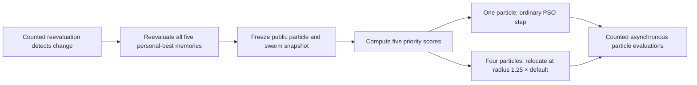

# Evolving Adaptive Collective Search

**An executable study of recovery, memory and trajectory continuity in dynamic multi-swarm optimization**

[Source fidelity](docs/reproduction.md) · [Cumulative evidence](#4-results-and-cumulative-evidence) · [Programs and data](artifacts/README.md) · [Native ShinkaEvolve](docs/shinkaevolve.md)

## Abstract

Collective search in a changing environment must combine recovery from stale information with
continued exploration. We reconstruct a multi-swarm particle optimizer from Blackwell, Branke and
Li (2008), using pinned DEAP source, and evolve small executable recovery programs with native
ShinkaEvolve. Earlier joint count/radius evolution did not establish an advantage on 80 fresh
histories; a later radius/velocity pilot was also inconclusive. The present study fixes relocation
count four, radius multiplier 1.25 and retained velocity, then evolves which particle continues its
ordinary PSO trajectory. A short native search selected a simple proximity/speed score, with mean
error **3.5675**, versus **3.7222** for random retention and **3.9017** for strongest refreshed
personal-best retention. Its paired difference from random is **−0.1547 [−0.3053, −0.0064]**
(descriptive 95%), but all eight histories were reused for search and selection. All four
slower-changing histories improve and all four faster-changing histories worsen. All personal-best
memories are reevaluated; the retained particle is neither stationary nor a privileged leader.
The result is an interpretable development candidate for independent testing, not a demonstrated
general recovery law.

## 1. Motivation: what should survive a change?

A useful collective optimizer must do more than move quickly toward the currently best point.
Multiple promising regions may coexist, a previously strong region may deteriorate, and discoveries
may become stale before the population converges. Multi-swarm PSO addresses these demands through
several coupled mechanisms: local attraction within each swarm, exclusion between nearby swarms,
adaptive allocation of swarms, and relocation after detected change.

Our research separates three questions that are easily conflated:

1. **Reconstruction:** does the numerical implementation express the intended mechanisms with
   correctly counted objective evaluations?
2. **Optimization:** can evolved programs reduce tracking error on development and fresh histories?
3. **Explanation:** do comparisons isolate the behavior responsible for any improvement?

A corrected upstream defect answers the first question. A functioning evolution pipeline answers
none of the performance questions by itself. A conditional program with a better search score does
not establish that its condition is useful, or that the behavior transfers to new histories.


*Figure 1. A separate **two-dimensional illustration**, rendered from saved simulated positions and
landscape snapshots. Colored subswarms move among changing peaks. This uses a different, simplified
configuration; it is not a measured five-dimensional result or a view of information available to
an evolved policy. The scientific comparisons below use five dimensions.*

### From how many particles to which particle

The earlier studies evolved relocation fraction, exact particle count and radius. Their strongest
selected programs often behaved nearly like constants. The radius/velocity sprint further found
that velocity reset was not broadly beneficial, while a count-four/radius-1.25 constant earned the
best development score. This makes the identity of the fifth particle a concrete next question.

When four particles relocate, the fifth follows the ordinary PSO update from its existing position
and velocity. Choosing it could preserve a promising local trajectory, maintain spatial coverage,
or simply select a poor continuation. **Its personal-best memory has no special protection:** all
five memories are reevaluated after detected change. The retained particle can move, lose fitness,
become or cease to be best, and later be replaced. “Retention” therefore refers to exemption from
this relocation event, not permanent leadership, stationary anchoring or selective memory retention.

## 2. Numerical method and source fidelity

### The reconstructed optimizer

The source chapter is [*Particle Swarms for Dynamic Optimization Problems*](https://doi.org/10.1007/978-3-540-74089-6_6)
by Blackwell, Branke and Li (2008). The implementation follows the documented DEAP multi-swarm
example at revision `8a96fd3a75026f7b30e835f595a5199c75634ddf`. It uses five neutral particles per
subswarm, no permanent quantum particles, one desired free swarm (`NEXCESS=1`), exclusion, and
adaptive swarm birth/removal. Here “quantum” means random spatial sampling, not quantum hardware.

Ordinary particles use constricted PSO motion: velocity combines its previous value with attraction
toward the particle's remembered best and the swarm's current best; position advances by that new
velocity. After counted reevaluation detects changed fitness, the corrected original baseline
reevaluates all personal-best positions and temporarily relocates all five particles in a
uniform-volume ball. Its radius is **one half of the configured movement severity**. The general
simulator also permits a radius multiplier, partial relocation and velocity reset.

The pinned upstream example accidentally overwrites its sampling-distribution argument, preventing
its intended relocation branches from executing. Our correction belongs to the baseline, not the
claimed product of evolution. Original source remains pristine. Initialization, asynchronous updates,
change timing, unbounded particle positions and other reconstruction choices are documented in
[reproduction.md](docs/reproduction.md). Missing historical seeds and implementation differences
preclude an exact reproduction of the book's numerical tables; the stronger published permanent
quantum-particle configurations are not implemented as comparators.

### Landscape, observations and accounting

| Experimental quantity | Current development studies |
|---|---|
| Landscape | Pinned DEAP Moving Peaks, ten conical peaks |
| Search space | Five dimensions; landscape peaks bounded by `[0,100]^5` |
| Change regimes | Severity `{1,3}` × period `{2,500,5,000}` queries |
| Change randomness | Movement correlation zero; independent environment RNG |
| Case horizon | Exactly 100,000 counted objective queries |
| Pairing | Same environment/optimizer seeds; landscape histories checked by hashes |
| Known scale | Default relocation radius = half the configured severity |
| Measurement | Offline error, recovery traces, actions and query categories |

**Offline error** is the average gap between the current optimum and the best fitness discovered
since the latest environmental change. Lower is better. Native selection maximizes
`1 / (1 + mean_offline_error)`. Initial particles, change detection, memory reevaluation, normal or
relocated particle evaluation, and exclusion all consume the same budget. The simulator stops at
the exact horizon; an unfinished final response is recorded rather than silently overshooting.

Environment randomness is separate from optimizer randomness, so policies share the same landscape
history. Equal optimizer seeds do not guarantee identical later perturbations: policies can consume
different random draws and reach different states. Effects compare complete closed-loop methods.
True optima and peak coordinates are measurement-side information, never candidate observations.
The known severity-derived radius is public; these experiments do **not** establish recovery when
the shock scale is unknown.


*Figure 2. Historical **5D reconstruction measurements**: three cases of 500,000 queries, with
cumulative offline error and active swarm count. Mean final offline error was 1.7024 (sample
SD 0.7896). These runs have a different horizon and suite from the 100,000-query development studies;
their means should not be read as an evolutionary comparison or as equivalence to the book's tables.*

## 3. Program evolution and the retention experiment

### A small action space with inspectable choices

The `particle_retention_v1` task keeps four of five particles relocated, radius multiplier **1.25**,
retained velocity, and reevaluation of every personal best. Evolution changes
`retention_priority(particle_features, swarm_features)`, a finite scalar score
computed for each of five particles on one immutable snapshot. The highest score selects the sole
relocation exemption; a separate recorded RNG resolves ties. Features include refreshed personal-best
rank, speed, distance to the refreshed swarm best and velocity alignment. They are sequentially
observed memories, without an oracle indicating freshness if the landscape changes during refresh.
Candidates do not receive particle IDs, hidden peaks, future histories or benchmark errors.
The thin hook chooses identity; numerical relocation and PSO updates keep their established rules.



*Mechanism schematic, not measured data. Relocation does not reset velocity; ordinary PSO updates
remain unchanged. Every particle receives a counted evaluation, and all memories are reevaluated.
The known default radius is half the configured movement severity. The sole exemption follows
its ordinary PSO trajectory.*

The references are uniform random retention and the strongest **refreshed personal-best** heuristic:
retain a particle with rank one, using the same recorded permutation to break ties. Both remain
visible comparators; the heuristic seeds native evolution. Particle-choice agreement is evaluated on the
same reached snapshot, rather than pretending that particle identities match across diverged
reference trajectories. Action frequencies, chosen ranks, speed, distance and velocity alignment
make it possible to describe what a successful program actually selects.

The study uses eight new, balanced development histories, a seed plus at most eight descendant
slots, and no independent validation stage. Terminal failures consume slots. Selection is based on
development error; fixed
examples and adverse episodes are examined without dropping unfavorable cases. No branch or
complexity bonus is added. A random or simple heuristic answer remains legitimate.

### Native search, feedback and lineage

ShinkaEvolve revision `9912af12d423504b8d580f4179fd15f5f88b8c50` controls proposal generation,
weighted parent sampling, two islands, archive/top inspirations, novelty decisions, migration and
archive updates. The inherited research profile uses measured textual feedback and meta-memory;
prompt co-evolution is off and the mutation model is fixed. Actual saved prompts, decisions and
receipts establish whether these mechanisms ran; configuration flags alone are not evidence.

All roles use subscription-authenticated Codex with `gpt-6-astra`, without paid fallback. For
particle retention, the requested inner Ultra setting is unsupported by the pinned Shinka/Headless
parsers; the task explicitly requests their strongest supported effort, **xhigh**, without relabeling
it as Ultra or changing global settings. Actual invocation evidence is recorded separately from
requested supervising Astra/Ultra. Earlier studies used no inner effort override. The existing
local embedding service is reused; case checkpoints, lineage, terminal logs and role receipts persist.
Scientific feedback discusses paired errors, regimes and observed behavior; protected historical
final data do not become hidden inputs to candidate execution.

## 4. Results and cumulative evidence

### Particle retention: development-only discovery

**Native evolution found an inspectable candidate, with a strong regime qualification.** Generation 7
minimizes distance to the refreshed swarm best plus one half of current speed, both normalized by
the known default radius. It does not use personal-best rank or require conditional branches.
The exact selected function is:

```python
def retention_priority(particle_features, swarm_features) -> float:
    """Favor proximity with a reduced penalty on retained speed."""
    distance = particle_features["distance_to_best_normalized"]
    speed = particle_features["speed_normalized"]
    speed_weight = 0.5
    return 1.0 / (1.0 + distance + speed_weight * speed)
```

The highest-scoring particle takes its ordinary PSO step; the other four relocate. The
[frozen source](artifacts/particle_retention_v1/20260916T132022Z/programs/selected.py) preserves the
original file, including its stale seed-level module description; the function above describes
its actual behavior. Native ancestry is **heuristic seed 0 → generation 2 → generation 7**.
Generation 2 used equal distance/speed weights; generation 7 reduced the speed penalty and also
received the seed as archive inspiration. These were native proposals, not manually inserted rules.


*Figure 3. Eight valid numerical programs: the seed and seven descendants, each scored on the same
eight **5D development histories**. Generation 3 consumed a terminal slot but failed static checking
before objective execution, so it has no numerical point; its source and lineage remain in the
native database. Generation 1 rediscovered the random reference and its repeated work stays counted.*

| Method | Mean offline error ↓ | Selected − method | Descriptive 95% interval | Selected wins/losses |
|---|---:|---:|---:|---:|
| Random retention | 3.722188 | −0.154688 | [−0.305334, −0.006405] | 4 / 4 |
| Strongest refreshed-pbest heuristic | 3.901685 | −0.334185 | [−0.525500, −0.142869] | 6 / 2 |
| Selected generation 7 | **3.567500** | — | — | — |

These intervals summarize **selected development data**, using 2,000 paired, within-regime bootstrap
resamples with equal regime weights. They do not establish independent improvement. Against random,
the paired SD is **0.4081** and median **−0.0362**; case 002's **−0.9936** effect contributes about
80% of the net mean benefit. All four period-5,000 cases improve, while all four period-2,500 cases
worsen. Against the heuristic, paired SD is **0.4972**; both severity-three/period-2,500 cases worsen.
Every case is retained in the table and figures in the [full report](docs/sprints/particle_retention_20260916/REPORT.md).


*Figure 4. All eight paired effects, regime means and measured recovery curves. Error differences
are selected minus comparator; negative values favor the selected rule. Recovery uses actual saved
query offsets, averaging environments within each case and then cases. No immediate, unrecorded
recovery value is interpolated. The longer-period advantage is a development observation.*

The selected rule agrees with the refreshed-pbest heuristic on **33.89%** of decisions, with equal
case weight. It retains ranks one through five on **33.89%, 21.70%, 20.35%, 16.14%, 7.92%** of
decisions. Mean selected distance/default-radius is **4.5944**, speed/default-radius **10.7600**,
and velocity alignment toward the refreshed best **−0.1548**. These describe its reached states;
they neither imply positive alignment nor isolate a causal benefit of any one feature.


*Figure 5. Choice frequencies and state characteristics from saved decisions. Dots summarize cases,
not independent particle-level replications. Agreement uses a counterfactual heuristic choice on
the same reached snapshot and tie permutation. All memories are reevaluated under every method.*

Prospective examples prevent a narrative built only from good recoveries. In case 000, the first
completed decision at query **2,506** retains rank two; the first at or after 50,000 queries occurs
at **50,011** and retains rank four. Both differ from the heuristic. The saved examples include all
five particle states, priorities, actual movement and subsequent errors at the first recorded
offsets meeting the 25/100/500-query requests; all sixteen selected-method examples are preserved.
The [complete post hoc recovery episodes](assets/particle_retention_v1/recovery_episode_extremes.png)
show both a large benefit (case 003/environment 12: **−13.8041** environment mean error) and a
clear loss (case 002/environment 19: **+3.3405**). They compare whole closed-loop trajectories,
not the isolated effect of one particle choice.

The batch completed **72 new full executions / 7.2 million queries**, plus eight exact cached seed
records. Native roles requested **29 logical responses**: eight mutation, eight novelty and thirteen
meta. The archive records nine terminal slots and seven valid descendants; no migration occurred
before the ten-generation interval. One failed slot used zero objective queries. Its function-local math import was rejected
by a restriction not explicit in the task prompt; this is an admission limitation, not a poor
numerical outcome for its proposed idea. The [prospective protocol](docs/particle_retention_v1_protocol.md),
[four-slot interim](docs/sprints/particle_retention_20260916/INTERIM.md) and final report preserve
the fixed settings, decision to continue, exact sources and model-role receipts. No fresh validation
or repeated search was added.

### What earlier studies establish—and leave open

| Study | Comparison and independent evidence | Finding |
|---|---|---|
| V1: broad recovery program | Selected − corrected baseline; 8 fresh paired histories | +0.0627, descriptive 95% interval [−0.1470,+0.2724]; no established advantage |
| V2: exact count at radius 2 | Selected − validation-selected count two; 40 fresh histories | −0.4265 [−0.6903,−0.1829]; improved that comparator, not a demonstrated conditional mechanism |
| V3: joint count and radius | Overall winner − baseline/selected fixed pair; 80 fresh histories | +0.0227, predeclared 97.5% interval [−0.2044,+0.2368]; both control labels coincide |
| Radius/velocity sprint | Constant count4/radius1.25 − original baseline; 8 fresh pilot histories | −0.6303, descriptive 95% interval [−1.4721,+0.2241]; inconclusive and influenced by a large retained benefit |

Intervals and study designs differ. These rows are cumulative evidence, not a common leaderboard;
their means come from different histories. None establishes a causal benefit from a particular
engine feature, and inconclusive contrasts do not establish equivalence.

#### V3: preserving the null result

V3 ran three 30-slot native searches, jointly evolving exact count and radius. Frozen validation
selected three search winners and a fixed pair before 80 fresh final histories were generated.
The baseline and selected fixed pair both used count five/radius one, with mean error **3.4779**.
The overall winner scored **3.5006**; all three search winners had higher mean error than baseline.
Its count-three branch applied when relative fitness loss was at most 0.075 and diameter exceeded
three times default radius; otherwise it chose four. Radius was always 1.5.


*Figure 6. **5D final comparison** on 80 fresh histories. Dots are independent paired cases;
intervals use 20,000 within-regime bootstrap resamples with equal regime weights. The two primary
control labels share one execution class, so they do not provide independent corroboration.
All cases, including large losses, are included.*

Component substitutions and a frozen joint-action sampler likewise did not establish useful
current-state dependence. V3 completed **2,960 executions / 296 million queries**; its
[full report](docs/joint_relocation_v3.md) preserves selection chronology, sources, recovery,
uncertainty and documented amendments. [V1](docs/comparison.md) and
[V2](docs/relocation_allocation_v2.md) retain their original analyses. In particular, V2's evolved
method had higher mean error than the original corrected baseline despite beating its selected
constant, and its state-free allocation control did not establish a conditional advantage.

#### Radius and retained velocity: a bounded follow-up

Blackwell, Branke and Li, printed p.215, suggest retained velocity as an explanation for relocation
overshoot and preferred sampling radius. We treated it as a hypothesis. Six methods on eight reused
development histories tested count-four radii 1/1.5 crossed with velocity retention/reset, alongside
the original baseline and exact frozen V3 policy. The paired radius-by-velocity interaction was
**−0.043961**, SD **0.836208**, range **[−1.815428,+0.930971]**. Opposing regime effects dominated
the small mean; no overshoot mediator was measured.


*Figure 7. **5D development diagnostic**; six methods share eight recorded histories. Recovery
uses actual saved query offsets, excluding the initial environment and averaging environments
within each case before cases. There is no interpolation of unrecorded immediate recovery.*

The direct constant **count four/radius 1.5/retain** scored **3.089088**, versus **3.152140** for
V3's exact selected rule: paired difference **+0.063052**, SD **0.391413**. V3 chose count three
on 7.26% of responses with equal case weighting. That reused subset clarifies the nearly constant
behavior but does not confirm the constant's superiority or replace V3's final comparison.

One 13-slot native search selected the constant count-four/radius-1.25/retain rule, development
error **2.886761**, from parent generation 0 with generation 2 as archive inspiration. Its frozen
pilot averaged **3.562580** against baseline **4.192856**, with four wins and four losses. A
**−6.197993** difference in one retained case materially influenced the mean. The sprint used
**160 new executions / 16 million queries** and **45 requested native logical responses**;
eight seed cases were reused and eight repeated descendant evaluations remained counted.
The [report](docs/sprints/radius_velocity_20260916/REPORT.md) preserves exact sources, behavioral
contrasts, native recommendations and uncertainty. The suggested isolated radius-one versus
radius-1.25 comparison remains a separate unexecuted question; retention now asks which trajectory
continues at the frozen 1.25 setting.

## 5. Interpretation and limitations

The study is designed to distinguish source fidelity, execution success, development performance,
independent transfer and an interpretable mechanism. The sequence so far favors testing simple
responses explicitly rather than assuming that an adaptive-looking program explains its score.
The present retention study makes a smaller intervention: identity at a relocation event, with
count, radius, velocity handling and memory processing fixed.

The justified next experiment is a **modest fresh paired comparison of this frozen simple score,
random retention and the refreshed-pbest heuristic**, retaining both change periods. Its immediate
question is whether the observed period-dependent advantage survives independent histories.
Further tuning on these same eight cases cannot answer that question. There is no evidence here
that a larger conditional program or a different engine feature is required.

A chosen particle's association with favorable recovery does not establish that it caused that
recovery. Changing the choice changes subsequent evaluations, swarm geometry and random-number
consumption. A local rank or alignment preference may summarize an evolved program while failing
to identify the causal mediator. The predeclared examples avoid selecting only attractive behavior;
post hoc extreme episodes are labeled as such and complement the complete case distribution.

Eight development histories and one short search offer limited evidence about reliability across
histories or across repeated evolutionary searches. Known severity, four regimes, a synthetic
landscape and a reconstructed baseline further limit scope. Robotics, resource allocation and
other applications require their own models and evidence. No result here establishes a universal
recovery law or the effectiveness of a single native engine feature.

## 6. Reproducibility and research records

[The artifact inventory](artifacts/README.md) indexes saved configurations, sources, native databases,
case outcomes, measured figures and model receipts. The individual study reports contain exact
run identities, checkpoint commands, selection chronology and live terminal/WebUI instructions.
Operational browser and crash-recovery details remain in [recovery](docs/recovery.md) and
[native integration](docs/shinkaevolve.md), separate from scientific evidence.

Dependencies are pinned in `uv.lock`; first-time setup and numerical conventions are in
[reproduction.md](docs/reproduction.md). Existing completed cases are preserved. Resume retains
sources and checkpoints, but the current wrapper does not restore native proposal RNG state after
a process restart. The native viewer displays candidate source, measured search fitness and
ancestry; neither its appearance nor a passing test establishes scientific discovery.

```bash
# Reproduce the current measured analysis without objective/model calls.
source .venv/bin/activate
python scripts/analyze_particle_retention.py \
  --run artifacts/particle_retention_v1/20260916T132022Z \
  --selected-generation 7 --output /tmp/particle-retention-analysis
```

## References

- Blackwell, T., Branke, J., & Li, X. (2008). [Particle Swarms for Dynamic Optimization Problems](https://doi.org/10.1007/978-3-540-74089-6_6). In C. Blum & D. Merkle (Eds.), *Swarm Intelligence: Introduction and Applications*. Springer.
- Blackwell, T., & Branke, J. (2006). [Multiswarms, exclusion, and anti-convergence in dynamic environments](https://doi.org/10.1109/TEVC.2005.857074). *IEEE Transactions on Evolutionary Computation*, 10(4), 459–472.
- DEAP contributors. [Pinned multi-swarm example](https://github.com/DEAP/deap/blob/8a96fd3a75026f7b30e835f595a5199c75634ddf/examples/pso/multiswarm.py) and [Moving Peaks source](https://github.com/DEAP/deap/blob/8a96fd3a75026f7b30e835f595a5199c75634ddf/deap/benchmarks/movingpeaks.py). Original licensing and notices apply.
- Sakana AI. [ShinkaEvolve](https://github.com/SakanaAI/ShinkaEvolve). Citation metadata for this project: [CITATION.cff](CITATION.cff).
