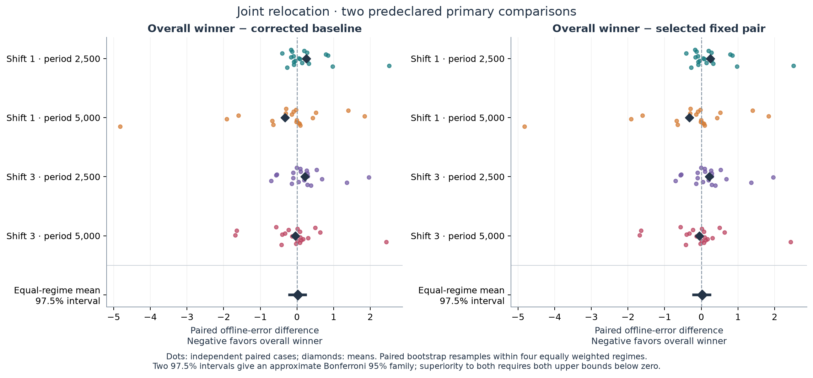
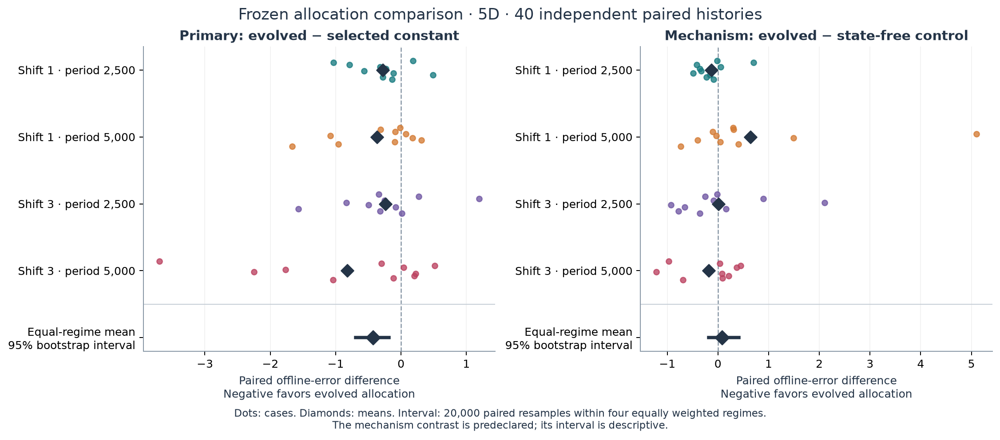
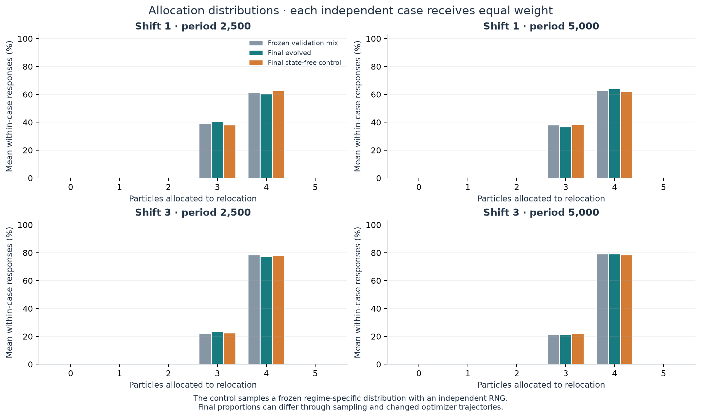
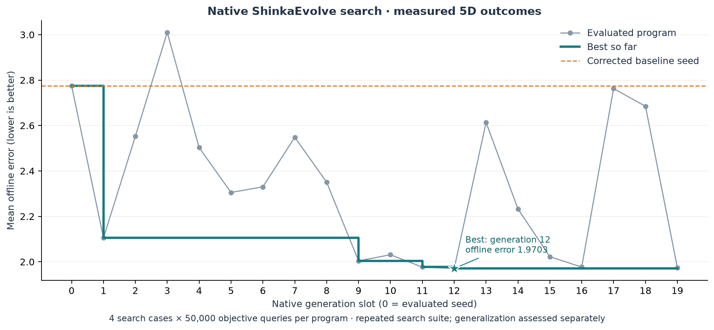
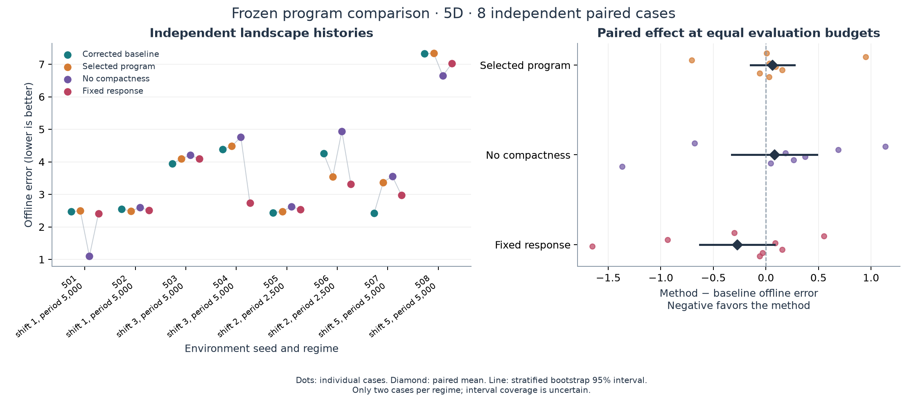
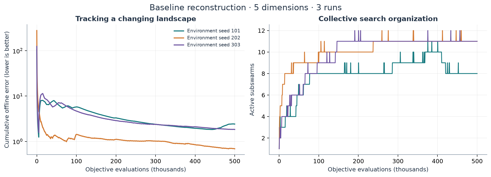
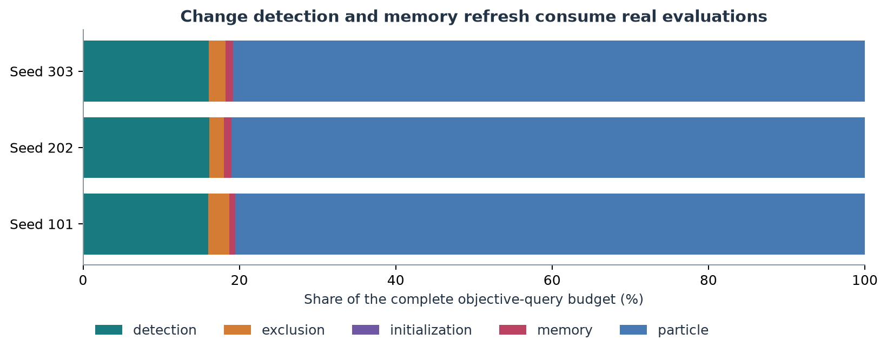
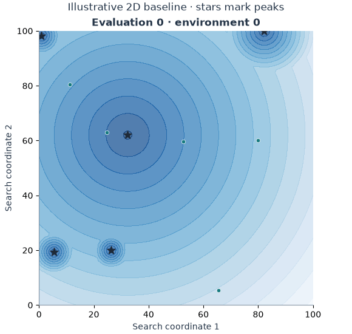

# Evolving Adaptive Collective Search

**LLM program evolution for dynamic multi-swarm optimization**

This project studies whether ShinkaEvolve can discover better adaptation rules for a population of particle swarms searching a changing landscape. The starting point is the multi-swarm particle swarm optimizer described by Blackwell, Branke and Li in *Swarm Intelligence: Introduction and Applications* (2008), reconstructed from an established DEAP implementation.

**Status (16 September 2026): V3 execution and analysis are complete.** Three
native 30-slot searches produced 87 valid descendants, followed by validation
and 80 fresh final histories: **2,960 executions / 296 million counted objective
queries**. Jointly evolving relocation count and radius **did not establish an
advantage over the corrected baseline or the validation-selected fixed pair**.
Those controls coincide. The selected program's paired error difference is
**+0.0227, 97.5% interval [−0.2044, +0.2368]**. The mechanism comparisons also
leave a benefit from current-state dependence unestablished.

See the [V3 report](docs/joint_relocation_v3.md),
[prospective protocol](docs/followup_joint_relocation_v3.md),
[frozen execution settings](docs/v3_execution_settings.md),
[embedding calibration](docs/local_embeddings_v3.md) and
[complete artifact archive](artifacts/joint_relocation_v3).
The prospective implementation was committed as `a66e6c3`; two documented
alias amendments preceded protected evaluation. Preparation checks are separate
from research outcomes.

**Earlier findings are preserved.** [V2](docs/relocation_allocation_v2.md) used
664 executions / 66.4 million queries: its evolved allocation beat the selected
constant, but did not establish useful current-state dependence and had higher
mean error than the corrected baseline. The [V2 review](docs/review_v2_and_next.md),
[V1 findings](docs/comparison.md) and [recovery record](docs/recovery.md) retain
their original evidence.

The native V3 WebUI serves the actual search databases on **http://localhost:8893**;
existing listeners on ports 8890–8892 were preserved. This
[selected-source link](http://localhost:8893/viz_tree.html?db_path=search_2_seed_610003%2Fprograms.sqlite&selected_node=1eceb3f9-3f78-42be-907c-e500c0888f94&left_tab=tree-view&right_tab=agent-code)
opens the overall winner. Native HTTP source/parent access was verified; later
automated browser interaction timed out, as recorded in the report.

```bash
# Attach to the campaign without launching a duplicate controller
bash scripts/progress.sh results/joint_relocation_v3/operations

# Final comparison logs and completed checkpoints
bash scripts/progress.sh results/joint_relocation_v3/study_20260916/final
```

## Abstract

The cumulative study now includes five native ShinkaEvolve searches. V3 allowed
exact particle count and relocation radius to evolve jointly from a
baseline-equivalent seed, using native novelty judging, meta-memory and two
islands. After frozen validation selection, the overall winner's mean offline
error on 80 fresh paired histories was **3.5006**, versus **3.4779** for both the
corrected baseline and selected fixed pair. Its primary interval spans benefit
and harm. All three search winners had higher mean error than the baseline;
none established an advantage. Component substitutions and a frozen joint-action
sampler likewise did not establish a useful conditional mechanism. These are
bounded negative findings, not proof of equivalence or a causal assessment of
individual engine features.

The earlier V1/V2 findings follow unchanged:

Collective search must preserve useful information while responding to environmental change. We reconstructed a corrected multi-swarm particle swarm optimizer and conducted two native ShinkaEvolve searches through subscription-authenticated Codex. V1 improved search error without an independent advantage. V2 isolates the number of particles relocated at a fixed radius rule. After separate validation, its selected program had final mean offline error **3.5541**, versus **3.9806** for the validation-selected constant count two. The paired difference was **−0.4265**, with a stratified bootstrap 95% interval **[−0.6903, −0.1829]** across 40 fresh cases. However, its difference from a control sampling the same validation allocation mixture without current-state information was **+0.0841 [−0.1787, +0.4096]**. The original corrected baseline had lower mean error, **3.2146**. This supports an advantage over the selected constant within these regimes, while leaving the value of conditional allocation unestablished. Matched budgets, complete lineage, frozen selection and explicit limitations make the mixed result reproducible.

## Research question

**Can evolved control programs improve the tracking of moving optima, and which changes to collective search explain any improvement?**

The central tension is between concentrating evaluations on promising regions and keeping enough exploratory capacity to find displaced or newly competitive peaks. We examine this tension through observable swarm behavior and tracking error.

## Background and provenance

The case study comes from [“Particle Swarms for Dynamic Optimization Problems”](https://doi.org/10.1007/978-3-540-74089-6_6), pp.193–217, especially multi-swarm PSO (§4.2, pp.201–204), the Moving Peaks setup (§5.1, pp.208–209), and the particle-conversion comparison (pp.210–211).

The reconstruction uses DEAP commit **`8a96fd3a75026f7b30e835f595a5199c75634ddf`**:

- [Multi-swarm optimizer example](https://github.com/DEAP/deap/blob/8a96fd3a75026f7b30e835f595a5199c75634ddf/examples/pso/multiswarm.py).
- [Moving Peaks implementation](https://github.com/DEAP/deap/blob/8a96fd3a75026f7b30e835f595a5199c75634ddf/deap/benchmarks/movingpeaks.py).

This is a **conceptual reproduction using a later established implementation**. It does not claim possession of the authors’ original code, original seeds, or exact numerical reproduction of every table. Upstream code, local corrections and experimental extensions are recorded separately.

## Method

The baseline uses five neutral particles per subswarm, no permanent quantum particles, one desired free swarm (`NEXCESS=1`), and temporary UVD particle conversion following detected environmental changes. Here “quantum” denotes stochastic particle placement in a search region; no quantum hardware is involved.

The benchmark exposes evaluated objective values to the optimizer. Its latent peak positions and optimum are used for measurement, not as privileged inputs to the adaptation program. Every objective query, including change detection and memory reevaluation, counts toward the evaluation budget.

ShinkaEvolve modifies `choose_response(observation)` in `tasks/adaptive_swarm/initial.py` through its native proposal, evaluation, island archive and parent-selection workflow. The initial configuration enables measured text feedback and disables embedding novelty checks, meta-recommendations and prompt evolution. The program controls relocation radius, the fraction of particles relocated, whether remembered solutions are reevaluated or reset, and whether velocity is reset after detected change. It receives optimizer-visible state such as fitness deterioration, recent improvement, swarm diameter and prior response information. Candidate programs are executed against the benchmark and archived with feedback and ancestry. The measured landscape and result accounting remain outside the candidate interface; Python execution is not a security sandbox, so selected programs must also be inspected for prohibited access.

The primary outcome is **offline error**: the average gap between the current optimum and the best solution found since the latest environmental change. Lower values indicate better tracking. Native selection maximizes `1 / (1 + mean_offline_error)`; the research report retains the underlying error, recovery trajectories, swarm counts and evaluation use. [Scientific context](docs/evolution_context.md) is supplied to the mutation prompt and saved with each new run.

The separate [v2 allocation study](docs/relocation_allocation_v2.md) evolves an
integer count from zero to five while holding radius multiplier 2, memory
reevaluation and retained velocity fixed. It uses 16 search cases, 16 validation
cases and 40 fresh final cases, all at 100,000 evaluations. Validation selects
one of the three best source-distinct programs and one global constant among
all six counts. A frozen control samples the selected program's validation
allocation mixture within each known regime, using an independent RNG and no
current-state information. That comparison also changes temporal dependence;
it does not isolate a single causal variable perfectly.

## Reproduction

The book’s reference configuration is Moving Peaks Scenario 2:

| Setting | Book reference |
|---|---:|
| Dimensions | 5 |
| Search domain | `[0, 100]^5` |
| Peaks | 10 |
| Peak height interval | `[30, 70]` |
| Peak width interval | `[1, 12]` |
| Evaluations between changes | 5,000 |
| Change severity | 1.0 |
| Movement correlation | 0 |
| Evaluations per run | 500,000 |
| Independent runs in the book | 50 |

Table 3 on p.211 reports offline error **1.80 (standard error 0.08)** for the `(5+0)` configuration with `NEXCESS=1`. This is a published comparison point, **not a result obtained by this repository**. The initial reconstruction configuration uses three independent cases at 500,000 evaluations each. The pinned DEAP source sets movement severity to 1.0, despite a stale description suggesting 1.5, and uses correlation 0.5; this project explicitly sets correlation to the book's 0.0. Sample sizes and other implementation differences must accompany the results.

Install the pinned research environment (Python 3.10+; `uv` is preferred):

```bash
bash scripts/setup.sh
source .venv/bin/activate
python -m pytest -q
```

Completed reconstruction outputs are already in [artifacts/reconstruction_v1](artifacts/reconstruction_v1). To perform a new reconstruction:

```bash
python -m adaptive_swarms baseline --config configs/reproduction.json
```

## Experiments

1. **Reconstruction:** establish that the documented baseline tracks a changing landscape and that its individual mechanisms behave as specified. Record numerical agreement and remaining differences with the book.
2. **Program evolution:** run native ShinkaEvolve from the baseline adaptation program, initially requesting 20 generation slots: one seed and up to 19 descendant slots. This is a practical first search size and can be changed; it is not an evidence threshold.
3. **Independent comparison:** freeze the selected program and compare it with the baseline on previously unused seeds and changes in environmental conditions, using matched objective-query budgets.
4. **Mechanism study:** inspect the evolved code and traces, then remove the mechanism that appears to explain its behavior. Add only comparisons that answer a concrete remaining question.

```bash
# Terminal 1: requires Codex CLI authenticated with a ChatGPT subscription
python -u scripts/run_evolution.py --generations 20

# Terminal 2: native live archive, open http://localhost:8888
bash scripts/webui.sh results/evolution

# Inspect the published native search without making model calls
bash scripts/webui.sh artifacts/evolution

# Inspect the separate allocation-v2 native archive on its own port
bash scripts/webui.sh artifacts/relocation_allocation_v2/evolution 8889

# Reconnect to timestamped progress without launching another controller
bash scripts/progress.sh

# Regenerate the scientific figures from completed measurements
python -m adaptive_swarms figures --run artifacts/reconstruction_v1 --output assets/reconstruction
python scripts/plot_evolution.py --run artifacts/evolution/20260915T101024.562418Z-search
python scripts/plot_allocation_study.py \
  --run artifacts/relocation_allocation_v2/study_20260916 \
  --output assets/relocation_allocation_v2
```

Run only one WebUI command on a given port. The native WebUI exposes candidate source, measured fitness, ancestry and the archive as it grows. Terminal output identifies active stages, proposal/case identities, measured outcomes and saved paths. Evaluation progress is relayed live; a 20-second heartbeat identifies waiting during model calls. Each run saves `run.log`, `events.jsonl`, manifests, case data and the native `programs.sqlite`. This is operational logging, not a promise of streamed model reasoning. Recovery verification passed HTTP, database, browser navigation and source/ancestry checks. No browser page errors occurred; the native Plotly dependency emitted a deprecation warning. See [native integration](docs/shinkaevolve.md), [the research plan](docs/research_plan.md) and [the Codex handoff](docs/codex_handoff.md).

### Artifacts and resumption

Readers accept both legacy JSON and compressed case traces. Completed cases,
accepted native proposals, lineage, rotated logs and `best/artifacts.json`
references remain available. The launcher has no mandatory `/mnt/c` verification,
free-space floors, worker storage allowances, checkpoint-write cap, or low-space
cancellation watcher. Actual I/O failures remain errors and do not become
scientific fitness judgments.

The run `results/evolution/20260915T101024.562418Z-search` finished before the
crash: generations **0–19** are complete, with **21 database rows** including
the native seed island copy. Recovery verified all **80 saved cases**, database
integrity, parent links and best-artifact hashes. No search controller restart
was needed. The native WebUI was restarted on the original database; a consistent
SQLite backup preserved its WAL state. The comparison continued in a new directory,
`results/comparison/20260916T001949Z-frozen`, checkpointing all 32 method cases.
The complete search and comparison are published under [artifacts](artifacts/README.md).

For an unfinished run, retain its original target and saved scientific settings:

```bash
.venv/bin/python -u scripts/run_evolution.py \
  --resume "results/evolution/<unfinished-run>" \
  --generations 20 --model gpt-6-astra
```

The saved inner effort for the completed run remains unspecified. Comparison
execution makes no model calls. For the completed comparison's checkpoint-based
resume command and terminal/WebUI attachment, see [recovery](docs/recovery.md).
Historical [artifact compatibility and rollback verification](docs/storage.md)
remain available.

## Results

### Joint relocation V3: frozen final comparison

Every method used the same **80 fresh paired histories × 100,000 queries**,
with 20 histories in each of four 5D severity/period regimes. Lower error is
better. The fixed pair was selected from all 24 nominal validation settings
(21 proven execution classes), before any final histories were generated.

| Frozen method | Mean final offline error |
|---|---:|
| Corrected baseline and selected fixed pair: count 5, radius 1 | **3.4779** |
| Search 0 winner, generation 17: count 4, radius 1.1875 | 3.5707 |
| Search 1 winner, generation 26: conditional count 3/4, radius 1.25 | 3.5290 |
| Overall winner, search 2 generation 14: conditional count 3/4, radius 1.5 | 3.5006 |
| Overall winner with radius replaced by 1 | 3.4986 |
| Overall winner with count replaced by 5 | 3.5490 |
| Frozen regime-conditioned joint-action sampler | 3.4904 |

The overall winner chooses three particles when relative fitness loss is at
most 0.075 and swarm diameter exceeds three times the known default radius;
otherwise it chooses four. Its radius multiplier is always 1.5. All selected
winners use constant radii, so the study does not demonstrate adaptive radius
selection or varying count/radius correlation.

Overall winner minus baseline is **+0.0227 [−0.2044, +0.2368]** with the
predeclared 97.5% stratified paired bootstrap interval. The selected fixed pair
is identical to the baseline, making the second primary label the same
numerical contrast. Superiority over both is unsupported. Overall winner minus
joint sampler is **+0.0102 [−0.2296, +0.2805]** (descriptive 95% interval);
component and interaction intervals also include zero. These intervals do not
establish equivalence. Substitutions alter closed-loop trajectories, while the
sampler changes both state association and temporal dependence.



*Measured 5D results. The two primary control labels share the same execution;
intervals use 20,000 within-regime bootstrap resamples with equal regime weights.
All histories, including large losses, remain in the analysis.*

Search used 1,440 executions / 144 million queries; validation used 960 / 96
million; final comparison used 560 / 56 million. Actual native machinery
included 91 mutation responses, 91 novelty decisions (four rejected), 126
meta responses, 63 prompts containing prior recommendations, 12 island
transfers and 94 local embeddings. No model calls were made in validation or
final comparison. Full uncertainty, regimes, recovery curves, action
distributions, query categories and limitations are in the
[V3 report](docs/joint_relocation_v3.md).

### Allocation v2: frozen final comparison

Each method received the same **40 fresh paired landscapes × 100,000 queries**,
with ten cases in each severity/period regime. Lower offline error is better.

| Frozen method | Mean final offline error |
|---|---:|
| Original corrected baseline: radius multiplier 1, all five relocated | **3.2146** |
| Radius multiplier 2, count three | 3.6267 |
| Validation-selected constant: radius multiplier 2, count two | 3.9806 |
| Validation-selected evolved program: generation 13 | **3.5541** |
| Frozen control without current-state information | 3.4700 |

Generation 13 normally chooses three particles, or four when the swarm is
compact and observed fitness loss exceeds recent improvement. Its compactness
threshold also depends on the known severity scale. It improved 28 of 40 cases
against the selected constant; the primary mean difference was
**−0.4265 [−0.6903, −0.1829]**, with stratified SE **0.1366**. The mechanism
contrast was **+0.0841 [−0.1787, +0.4096]**: this does not establish either a
benefit from current-state dependence or equivalence to the control. The control
also changes temporal dependence, so it is not a perfect single-variable ablation.

The selected constant was best on validation, not an oracle chosen on final
outcomes. Its poorer final result illustrates uncertainty in validation selection;
the experiment does not show that the program beats every constant allocation.
Contextually, evolved minus the original corrected baseline was
**+0.3395 [+0.0531, +0.6596]**; secondary intervals are descriptive.



*Five-dimensional experiment. Dots are independent paired cases; intervals use
20,000 paired bootstrap resamples within four equally weighted regimes.*



*Each case receives equal weight. Control frequencies can differ through sampling
and changed trajectories. All allocation methods retain radius multiplier 2.*

The study completed **320 search, 144 validation and 200 final method cases**,
with no identical-method aliases needed. Nineteen native mutation calls used the
existing subscription route; validation and final stages made no model calls.
All prior published files passed their hash inventory before v2 publication.
The [full report](docs/relocation_allocation_v2.md) includes selection chronology,
regime and case effects, measured recovery, query allocation and limitations.
One retained search-feedback label described the adapter's encoding fraction
as a relocated fraction. Exact count distributions, execution and fitness were
correct, but possible influence on mutation interpretation is explicitly disclosed.

### Preserved v1 study

| Evidence | Current status |
|---|---|
| Baseline reconstruction | 3 × 500,000 evaluations; mean offline error **1.7024**, sample SD **0.7896** |
| Native seed evaluation | 4 × 50,000 evaluations; mean offline error **2.7751**, selection score **0.264895** |
| Native ShinkaEvolve descendants | **19 evaluated descendants**; selected generation 12, mean search error **1.9703**, score **0.336661** |
| Frozen-program independent comparison | **8 × 100,000 evaluations per method**; baseline **3.7230**, selected **3.7857** |
| Mechanism comparisons | Native parent without compactness rule **3.8037**; fixed response **3.4496** on the same eight cases |

Individual reconstruction errors were 2.4152, 0.8536 and 1.8384. Three cases do not establish numerical equivalence to the book's 50-run result, and implementation differences remain documented in [the reproduction record](docs/reproduction.md). The seed evaluation uses a different, shorter search suite; its error should not be compared directly with the reconstruction mean. Native initialization stores the seed and an island copy: two database rows represent one evaluated program, not two discoveries.

The selected [generation-12 program](artifacts/comparison/20260916T001949Z-frozen/programs/selected.py) uses fitness deterioration to adjust relocation, preserves more particles when the swarm already covers a broad region, and adds a recovery floor for compact swarms. Memory reevaluation and retained velocity remain baseline choices. The native parent chain is **0 → 4 → 9 → 10 → 12**. The [published native archive](artifacts/evolution/20260915T101024.562418Z-search) contains the actual subscription-backed mutations, explanations, programs and measured cases.



*Five-dimensional search: four cases × 50,000 evaluations per program. The seed island copy is counted once. These repeatedly used search cases do not establish generalization.*

On eight fresh cases across four regimes, **selected minus baseline error was +0.0627**, with a stratified bootstrap 95% interval **[−0.1470, +0.2724]**; negative favors the selected program. It improved two cases and worsened six. Removing the compactness addition changed mean error by **+0.0180** relative to selected, with interval **[−0.3253, +0.3612]**. The fixed control (radius scale 2, fraction 0.6) had lower error than selected by **0.3361**, but it is an investigator-defined control, not an evolved discovery. Its interval against the baseline still spans zero.

Each regime has only two independent cases, so bootstrap coverage is uncertain and broad generalization is unsupported. Budgets include detection and memory queries; paired methods encountered identical landscape histories. Programs were frozen before independent execution, with the pre-freeze audit's configuration access disclosed in the selection record. See [the full report](docs/comparison.md) for regime effects, behavior, provenance and limitations.



*Eight independent paired landscapes; four frozen methods, each with 100,000 objective evaluations per case. Dots are cases, not trajectory checkpoints.*



*Five-dimensional reconstruction: cumulative offline error and swarm count, computed from saved evaluation traces.*



*Objective queries used by ordinary search, change detection, memory updates and other baseline operations. Detection and memory costs are included in the budget.*



*Separate two-dimensional illustration with five peaks and larger movement severity. This makes particle behavior visible; it is not one of the three five-dimensional reconstruction cases. Environment changes and particle positions come from recorded simulation snapshots.*

Raw data, logs and archive databases are committed under [artifacts](artifacts/README.md), with a SHA-256 inventory. The earlier negative-score seed check is preserved as integration history and clearly distinguished from the corrected positive-score seed check.

## Discussion

V2 provides evidence of a final advantage over the validation-selected constant
count two, but does not establish useful state dependence or overall superiority
to the original corrected optimizer. The frozen action-mixture control had lower
mean error than the evolved program, with an interval spanning gains and losses.
The baseline also outperformed the evolved allocation contextually. One native
search, a fixed radius rule and four known regimes limit the scope; neither
selection instability nor an inconclusive mechanism contrast justifies extending
the experiment until a favorable result appears.

In v1, the search successfully generated executable, traceable adaptation rules, but its best search score did not establish an independent performance advantage. The compactness mechanism helped some fresh cases and hurt others; its small pooled effect is inconclusive. A fixed response performed better than the selected program in this suite, so the observations do not support attributing value to the added adaptation complexity. Floating-point rounding at the simulator's `ceil(fraction × 5)` boundary also affects how many particles actually move; the study retains that executed behavior and reports actual relocation counts.

This study concerns dynamic optimization in a synthetic environment. Applications to robotics, resource allocation or policy require their own models and evidence. Differences in random number generation, boundary handling, change timing, particle conversion and objective-query accounting may affect numerical comparability with the 2008 results.

## Reproducibility

Reported runs retain configurations, environment and algorithm seeds, source provenance, evaluation budgets, programs, per-case outcomes and timing. This first build ran before the initial Git commit; its manifests say so explicitly and include source fingerprints instead of an invented revision. Dependencies are locked in `uv.lock`; ShinkaEvolve is pinned to `9912af12d423504b8d580f4179fd15f5f88b8c50`. Evolutionary runs additionally retain native records, requested model settings, actual call outcomes and resume information. Corrected upstream behavior is documented separately from evolved changes.

The intended model route uses an authenticated Codex subscription through ShinkaEvolve’s native Headless provider. It must not silently fall back to a paid API. The requested supervising workflow is **Astra + Ultra in the Codex interface**. A UI orchestration mode must not be silently translated into an unsupported CLI reasoning value; launch configuration and the actual inner model settings are recorded separately.

For the WSL workspace:

```bash
cd ~/actir/shinka-adaptive-swarms
code --new-window .
```

Select the requested Astra/Ultra mode in Codex, then use [the continuation handoff](docs/codex_handoff.md). A terminal launcher can be used when its settings are supported by the installed runtime. The continuation covers execution, result interpretation, README updates and GitHub publication. Existing valid results are reused.

The included `.vscode/tasks.json` provides setup, reconstruction, native evolution and WebUI terminal tasks. `scripts/codex_work.sh` can save an interactive Codex terminal transcript. The default inner mutation route is `headless/codex@gpt-6-astra`; no explicit inner effort is set or claimed to be Ultra. See [the runtime notes](docs/shinkaevolve.md) before changing that setting.

## References

- Blackwell, T., Branke, J., & Li, X. (2008). [Particle Swarms for Dynamic Optimization Problems](https://doi.org/10.1007/978-3-540-74089-6_6). In C. Blum & D. Merkle (Eds.), *Swarm Intelligence: Introduction and Applications*, pp.193–217. Springer.
- Blackwell, T., & Branke, J. (2006). [Multiswarms, exclusion, and anti-convergence in dynamic environments](https://doi.org/10.1109/TEVC.2005.857074). *IEEE Transactions on Evolutionary Computation*, 10(4), 459–472.
- DEAP contributors. [DEAP](https://github.com/DEAP/deap), pinned source revision above. Upstream licensing and notices apply to reused source.
- Sakana AI. [ShinkaEvolve](https://sakanaai.github.io/ShinkaEvolve/) and [source repository](https://github.com/SakanaAI/ShinkaEvolve).

Citation metadata for this repository is available in [CITATION.cff](CITATION.cff).
