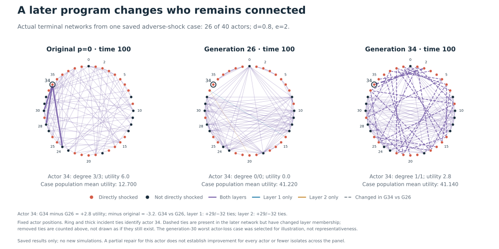
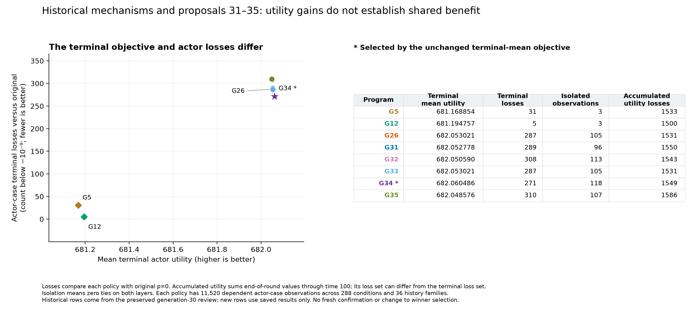
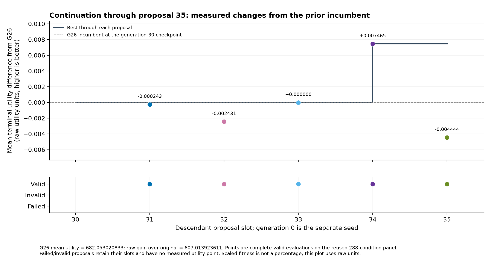

# Cooperation under Partial Shocks
### Evolving decentralized decision rules in multiplex networks with ShinkaEvolve

*An executable study of coordination, adaptation, and unequal gains in the Burghardt–Maoz model.*

[Selected program](docs/studies/cooperative_network_generation35/selected_program/main.java) · [Scientific review](docs/studies/cooperative_network_generation35/generation35_review.md) · [All programs](docs/studies/cooperative_network_generation35/PROGRAM_INDEX.md) · [Evidence and reproducibility](#7-evidence-and-reproducibility)

## Abstract

Cooperative networks must adapt when the costs of maintaining relationships change for some participants but not others. Without an authority assigning connections, individually attractive decisions can prevent actors from building collectively valuable structures. We investigate whether executable decision rules evolved by ShinkaEvolve can overcome this coordination problem in a reconstruction of Burghardt and Maoz's cooperative multiplex-network model.

The completed 35-generation experiment discovers a family of policies that temporarily construct overlapping groups, tolerate some immediately costly relationships, and subsequently return to individually beneficial adjustment. The final selected program, generation 34, achieves substantially higher average terminal utility than the matched original policy on the development panel. However, some actors lose, exclusion increases, and higher absolute utility does not establish greater resilience to shocks. The result identifies a computational mechanism and its distributional costs. Generalization to fresh histories, the stability of the constructed groups, and the political feasibility of their shared membership convention remain open questions.

**Keywords:** multiplex networks · cooperation under anarchy · partial shocks · program evolution · collective intelligence · distributional effects

## 1. Introduction

Cooperation is organized through relationships. Trade, security, technology, and institutional ties can connect the same participants in several overlapping networks. These connections create opportunities for coordination while also exposing actors to changes in their partners' circumstances. A shock need not affect every participant directly to alter the incentives and structure of an entire network.

This tension matters in an age of weaponized interdependence. Farrell and Newman show how asymmetric economic networks can create opportunities for surveillance and exclusion by states controlling central nodes. Their argument motivates attention to **who benefits from a network, who depends on whom, and who can be excluded**, alongside aggregate performance. The present simulation examines a narrower mechanism: costly bilateral cooperation across two layers, with changing incentives and no central allocation of ties. It contains neither jurisdiction over global hubs nor a strategic coercer. [Farrell and Newman, 2019](https://www.belfercenter.org/publication/weaponized-interdependence-how-global-economic-networks-shape-state-coercion)

Our question is:

> **Can evolved local decision rules improve cooperation after partial shocks—and how are their gains and losses distributed across the network?**

The experiment extends the explanatory model of [Burghardt and Maoz (2018)](https://doi.org/10.1038/s41598-018-31960-y). Their study examines how noise and network incentives shape formation and adaptation. Here, ShinkaEvolve searches for executable actor policies within a fixed simulation and evaluation design. The contribution is an inspectable policy, its evolutionary history, and a comparison of collective and individual outcomes.

The completed run supports three findings. Scheduled group construction can produce large development-panel gains over immediate-improvement behavior. Later search mostly refines an established mechanism. Finally, policies with almost identical averages can produce markedly different exclusion and loss patterns. Each finding concerns the **same experiment through proposal 35**; earlier project versions are not pooled into its evidence.

## 2. Model and experimental design

### 2.1 Cooperative relationships across two layers

The model contains 40 actors and two undirected network layers. A tie requires both endpoints' consent to form; either endpoint can terminate it. Actors can add, remove, or replace relationships. No central authority assigns the network.

An actor's utility is

$$
u_i = \sum_{\ell=1}^{2}
\left(k_{i\ell}-c_{i\ell}k_{i\ell}^{2}+d\,z_{i\ell}\right)+e\,v_i.
$$

Here, $k_{i\ell}$ is its degree in layer $\ell$, $c_{i\ell}$ its relationship-cost coefficient, $z_{i\ell}$ the number of triangles containing it, and $v_i$ its number of partners connected on both layers. Parameters $d$ and $e$ reward triangle closure and cross-layer overlap.

These complementarities create a coordination problem: a relationship can be unattractive in isolation but valuable once further relationships complete a triangle or reinforce cooperation across layers. Utility is measured in model units, with no monetary or national-welfare calibration.

The authors' [pinned Java source](https://github.com/KeithBurghardt/MultiplexShockCode/tree/b3d7737613578da260fee561b6f73122dc4f2ab0) supplies the primary behavioral reference. The implementation records differences between the paper's prose and its executable code, gives precedence to the latter, and discloses the full observation horizon and independently seeded shock recipients as overrides. This is a documented reconstruction and optimization extension; exact reproduction of every published figure and statistic is unfinished. [Source mapping](docs/studies/cooperative_network_generation35/source/documentation/source_behavior_mapping.md) · [Methods audit](docs/studies/cooperative_network_generation35/source/documentation/source_methods.md)

### 2.2 Formation, shock, and subsequent adaptation

Both layers start empty. Actors form relationships through time 50, after which the intervention changes selected actors' costs in both layers. Simulation continues to time 100.

| Component | Specification |
|---|---|
| Population and network | 40 actors; two undirected layers |
| Adverse shocks | Costs rise from 0.2 to 0.6 for 13, 26, or 40 actors |
| Favorable shocks | Costs fall from 0.6 to 0.2 for 13, 26, or 40 actors |
| Controls | Costs remain at 0.2 or at 0.6 |
| Incentives | $d$ and $e$ independently take 0, 0.4, 0.8, 1.2, 1.6, or 2 |
| Development panel | 288 conditions: 36 incentive combinations × eight shock/control conditions |
| Selection objective | Mean actor utility at time 100, averaged equally across conditions |
| Original comparator | Fixed-noise policy $p=0$, selected before evolution from four original-policy variants |

Each condition has one development history. The eight related cases within an incentive combination form a history family: the panel contains **36 independent history families**, not 288 independent replications. Policies share paired external seeds and shock recipients; different decisions can still change endogenous random trajectories. The original-behavior seed matched the comparator before discovery.

The selection objective has no constraint requiring every actor to benefit. Distributional outcomes and cumulative utility are reported separately. The [frozen design](docs/studies/cooperative_network_generation35/source/experiments/paper_trajectory_v2/scientific_contract.json), [development cases](docs/studies/cooperative_network_generation35/source/experiments/paper_trajectory_v2/development_cases.json), and [comparator selection](docs/studies/cooperative_network_generation35/source/experiments/paper_trajectory_v2/reference_comparator_selection.json) preserve the comparison.

## 3. Program evolution

### 3.1 What evolves

ShinkaEvolve edits Java policies with two entry points:

~~~java
void act(Turn turn, Memory memory);
Decision accept(Offer offer, Memory memory);
~~~

The program controls partner choice, additions, deletion, rewiring, inaction, and acceptance of offers. Every actor runs the same policy with separate private memory. It receives permitted local observations, public identifiers and parameters, its own costs, and simulation time. It cannot inspect the global graph, other actors' private costs, or hidden shock recipients.

The utility equation, shock process, evaluator, and execution limits remain fixed. These permissions make the evolved object broader than a single exploration probability, while retaining the underlying network-formation problem. [Policy interface and task](docs/studies/cooperative_network_generation35/source/frozen/task_prompt.md)

### 3.2 Native ShinkaEvolve mechanisms

The recorded search uses native parent and inspiration selection, mutations, island populations, migration, model selection, code-novelty checks, meta recommendations, and prompt evolution. The final review distinguishes enabled features from observed events:

| Mechanism | Evidence retained in this campaign |
|---|---|
| Islands and migration | Three populated islands; eight recorded migration moves at proposals 10, 20, and 30 |
| Parent and inspiration selection | Accepted programs retain their parent, inspirations, and sampling island |
| Model-selection bandit | Restored native UCB state, selections, submissions, and rewards |
| Code novelty | Local embeddings and conditional novelty judging; novelty admission does not imply new network behavior |
| Meta memory | Three completed updates covering 30 evaluated programs; generations 32–35 remain in the pending buffer |
| Prompt evolution | The third evolved prompt was created after G32 and used for G33–G35 |

For proposals 31–35, the mutation routes were subscription-backed Sol and Astra at **xhigh** effort. G34 was generated by Sol from parent G30, with G22 and G26 as inspirations, on island 2. Supervising-agent effort is a separate setting. No new island migration occurred during these last five proposals. [Native mechanism audit](docs/studies/cooperative_network_generation35/tables/generation35/native-mechanisms.md) · [Detailed receipts and accounting](docs/studies/cooperative_network_generation35/generation35_review.md)

“Generation” denotes a numbered proposal slot, not necessarily another step along one lineage. The run ends at **35 descendant proposal slots, with 32 valid descendants**, plus the separate seed. G1 had no accepted program, G2 was invalid, and G14 failed before evaluation. They are retained as failures, without scientific scores.

## 4. The discovered policy

The final selected program is **G34**. Its central mechanism is scheduled construction of overlapping groups followed by a return to the original policy.

| Phase | Executed behavior |
|---|---|
| Before time 50 | Follow original immediate-improvement behavior |
| Time 50 to before 93 | If triangle benefit $d\geq0.4$, construct preferred groups across both layers |
| From time 93 | Return to original immediate-improvement behavior |
| When $d<0.4$ | Retain original behavior throughout |

During construction, each actor compares hypothetical balanced partitions, using **its own costs** and public incentives as if costs were homogeneous. It selects a preferred number of groups. Membership follows a public-ID convention:

~~~java
return actor % cohortCount == other % cohortCount;
~~~

G34 introduced this round-robin convention in place of contiguous ID blocks. Actors then remove outside-group connections, add missing within-group connections, and prioritize partners already connected on the other layer. They accept finite within-group offers even when the immediate payoff change is negative. Rejected partners are remembered and avoided for subsequent initiated construction offers.

This is an explicit route through a coordination barrier: temporary local losses can help assemble structures with triangle and overlap benefits. However, actors with different costs can prefer different group counts and incompatible memberships. The code supplies a shared convention; it does not demonstrate negotiated agreement over who belongs where. No ablation has isolated each component's causal contribution. [Read the selected executable](docs/studies/cooperative_network_generation35/selected_program/main.java)

*Figure 1. Changing membership can redistribute exclusion.* These are saved terminal networks in a selected adverse-shock case with 26 affected actors, $d=0.8$, and $e=2$. Actor 34 ends with utility 6.0 under the original, zero under G26, and 2.8 under G34. The corresponding population means are 12.700, 41.220, and 41.140. This deliberately adverse example illustrates a mechanism; it is not a prevalence estimate. [Figure data and provenance](docs/studies/cooperative_network_generation35/figures/generation35-network-example.json)

## 5. Results through generation 35

### 5.1 Collective gains and their distribution

The final policy produces denser networks with more cross-layer overlap. On the development panel, mean degree per actor per layer rises from 5.2673 under the original to 25.1095 under G34; mean overlap fraction rises from 0.6541 to 0.9384. Undefined overlap ratios are counted as zero.

| Policy from this run | Mean terminal utility | Terminal-loss observations | Isolated observations | Cumulative-loss observations |
|---|---:|---:|---:|---:|
| Original comparator | 75.0391 | — | 45 | — |
| G12: retained lower-harm alternative | 681.1948 | 5 | 3 | 1,500 |
| G26: leader through proposal 30 | 682.0530 | 287 | 105 | 1,531 |
| **G34: selected through proposal 35** | **682.0605** | **271** | **118** | **1,549** |

Losses compare the same actor and case against the original, using a difference below $-10^{-9}$. Each policy has 11,520 actor-case observations across related simulations; these are not independent people or replications. Isolation means no ties in either layer. Cumulative utility sums saved end-of-round utility through time 100 without discounting.

G34's raw mean gain over the original is **607.021389 utility units**. Its native score of **2.845995745** is that gain divided by the frozen positive scale 213.28963331061775. **The score is not a percentage improvement.**

The distribution matters. G34's terminal losses include 171 observations among directly affected actors under adverse shocks and 100 among unaffected actors under favorable shocks. Thus an actor can lose through reorganization even when its own costs do not rise.

*Figure 2. Similar averages conceal different social outcomes.* G12 sacrifices a small amount of mean terminal utility relative to G34 while producing far fewer terminal losses and isolates. It remains an informative alternative, although the frozen mean-utility objective selects G34. All measurements come from the development panel. [Numerical review](docs/studies/cooperative_network_generation35/tables/generation35/review.json)

### 5.2 What the final five proposals added

Most of the substantial gain over the original had already appeared with early group-construction policies in this run. The final continuation tested refinements to timing, membership, and partner selection.

| Proposal | Main change relative to its parent | Mean terminal utility |
|---|---|---:|
| G31 | Completion-aware construction handoff | 682.052778 |
| G32 | Rank overlapping partners by common cohort neighbors | 682.050590 |
| G33 | Restore cleanup at time 93 rather than 95 | 682.053021 |
| **G34** | **Replace contiguous membership with round-robin groups** | **682.060486** |
| G35 | Break layer-choice ties using overlap availability | 682.048576 |

*Figure 3. One small improvement at the final search boundary.* G34 raises mean utility by 0.007465278 over G26. The plotted differences use G26 as their fixed reference, including the point for G35. These are development measurements, not fresh-history significance estimates.

The plateau has a substantive explanation. All 288 retained compressed trajectories for G31 match G22, and all 288 for G33 match G26. Source-code variation sometimes rediscovered existing behavior. G34 changes group membership within the established construction mechanism. This supports **local refinement and behavioral repetition**; it does not prove a global optimum or that further search could never help. [Proposal-by-proposal review](docs/studies/cooperative_network_generation35/generation35_review.md)

### 5.3 Higher utility does not establish greater shock resilience

G34 and the original share the same time-50 graphs and actor utilities in all 288 development cases. G34 subsequently reorganizes unchanged-cost controls as well as shocked networks: construction follows a schedule and does not require detection of a shock.

For the 13-actor adverse shock, G34's mean terminal utility is **285.911111 units below its own unchanged-low-cost control**. The original policy's corresponding penalty is **29.459722**. A higher absolute payoff in a shocked condition therefore coexists with a larger penalty relative to the policy's own control.

These contrasts also differ from the original paper's normalized resilience and flexibility measures. The supported result is improved average terminal utility on the development panel; broad claims of superior resilience require additional evidence.

## 6. Discussion

### 6.1 Coordination without central edge allocation

The experiment demonstrates how local actions under bilateral consent can assemble highly organized networks. Yet decentralization has several meanings. Actors control their own ties, but every actor receives the same externally selected program, public-ID convention, and phase schedule. ShinkaEvolve optimizes that shared program against a population-level objective.

Consequently, the resulting network is generated through decentralized interaction, while the membership rule is explicitly programmed. This is not evidence that independent actors spontaneously negotiated institutions or adopted a common strategy. Nor is it cooperative coevolution of separately evolving actor populations.

### 6.2 Formation, maintenance, and exclusion

A group can be valuable when assembled and difficult to sustain under subsequent unilateral choices. The saved actor-34 example separates these stages: under G26, the actor participates in a beneficial overlapping structure during construction but becomes isolated during the final return to immediate-improvement behavior. The retained paths identify the transition; they do not provide an action-level causal trace proving which component caused it.

Bilateral consent protects an actor against an unwanted new connection. It does not protect against a partner leaving. This distinction helps explain why collective gains, individual participation, and stability need separate assessment. G12's near-leading utility with fewer losses further shows that the scalar selection objective does not exhaust the interesting solutions. [Research synthesis](docs/studies/cooperative_network_generation35/research_synthesis.md)

### 6.3 Implications for cooperation under anarchy

For international-relations research, the model makes a useful question concrete: **who bears the temporary and continuing costs of building a cooperative order when participation and exit remain decentralized?** It also shows how actors untouched by a shock can suffer when others reorganize their relationships.

For a future study of Japan's Indo-Pacific partnerships, the relevant questions concern mutual reinforcement, membership, and dependence. Here, that connection is an interpretation to investigate, not an empirical finding about Japan. The simulation has no national capabilities, alliance obligations, territorial threats, institutional bargaining, transfers, or endogenous coercion. Its payoffs represent abstract network utility, without specified geopolitical preferences.

A useful next political extension would therefore ask how membership conventions become acceptable, how vulnerable participants remain included, and whether institutions can sustain cooperation after its construction phase. Those mechanisms would require an explicitly revised experiment.

### 6.4 Limits and the next scientific comparison

All programs were selected on a repeatedly used development panel. There has been **no fresh-history confirmation** of G34, no proof of an optimal policy, and no calibrated national-policy evaluation. Population size, timing, identifiers, incentives, and shared-code deployment restrict the scope of the findings. The full reference reproduction is also incomplete.

The most informative next comparison is a frozen G34 against the original and retained G12 on fresh paired histories, with uncertainty assessed at the history-family level. It should measure terminal and cumulative utility, exclusion, and matched shock/control effects. Testing public-ID permutations and alternative intervention times would probe reliance on the supplied convention and schedule. These are proposed follow-ups, not completed results.

## 7. Evidence and reproducibility

The generation-35 research record is available **inside this repository**:

| Research object | Location |
|---|---|
| Selected executable | [G34 Java policy](docs/studies/cooperative_network_generation35/selected_program/main.java) |
| All proposal slots, source, metrics, and failures | [Program index](docs/studies/cooperative_network_generation35/PROGRAM_INDEX.md) |
| Detailed scientific interpretation | [Generation-35 review](docs/studies/cooperative_network_generation35/generation35_review.md) · [Research synthesis](docs/studies/cooperative_network_generation35/research_synthesis.md) |
| Original source, adapters, evaluator, and frozen task | [Source packet](docs/studies/cooperative_network_generation35/source/) |
| Numerical results and native mechanism evidence | [Review tables](docs/studies/cooperative_network_generation35/tables/generation35/) |
| Consistent database and matching search state | [Checkpoint documentation](docs/studies/cooperative_network_generation35/checkpoint/README.md) |
| File inventory, hashes, and publication scope | [Contents and omissions](docs/studies/cooperative_network_generation35/CONTENTS.md) · [Provenance](docs/studies/cooperative_network_generation35/PROVENANCE.json) |

The compact publication contains the programs, selected figures, review data, source packet, and final checkpoint. Full raw trajectory caches and some execution receipts remain in the pinned original archive identified by the inventory; it is not a standalone portable runtime.

<strong>Completed run and historical context</strong>

The authorized run stopped after descendant proposal 35, retaining G34 as the selected program. The seed is generation 0; 32 descendants are valid. The consistent checkpoint is <code>programs-036.sqlite</code> with matching <code>native-036</code> state. Its suffix counts the seed and proposal target; it does not mean generation 36 was executed. Fresh confirmation and further discovery remain unperformed.

This README reports <code>paper_trajectory_v2</code>, the Burghardt–Maoz cooperative-network experiment. The repository also preserves earlier multi-swarm PSO research. Its [previous README](https://github.com/ReloadLightly/shinka-adaptive-swarms/blob/fef985a4f08039cfbed466d0c51833dae920dcd1/README.md) and [artifact inventory](artifacts/README.md) retain that separate work. PSO outcomes and the earlier restricted exploration-policy experiment are not evidence for the results reported here.

## References

1. Burghardt, K., and Maoz, Z. (2018). [Partial Shocks on Cooperative Multiplex Networks with Varying Degrees of Noise](https://doi.org/10.1038/s41598-018-31960-y). *Scientific Reports*, 8, 13619. [Original code](https://github.com/KeithBurghardt/MultiplexShockCode).
2. Lange, R. T., Imajuku, Y., and Cetin, E. (2025). [ShinkaEvolve: Towards Open-Ended and Sample-Efficient Program Evolution](https://arxiv.org/abs/2509.19349). arXiv:2509.19349. [Framework documentation](https://sakanaai.github.io/ShinkaEvolve/).
3. Farrell, H., and Newman, A. L. (2019). [Weaponized Interdependence: How Global Economic Networks Shape State Coercion](https://doi.org/10.1162/ISEC_a_00351). *International Security*, 44(1), 42–79.

Further primary literature and the limits of the international-relations interpretation are discussed in the [research synthesis](docs/studies/cooperative_network_generation35/research_synthesis.md).
