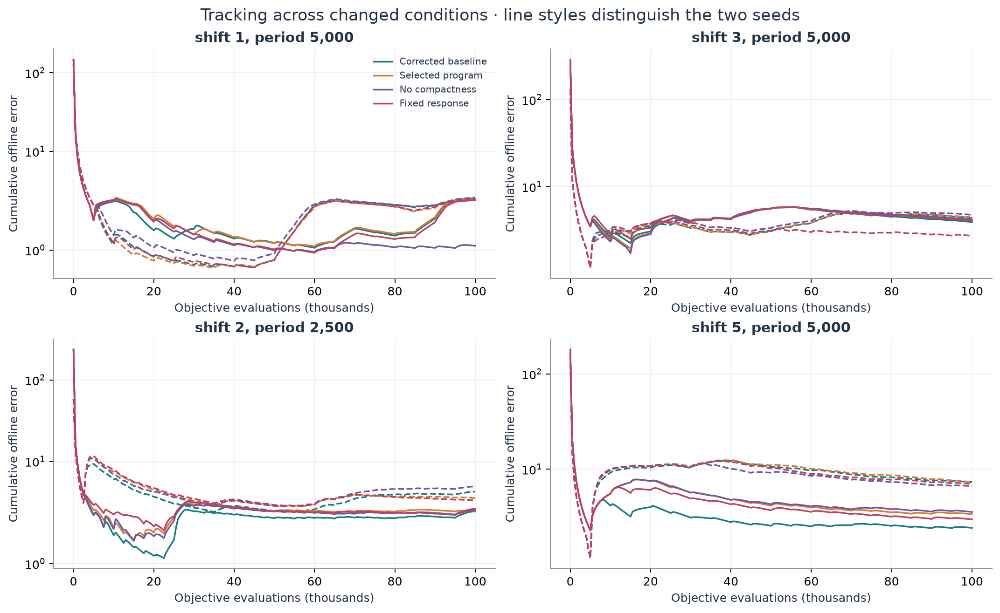
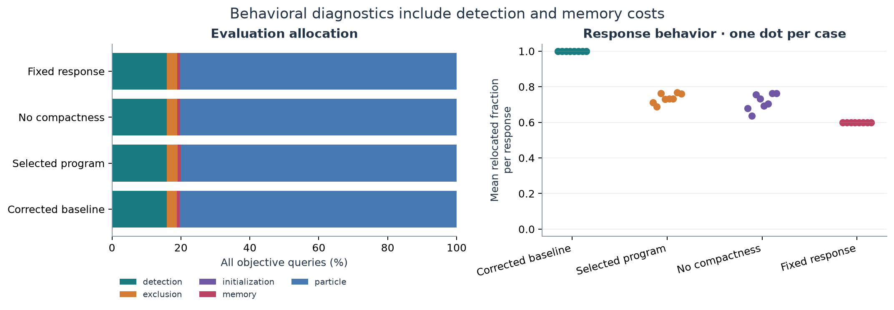

# Frozen-program comparison and mechanism study

The search-selected program did **not** improve mean offline error against the
corrected baseline on this independent suite: **3.7857 versus 3.7230**. Its mean
paired difference was **+0.0627**, with a stratified bootstrap 95% interval of
**[−0.1470, +0.2724]**. A simple constant response had lower pooled error than the
selected adaptive program. The compactness ablation produced mixed effects across
regimes. These results limit the interpretation of the search improvement.

All **32 method cases** completed at **2026-09-16 00:23:42 UTC**, with no missing
cases. This report uses the saved [comparison summary](../artifacts/comparison/20260916T001949Z-frozen/summary.json),
[frozen selection record](../artifacts/comparison/20260916T001949Z-frozen/freeze.json),
and [case manifest](../artifacts/comparison/20260916T001949Z-frozen/manifest.json).

## Selection and provenance

The native ShinkaEvolve run `20260915T101024.562418Z-search` completed generations
0–19: one evaluated seed and 19 evaluated descendants, each on four cases of
50,000 objective evaluations. Its 21 database rows include a native seed island
copy, which is not an additional evaluation or discovery. The selected program is
generation 12, ID `e671664f-bcd3-4e00-b681-7b532d7daa22`, the correct archive entry
with the highest selection score, **0.3366612734**. Its mean search offline error
was **1.9703446131**, compared with the seed's **2.7750772829**. These are search
outcomes, not independent estimates of the selected program's advantage.

The direct parent chain is generations **0 → 4 → 9 → 10 → 12**. Generation 12
added a compact-swarm recovery floor to generation 10's controller. The selected
source SHA-256 is
`dcd01e2613b8226270383a4bce4ff2839bf44872a40d92cbb7b50ea54033af02`.
Its authentic parent SHA-256 is
`c4e796efe2e343c703c15c308973d30af991eeb14420a7c6517d256f666b729b`.
The source and parent were checked against the native archive. Both perform only
arithmetic on `relative_fitness_drop`, `default_radius`, and `swarm_diameter`,
using `float`, `min`, and `max`; neither accesses files, seeds, benchmark internals,
or latent landscape state.

The [native SQLite archive](../artifacts/evolution/20260915T101024.562418Z-search/programs.sqlite),
[selected source](../artifacts/comparison/20260916T001949Z-frozen/programs/selected.py),
[parent ablation](../artifacts/comparison/20260916T001949Z-frozen/programs/no_compactness.py),
and [constant control](../artifacts/comparison/20260916T001949Z-frozen/programs/fixed_response.py)
retain the executable evidence. The original completed search was reused after
the VS Code/WSL crash; the controller had already finished, leaving no unfinished
search work to resume.

Programs and control definitions were frozen at **2026-09-16 00:19:49 UTC**;
comparison execution began at **00:20:13 UTC**. A readiness audit agent had already
read the existing suite configuration before this freeze. No comparison outcomes
existed, no candidate mutations followed that inspection, and the supervising
agent selected exclusively by search score and defined controls from source
without viewing the comparison cases. The freeze precedes execution and the
runner's suite load; it does not establish that every investigator was blind to
the suite configuration. This disclosure is retained in `freeze.json`.

The original mutation route was subscription-authenticated
`headless/codex@gpt-6-astra`. Its internal reasoning effort was unspecified; it is
not labeled Ultra. The comparison required no model mutations or API calls.

## Programs and mechanism questions

All methods share the documented corrected `(5+0)` multi-swarm optimizer. Swarm
creation, exclusion, PSO motion, objective accounting, and the corrected
uniform-volume relocation sampler are unchanged. The upstream DEAP sampling
defect was corrected before evolution and is not credited as a discovery.

| Method | Relocation response | Question |
|---|---|---|
| Corrected baseline | Radius multiplier 1; all five particles | Reference algorithm |
| Selected generation 12 | Loss-dependent response, dispersion adjustment, compactness floor | Does the search-selected controller transfer? |
| No compactness | Exact native generation 10 parent; removes only the floor | Does the compactness addition help? |
| Fixed response | Radius multiplier 2; fraction 0.60 | Does the selected state dependence add value over this simple constant? |

Every method reevaluates personal-best memories and preserves velocities. The
fixed response is an investigator-defined control, not an evolved discovery or a
tuned optimum. Its constants are the selected controller's compactness-floor
values, fixed before comparison outcomes.

The selected program first maps nonnegative relative fitness loss to a radius
multiplier and requested relocation fraction. The endpoints are `(0.75, 0.40)`
at losses up to 0.03, `(1.75, 0.60)` at 0.08, and `(2.50, 0.80)` at 0.15 or
greater, with linear interpolation between endpoints. When swarm diameter grows
from four to eight default radii, a continuous adjustment reduces the response
toward a more conservative schedule. Its target at severe loss is `(2.0, 0.60)`.

Generation 12's addition applies when diameter is below twice the default radius.
With weight `max(0, 1 - diameter / (2 * default_radius))`, it raises radius
multipliers below 2 and requested fractions below 0.60 toward those values.
Stronger responses remain intact. The hypothesized benefit is recovery from
spatial displacement when observed fitness loss is small and current particle
coverage is narrow. This is a hypothesis tested by the parent ablation, not a
conclusion inferred from the code alone.

The simulator selects **`ceil(5 * fraction)` particles**. Thus 0.40 selects two of
five, 0.60 selects three of five, and 0.80 selects four of five; intermediate
requested fractions are rounded upward to whole particles. The fixed control
always selects three of five, and the baseline selects five of five. The default
radius is half the configured movement severity, so fixed multiplier 2 gives a
radius equal to that severity. Reported behavior distinguishes the requested
continuous fraction from the fraction of particle indices selected for relocation.

Floating-point arithmetic matters at the boundary: the evolved expression can
return `0.6000000000000001`, which selects four particles under `ceil(5 * fraction)`.
This occurred in 29 of the selected program's 204 search responses. The executed
program was frozen without rounding corrections; the behavior table below reports
actual particle selections, including such effects. A correction after selection
would define a different policy and is not folded into these results.

## Independent protocol and measurement

The suite contains eight independent environment/optimizer seed pairs, with four
methods evaluated on each: **32 method cases and 3,200,000 objective evaluations**.
Each method receives exactly **100,000 evaluations per case**. Change detection,
memory reevaluation, initialization, ordinary particle updates, and exclusion
reinitialization all consume this budget. Equal budgets and identical environment
history hashes are validated for every comparison. Environment RNGs are separate
from optimizer RNGs; different relocation decisions cannot alter the environmental
sequence. Matching optimizer seeds do not imply matching particle trajectories.

All cases use five dimensions, ten conical peaks, five particles per swarm,
`NEXCESS=1`, domain `[0,100]^5`, and movement correlation zero. Two independent
cases are used in each regime:

| Movement severity | Evaluations between changes | Interpretation |
|---:|---:|---|
| 1 | 5,000 | Reference regime, fresh seeds |
| 3 | 5,000 | Regime seen during search, fresh seeds |
| 2 | 2,500 | Joint shift in severity and change frequency |
| 5 | 5,000 | Larger displacement than in search |

The comparison horizon is twice the search horizon. Its changes in outcome
therefore combine new seed histories, a longer horizon, and, for the latter two
regimes, changed environmental conditions. The severity-2/period-2,500 regime
does not isolate frequency from severity. Landscape dimensionality and number of
peaks were not varied.

Offline error is the average gap between the current optimum and the best fitness
observed since the latest environmental change. Lower is better. The reported
effect is **method error minus comparator error**; negative favors the method.
Paired bootstrap intervals resample independent case differences within each
regime and retain the fixed regime weights, with 20,000 replicates and analysis
seed 20260915. Responses and checkpoints are not independent replications.

Only two cases per regime support the intervals. Their coverage and stability are
uncertain, and the pooled effect describes this equally weighted mixture of four
regimes rather than an unspecified population of dynamic landscapes. No
significance claim or broad generalization follows from a favorable pooled mean.

## Saved results

| Method | Mean offline error | Paired difference from baseline | Stratified bootstrap 95% interval | Cases better / worse than baseline |
|---|---:|---:|---|---:|
| Corrected baseline | 3.7230 | — | — | — |
| Selected generation 12 | 3.7857 | +0.0627 | [−0.1470, +0.2724] | 2 / 6 |
| No compactness | 3.8037 | +0.0807 | [−0.3230, +0.4843] | 2 / 6 |
| Fixed response | 3.4496 | −0.2734 | [−0.6272, +0.0804] | 5 / 3 |

The selected-minus-baseline paired SD is 0.4475 and ordinary SE is 0.1582;
the SE conditional on the fixed regime mixture is 0.1499. The means do not show
an independent advantage for the selected program. The fixed control's advantage
over the baseline is also uncertain on this small suite.

| Severity / period | Baseline | Selected | No compactness | Fixed response | Selected − baseline |
|---|---:|---:|---:|---:|---:|
| 1 / 5,000 | 2.5071 | 2.4925 | 1.8454 | 2.4612 | −0.0145 |
| 3 / 5,000 | 4.1628 | 4.2871 | 4.4826 | 3.4135 | +0.1243 |
| 2 / 2,500 | 3.3473 | 3.0108 | 3.7838 | 2.9238 | −0.3365 |
| 5 / 5,000 | 4.8749 | 5.3524 | 5.1029 | 5.0000 | +0.4775 |

The selected program is slightly better on average in the reference regime and
more clearly better in the joint severity/frequency shift. Each advantage comes
from one favorable case and one unfavorable case. It is worse on both cases at
severity 3 and on both cases at severity 5. Larger displacement did not produce
the hypothesized general recovery advantage.

Per-case values are retained to show the heterogeneity hidden by pooled means:

| Environment / optimizer seeds | Severity / period | Baseline | Selected | No compactness | Fixed response |
|---|---|---:|---:|---:|---:|
| 501 / 1501 | 1 / 5,000 | 2.4663 | 2.4953 | 1.0969 | 2.4081 |
| 502 / 1502 | 1 / 5,000 | 2.5479 | 2.4897 | 2.5940 | 2.5143 |
| 503 / 1503 | 3 / 5,000 | 3.9389 | 4.0941 | 4.2042 | 4.0916 |
| 504 / 1504 | 3 / 5,000 | 4.3867 | 4.4801 | 4.7609 | 2.7355 |
| 505 / 1505 | 2 / 2,500 | 2.4411 | 2.4737 | 2.6252 | 2.5307 |
| 506 / 1506 | 2 / 2,500 | 4.2534 | 3.5478 | 4.9425 | 3.3168 |
| 507 / 1507 | 5 / 5,000 | 2.4244 | 3.3716 | 3.5592 | 2.9757 |
| 508 / 1508 | 5 / 5,000 | 7.3254 | 7.3332 | 6.6466 | 7.0243 |

## Mechanism interpretation

| Comparison | Mean paired difference | Stratified bootstrap 95% interval | Cases favoring method / comparator |
|---|---:|---|---:|
| No compactness − selected | +0.0180 | [−0.3253, +0.3612] | 2 / 6 |
| Fixed response − selected | −0.3361 | [−0.5898, −0.0823] | 6 / 2 |

Removing the compactness addition worsened six of eight cases but changed the
pooled mean by only +0.0180. Its regime-specific effects were −0.6471 at severity 1,
+0.1954 at severity 3, +0.7730 at severity 2/period 2,500, and −0.2495 at severity 5.
Here positive favors retaining compactness. The large favorable parent outcome on
environment seed 501 and the adverse parent outcome on seed 506 illustrate why a
case win count alone cannot establish the mechanism's value. The floor helped
both cases in the faster-changing regime and both at severity 3, but did not give
a consistent advantage across all tested conditions.

The constant control beat the selected program on six of eight cases and had a
lower regime mean in all four regimes. Its pooled bootstrap interval against the
selected program excludes zero under this analysis, but two cases per regime
make interval coverage uncertain. The result supports a limited conclusion: this
particular evolved state dependence did not add demonstrated value over the
predefined constant response on these cases. It does not identify an optimal
constant policy or establish that adaptation generally cannot help.

| Method | Responses | Mean radius multiplier | Mean requested fraction | Mean fraction selected for relocation | Detection queries | Memory queries |
|---|---:|---:|---:|---:|---:|---:|
| Corrected baseline | 1,355 | 1.0000 | 1.0000 | 1.0000 | 15.9635% | 0.8469% |
| Selected | 1,283 | 2.1856 | 0.7037 | 0.7359 | 15.9144% | 0.8019% |
| No compactness | 1,277 | 2.0124 | 0.6781 | 0.7135 | 15.9440% | 0.7981% |
| Fixed response | 1,263 | 2.0000 | 0.6000 | 0.6000 | 15.9475% | 0.7894% |

These are descriptive pooled response averages, not independent observations for
inference. All logged responses in this comparison completed. The selected
program relocated two particles in 81 responses, three in 249, and four in 953;
the parent counts were 222, 108, and 947. The fixed control relocated three
particles in all 1,263 responses, preserving two positional anchors each time.
Ordinary particle evaluation still occurs for every particle, so relocating fewer
particles does not create free objective queries. Similar detection and memory
shares are consistent with the methods differing mainly in relocation behavior.

An action-level replay of the parent on the selected trajectory's saved public
observations finds that the added compactness block changed radius in 278 of
1,283 responses and requested fraction in 232. This replay uses no new objective
evaluations and does not estimate a counterfactual trajectory. It verifies that
the tested block was active; the actual paired parent runs establish its mixed
performance effect.

The scientific outcome is therefore a **search improvement without established
independent improvement**, with evidence that a simpler constant response can
match or exceed this controller. The study preserves that result rather than
extending the search or changing the comparison suite after viewing outcomes.
It remains limited to the corrected `(5+0)` algorithm, this interface, these eight
histories, and the tested horizons and conditions; it does not compare against
all algorithms or the stronger `(5+1)` variants in the source chapter.

*Measured 5D trajectories; solid and dashed lines distinguish the two independent
seeds within a regime. These checkpoints are repeated measurements.*

*All objective queries are counted. Each response-behavior dot summarizes one
independent case; particle relocation uses the executed integer counts.*

## Reuse and verification

Each completed method case is saved atomically as `case_XXX.json.gz`. Resume
validates the frozen program and simulator fingerprints, full case configuration,
and run signature before reusing it. No completed search or reconstruction
evaluation was repeated for this comparison. Focused tests passed for rejection
of differing environmental histories or budgets, provenance verification,
resumption after a saved baseline case, and bootstrap regime weighting.

The existing three-case reconstruction at 500,000 evaluations per case remains
separate evidence, with mean offline error 1.7024473162. It is not used as the
paired baseline here because its seeds and evaluation horizon differ. The book's
reported result and the project's reconstruction remain distinct from the fresh
comparison, as documented in [the reproduction record](reproduction.md).
