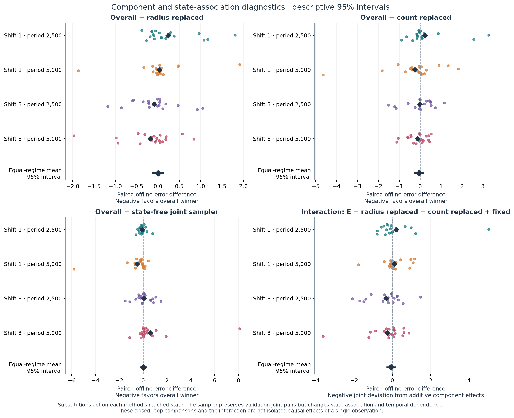
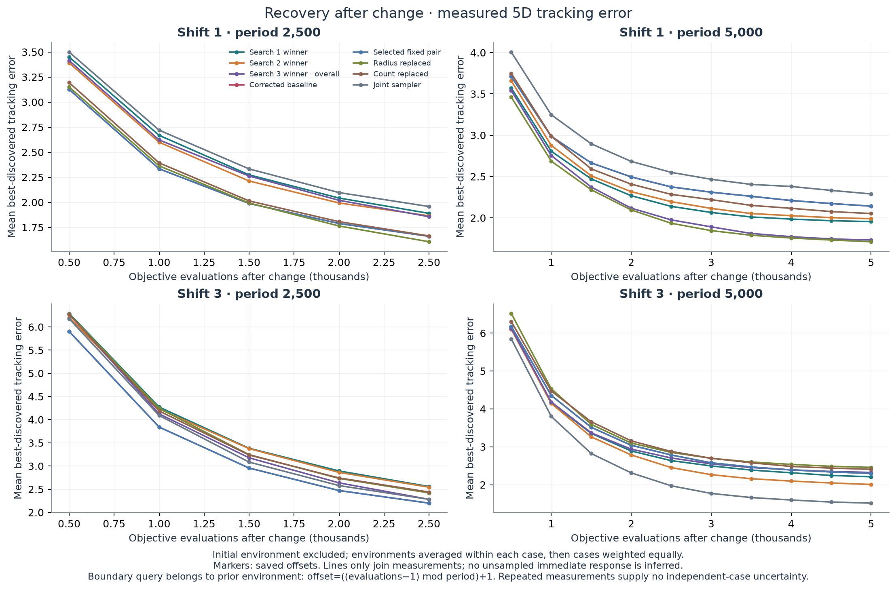

# Joint relocation v3: study record

**The completed v3 study did not demonstrate superiority or useful state
dependence.** On 80 fresh paired cases, the validation-selected overall winner
had mean offline error **3.500558**, versus **3.477853** for both the corrected
baseline and the validation-selected fixed pair. Its paired difference was
**+0.022706**, with the predeclared 97.5% interval **[−0.204384, +0.236831]**;
negative favors the evolved method. The state-free joint sampler comparison
was **+0.010187 [−0.229577, +0.280526]** at 95%. All global component and
interaction intervals also include zero. These results neither establish an
improvement nor establish equivalence.

Three native searches completed 90 evaluated slots, including three seeds and
87 descendants, followed by frozen validation, selection and final comparison.
The campaign retained **2,960 case executions and 296 million objective
queries**, excluding preparation. Every final case and large error remains in
the analysis. The study follows the frozen [v3 protocol](followup_joint_relocation_v3.md)
and [review of v2](review_v2_and_next.md), with the explicitly dated alias
amendments below. Existing v1 and v2 results are preserved as separate evidence.
The [saved analysis](../artifacts/joint_relocation_v3/study_20260916/analysis.json)
and [independent final audit](../artifacts/joint_relocation_v3/operations/independent-final-analysis-audit.json)
support the measured results reported here.

## Question and controlled interface

Can a jointly chosen relocation count and radius improve tracking beyond both
the corrected Blackwell–Branke–Li reconstruction and a validation-selected fixed
count/radius pair? A second question is whether any benefit depends on the
observed state, on one component alone, or on their interaction.

`choose_relocation(observation)` returns exactly `{"count": k,
"radius_scale": r}`. The count is a Python integer from zero through the
subswarm size; the radius multiplier is finite and nonnegative. The simulator
keeps memory reevaluation and retained velocity fixed. The public observation
contains dimension, domain width, swarm size/count/diameter, previous and current
observed best fitness, absolute and relative fitness drop, recent improvement,
queries since the previous response, previous response radius, default radius,
observed best displacement and remaining budget. It contains no peak coordinates,
hidden optimum, environment seed, final inputs, or benchmark object. The known
severity-derived default radius remains public; this experiment therefore does
not test adaptation without that scale.

The [exact-source review](../artifacts/joint_relocation_v3/study_20260916/source_review.json)
approved all nine shortlisted programs before validation. They use permitted
scalar observations and local computation, without imports, external access,
external randomness, persistent state or budget manipulation. Python execution
is not a security sandbox; source inspection is part of this evidence.

An interior fraction `(k - 0.5) / swarm_size` encodes each positive integer count
for the simulator's ceiling rule; zero encodes zero. This encoding is distinct
from the allocated fraction `k / swarm_size`. Saved responses distinguish the
requested count, allocated indices, and relocated particles that actually
received objective evaluations. The last category can be smaller when the
budget ends during a response. Radius changes still update the remembered
response radius at count zero, so count-zero equivalence is restricted to
literal fixed controls whose subsequent actions do not depend on that memory.

The initial action, count five and radius multiplier one, has the corrected
baseline's executed behavior. The source-fidelity correction that preceded v1
is not an evolutionary discovery. The baseline remains the reconstructed
five-neutral/zero-permanent-quantum configuration, with the deviations described
in [reproduction.md](reproduction.md); it is not the stronger published 5+1
configuration. Execution success, search fitness, fresh-case performance and
evidence of a conditional mechanism are separate claims.

## Preparation, registration and completed search

The [preparation record](v3_preparation_checks.json) and
[archived native seed check](../artifacts/preparation_joint_v3/20260916-native-seed/runs/20260916T024936.637020Z-seed/manifest.json)
document one 1,000-query case with model calls disabled. Its two native database
rows are the seed placed on two islands, not two evaluated cases. The saved
case, program and manifest hashes match the preparation record. Its eight
complete responses all request, allocate and evaluate five relocated particles;
feedback correctly reports allocated fraction 1.0 and encoding fraction 0.9.
Focused preparation tests cover baseline-equivalent trajectories, all integer
counts, malformed outputs, budget-truncated responses and checkpoint reuse.
This seed-only historical profile does not demonstrate the richer novelty or
meta-analysis mechanisms required for the research searches.

The archived 1,000-query diagnostic is one exact preparation item, **not the
total preparation objective budget**. Focused implementation tests also used
small numerical fixtures; their cumulative queries were not instrumented and
cannot be recovered exactly from test counts or overlapping rerun summaries.
The [independent preparation-accounting review](../artifacts/joint_relocation_v3/operations/independent-preparation-accounting-scope.json)
separates those fixtures, the archived diagnostic, static alias checks, local
embedding development and research executions. Research totals here exclude
preparation. The early preparation record's zero embedding calls predates the
later six development requests over 46 texts.

The research used three native ShinkaEvolve searches, each with 30
terminal generation slots including the baseline-equivalent seed. All searches
shared 16 search cases, with independent search RNG seeds 610001, 610002 and
610003. The environment is 5D,
with ten peaks, severity one or three and change period 2,500 or 5,000; every
case has exactly 100,000 objective queries. Detection, initialization, exclusion,
ordinary particle evaluation and memory refresh all count against that budget.
Environment and optimizer randomness remain separate. The four regimes have
equal weight, with four search cases per regime. Domain bounds are [0,100],
movement correlation is zero, and every subswarm has five particles. Particle
positions are not clipped to the domain; a domain width is not a bound on
observed particle displacement.

The prospective implementation and resolved settings were committed as
`a66e6c3d7133091a3c9c4cecffccb68d8c641fc4` before registration at
03:38:26.565365 UTC and the campaign launch at 03:38:44 UTC. The
[registration](../artifacts/joint_relocation_v3/study_20260916/registration.json)
preserves the source snapshots, case manifests, analysis specification and
engine settings. An
[independent seed audit](../artifacts/joint_relocation_v3/operations/independent-prospective-seed-audit.json)
checked 2,153 JSON/GZ files, reserving 192 historical numeric seed values across
both RNG roles. All 96 proposed search/validation environment and optimizer
values were unique and collision-free; none required replacement.

| Search index | Native run | Started UTC | Native completion UTC | Evaluated slots / descendants | Saved cases |
|---|---|---|---|---:|---:|
| 0 | `search_0_seed_610001` | 03:38:44 | 04:43:40 | 30 / 29 | 480 |
| 1 | `search_1_seed_610002` | 04:43:48 | 05:44:45 | 30 / 29 | 480 |
| 2 | `search_2_seed_610003` | 05:45:13 | 07:38:23 | 30 / 29 | 480 |

Each actual database contains 31 rows, including one seed island copy; these
are not 31 evaluated programs. All slots contain valid evaluated programs,
with no terminal failed slots. Four novelty rejections caused additional
proposals within existing generation slots, not extra completed evaluations.

A [clock-discontinuity record](../artifacts/joint_relocation_v3/operations/clock-discontinuity-20260916.json)
documents about 47.5 minutes of wall-clock advance beyond monotonic elapsed
time during search 2. Host suspension or clock correction is consistent with
the record, but the cause was not directly observed. The original controller
survived and continued without restarting or repeating completed evaluations.
The start/end times above do not measure uninterrupted compute time.

The frozen shortlist below uses search mean error, earlier generation and
source hash for ties. These are development-suite measurements only; search
indices are zero-based. The
[shortlist](../artifacts/joint_relocation_v3/study_20260916/shortlists.json)
retains exact source hashes, native IDs, parents, feedback and ranks.

| Search | Rank | Generation | Mean search offline error | Reviewed output behavior |
|---|---:|---:|---:|---|
| 0 | 1 | 22 | 3.644183 | Count 4, radius multiplier 1.21875 |
| 0 | 2 | 17 | 3.748590 | Count 4, radius multiplier 1.1875 |
| 0 | 3 | 8 | 3.758438 | Count 4, radius multiplier 1.25 |
| 1 | 1 | 26 | 3.663062 | Count 3/4 from normalized diameter and observed displacement; radius 1.25 |
| 1 | 2 | 27 | 3.663062 | Count 3 above diameter/default-radius 4.5, otherwise 4; radius 1.25 |
| 1 | 3 | 28 | 3.663062 | Equivalent to generation 27 on the registered domain; radius 1.25 |
| 2 | 1 | 21 | 3.524052 | Count 3 for sufficiently broad swarms with a spread-dependent fitness-loss gate, otherwise 4; radius 1.5 |
| 2 | 2 | 14 | 3.528668 | Count 3 when relative loss ≤0.075 and diameter/default-radius >3, otherwise 4; radius 1.5 |
| 2 | 3 | 23 | 3.547793 | Same loss ceiling, diameter/default-radius threshold 3.5; radius 1.5 |

Search 1 generation 26 uses a threshold `4 + 0.5*d/(1+d)`, where `d` is
nonnegative observed best displacement divided by the default radius. Equal
saved search scores do not prove that it is equivalent to generations 27/28.
Search 2 generation 21 requires normalized diameter `q > 3` and relative loss
at most `min(0.075, 0.10*(1-(3/q)^2))`. All six conditional shortlisted
programs choose count three or four while retaining a constant radius.

## Native machinery actually observed

The configured mechanisms and calibration are documented in
[execution settings](v3_execution_settings.md) and
[local embeddings](local_embeddings_v3.md). The completed
[machinery audit](../artifacts/joint_relocation_v3/operations/completed-searches-machinery-audit.json)
and [evidence summary](../artifacts/joint_relocation_v3/operations/completed-searches-machinery-summary.md)
check actual receipts, prompts, embeddings, recommendations and database
migration histories. The audit made no model or candidate calls.

Each request cell is **native wrappers / logical responses requested / usable
responses returned**. A batched wrapper may request five responses.

| Search | Mutation | Novelty judging | Meta-memory |
|---|---:|---:|---:|
| 0 | 30 / 30 / 30 | 30 / 30 / 30 | 18 / 42 / 42 |
| 1 | 30 / 30 / 30 | 30 / 30 / 30 | 18 / 42 / 42 |
| 2 | 31 / 31 / 31 | 31 / 31 / 31 | 18 / 42 / 42 |
| **Total** | **91 / 91 / 91** | **91 / 91 / 91** | **54 / 126 / 126** |

The 236 wrappers returned all 308 requested logical responses. There were no
saved response shortfalls, unresolved wrappers, feature-degradation events or
novelty fallbacks. Receipt/start-event coverage is complete. Hidden provider
retries and transport calls are not exposed by these counts.

All 91 mutation prompts contain the frozen scientific context and the full
source and feedback for their 255 sampled references: 91 parent, 85 archive
and 79 top-program references. Actual evaluated descendants used 49 diff,
24 full-rewrite and 14 crossover patches. Native sampling retained its own
parent and inspiration choices; no external replacement of those choices is
inferred or required by the audit.

Each search completed six meta updates at five-program intervals, producing
five program summaries, one global summary and one recommendation response
per update. The 18 saved meta artifacts contain 90 numbered recommendation
entries. Exact prior recommendation text occurs in 63 mutation prompts
(21/22/20 by search). Sixteen crossover prompts omit the recommendation section,
as the installed native crossover template specifies; another 12 prompts
precede the first completed update. Three of search 1's crossover prompts also
precede its first update. Configured meta-memory therefore does not mean every
mutation received a recommendation. The final meta update has no subsequent
mutation in which to demonstrate use.

The native novelty judge accepted 87 proposals and rejected four: generation
13 of search 0, generation 29 of search 1, and generations 19 and 23 of search 2.
Their maximum cosine similarities were 0.988567, 0.986662, 1.000000 and 0.977684.
The first two were cosmetic/equivalent reformulations; search 2's rejected
proposals were identical code and an equivalent loss-clamping reformulation.
Every rejection was followed by a retry within its slot. Nevertheless, search
1 generations 27/28 passed novelty checks despite being behaviorally equivalent
on the registered domain. This is a limitation of semantic novelty detection,
not a provider fallback, and both remain source-distinct shortlist entries.

Database histories identify 12 actual island transfers, one in each direction
between islands zero and one at generations 10 and 20 of every search. Exact
program IDs and transfer directions are retained in the audit. Enabled
migration, novelty and meta-memory are demonstrated operations; this design
does not isolate their individual causal contributions to search performance.

Local CPU embedding inference is accounted separately. Searches recorded
31/31/32 embeddings, totaling three seeds plus 91 proposals, all with 768
dimensions and no recorded inference errors. Before calibration was frozen,
development used six requests containing 46 texts. A separate expected
unknown-model readiness request was rejected, with no remote fallback. During
the search period, service records show 94 starts and 94 completions for 94
texts. Exact input hashes link 91 to saved program sources; three rejected or
overwritten inputs remain unlinked. Development hashes link 42 of 46 texts to
declared calibration sources. Completion events lack request IDs, so individual
concurrent requests are not paired retrospectively. The fixed model was the
pinned Jina code ONNX int8 artifact, CPU execution, two threads, and complete
disjoint 512-token windows; the frozen similarity threshold was 0.830958258366903.
Both development calibration passes remain counted: an initial long-input
pooling implementation failed full-token retention and was corrected before
the frozen calibration and research. The deliberate unknown-model rejection
performed no embedding inference.

All searches requested `gpt-6-astra`, and all 308 native response records report
`headless/codex@gpt-6-astra`. No inner effort override was sent. The native
client serializes `reasoning_efforts="disabled"`, while the manifest records
the Codex profile/default applying; effective provider effort is unverified.
Neither this value nor supervising Astra/Ultra establishes internal Ultra
effort. Native cost fields total 18.879200 for mutation, 5.384990 for novelty
and 25.954568 for meta: **50.218758 in estimated native cost**, not billing or
paid API charges. No paid fallback route was observed.

The retained native wording “passes all validation tests” describes search
evaluator correctness, not protected V3 validation; see the
[feedback wording note](../artifacts/joint_relocation_v3/operations/native-feedback-wording-note.json).

## Alias amendments and protected-stage chronology

The [constant-alias certification amendment](v3_alias_certification.md), commit
`7d698c7963ff4e291523761fa1e881f8dc17ef13`, was published at 05:18:03 UTC after
search 0 outcomes and before protected evaluation. It proves a restricted
constant-program syntax without importing or invoking candidates. The three
search-0 shortlist programs are constant, but use local assignments and
`min`/`int` expressions outside the original literal-return recognizer. Their
different radii remain distinct validation candidates.

The later [component-alias amendment](v3_component_alias_amendment.md), commit
`a70a62555a787e1da6438b7fe12d8e413186a004`, added source-hash-bound partial-output
facts for the six reviewed conditional programs: radius 1.25 for search 1's
generation 26/27/28 and radius 1.5 for search 2's generation 21/14/23. These facts
do not label the original policies constant. They allow a count-replaced method
to share a checkpoint only when its remaining radius and replacement count
prove the same executed action as another final method. A radius-replaced
method retains its conditional count. Equal scores or sampled trajectories
never establish an alias.

This controller amendment was made **after development outcomes**, not before
search. Its immutable [installation record](../artifacts/joint_relocation_v3/study_20260916/controller_amendment.json)
preserves the original registration and runner snapshots, records old/new
fingerprints and the committed source bytes, and writes new snapshots in a
separate directory. Ranking, candidate source, numerical simulation, budgets,
control definitions and inferential rules were unchanged. A non-aliased
component still calls the original function on its reached observation before
replacing one output. The proof also checks that this call is valid and has no
external effects; a literal radius alone is insufficient.

| Recorded operation | UTC on 16 September 2026 |
|---|---|
| Component amendment installed; no protected artifacts present | 07:51:30.280989 |
| Source-distinct union shortlist frozen | 07:51:40.093151 |
| Full and partial constant facts certified | 07:51:40.442999 |
| Exact source review bound the certified shortlist hash | 07:51:40.754812 |
| Validation launched under amended committed controller | 07:52:10.265859 |

The [certificate](../artifacts/joint_relocation_v3/study_20260916/constant_alias_certification.json)
preserves the original shortlist as `shortlists.pre-alias-certification.json`.
The final certified shortlist hash is
`9aac500e82dda7016d91963119c64f261081c67f4d8f29f47e6633a787e34e78`.
Installation and certification made zero model, candidate or objective calls.
Aliases retain the representative checkpoint's actual telemetry; absent
component-call fields are not fabricated. Nominal action labels and proof
provenance remain separate from measured response logs.

The [protected-stage start audit](../artifacts/joint_relocation_v3/operations/protected-stage-start-audit.json),
recorded at 07:53:49 UTC after validation launched, verified the preserved
original registration/snapshots, active amendment and all 90 evaluated search
slots. A later supervision-limit
interruption did not restart validation: the
[host-verification correction](../artifacts/joint_relocation_v3/operations/supervision-resumed-host-verification.json)
confirmed the same controller PID 692804 advancing before and after it. An
earlier sandbox-only process check had incorrectly reported the host process
absent. That visibility error was operational, with no recorded scientific
change or internal model-call failure.

## Validation completed and selection frozen

All nine source-distinct programs form the reviewed union shortlist, with no
cross-search source aliases. Validation used 32 separate cases and the fixed grid of counts zero
through five and radius multipliers 0.5, 1, 2 and 4. The 24 nominal fixed pairs
have 21 executable behavior classes because the four literal count-zero
controls are equivalent. Together with the nine programs, this stage had 33
nominal labels and 30 execution identities: **960 executions / 96 million
objective queries**, with 96 nominal method-case references supplied by
count-zero aliases. The [completed validation summary](../artifacts/joint_relocation_v3/study_20260916/validation/summary.json)
was saved at **08:34:56.730490 UTC**. All means below give each of the four
regimes equal weight and each of its eight cases equal weight.

| Selected method | Search generation / shortlist rank | Count behavior | Radius multiplier | Validation mean offline error |
|---|---|---|---:|---:|
| Search 0 winner | 17 / 2 | Constant 4 | 1.1875 | 3.3419496434 |
| Search 1 winner | 26 / 1 | Conditional 3/4, displacement-adjusted diameter threshold | 1.25 | 3.3939338712 |
| **Search 2 winner and overall winner** | **14 / 2** | **3 when relative loss ≤0.075 and diameter >3R, otherwise 4** | **1.5** | **3.3050935656** |
| Selected fixed pair | `fixed_k5_r1` | Constant 5 | 1.0 | 3.4217021490 |

Here `R` is the known default radius. The overall program's source SHA-256 is
`acefdf34161e9e666deb778e914d0e3287e74a42642946513cc93ceb73a467ec`.
Its native ID is `1eceb3f9-3f78-42be-907c-e500c0888f94`, with parent
`a705076c-9407-4e85-b8e2-889d0a103e31`. It always returns radius multiplier 1.5;
only count is conditional. Signed relative loss is used as supplied, so an
observed fitness improvement can satisfy the loss condition. Both search 0
and search 2 selected their second-ranked search source on validation.

All 24 nominal fixed-grid validation means are retained below; the repeated
count-zero row represents one executed behavior class.

| Count | Radius 0.5 | Radius 1 | Radius 2 | Radius 4 |
|---:|---:|---:|---:|---:|
| 0 | 5.634066 | 5.634066 | 5.634066 | 5.634066 |
| 1 | 4.155151 | 4.109216 | 3.958382 | 4.086718 |
| 2 | 3.969861 | 3.832889 | 3.776132 | 4.210342 |
| 3 | 3.698999 | 3.607847 | 3.684336 | 3.919796 |
| 4 | 3.557322 | 3.474867 | 3.531233 | 4.059328 |
| 5 | 3.524693 | **3.421702** | 3.562710 | 4.179806 |

The [selection and control freeze](../artifacts/joint_relocation_v3/study_20260916/selection.json)
was saved at **08:35:46.931008 UTC**, using the declared tie rules. It binds the
sources, all validation means, component definitions, empirical joint sampler
and analysis specification. Its record confirms that final cases did not exist
at freeze time. The 80 final histories were generated at **08:41:43.748214 UTC**,
excluding historical, search and validation seed values across both RNG roles.
The independent audit reproduced their saved generation sequence, confirmed
160 distinct environment/optimizer values, and verified that selection
preceded generation and execution.

The selected fixed pair is exactly the corrected baseline action, count five
and radius multiplier one. The eight final nominal labels therefore require
**seven distinct executions per case**, with `best_fixed` explicitly sharing
the baseline measurement. The overall winner is already `winner_search_2`,
not an additional label or execution.

| Final label | Frozen behavior |
|---|---|
| `winner_search_0` | Count 4, radius multiplier 1.1875 |
| `winner_search_1` | Generation 26's conditional count, radius multiplier 1.25 |
| `winner_search_2` | Overall winner: generation 14's conditional count, radius multiplier 1.5 |
| `baseline` | Count 5, radius multiplier 1 |
| `best_fixed` | Alias of `baseline` |
| `radius_replaced` | Overall winner's count rule, radius multiplier replaced with 1 |
| `count_replaced` | Count replaced with 5, certified retained radius multiplier 1.5 |
| `joint_sampler` | Frozen regime-specific joint action mixture, independent of current state |

The substituted-component methods first call the original program on the
observation actually reached, validate its response, and replace the specified
component. Their trajectories can diverge. Source-bound proof establishes that
the count-replaced method has constant pair `(5, 1.5)`; it does not coincide
with another frozen final method here.

The sampler was frozen from all 32 validation cases, each of which had at least
one response, so no baseline fallback was needed. Equal-case target action
probabilities are:

| Severity | Change period | P(count 3, radius 1.5) | P(count 4, radius 1.5) |
|---:|---:|---:|---:|
| 1 | 2,500 | 0.066027 | 0.933973 |
| 1 | 5,000 | 0.068411 | 0.931589 |
| 3 | 2,500 | 0.053003 | 0.946997 |
| 3 | 5,000 | 0.047932 | 0.952068 |

All selected winners have constant radii. In the overall winner's frozen joint
distribution only count varies, so the sampler comparison does not test an
association between two varying output components. Conditional radius was
available in the search space but was not selected; no discovery of adaptive
radius follows from these sources.

The final stage completed at **09:10:05.838120 UTC** with **560 distinct case
executions / 56 million queries**. Its 640 nominal method-case references
include 80 explicit baseline/fixed aliases. Analysis was saved at
**09:10:55.822422 UTC**. The campaign therefore contains **2,960 research
executions and 296 million queries**, below the declared ceiling of 3,040 /
304 million; alias reuse, rather than omitted comparisons, explains the
80-execution difference. No selected source, control or inferential rule was
changed after the freeze.

| Stage | Distinct executions | Queries per execution | Objective queries |
|---|---:|---:|---:|
| Three native searches | 1,440 | 100,000 | 144,000,000 |
| Protected validation | 960 | 100,000 | 96,000,000 |
| Frozen final comparison | 560 | 100,000 | 56,000,000 |
| **Research total** | **2,960** | **100,000** | **296,000,000** |

The independent audit streamed all 1,520 protected checkpoints and verified
their budgets, case histories, errors, aliases and frozen identities. It also
checked final-case response annotations, reconstructed the frozen validation
selection and sampler pairs, and independently reproduced every global and
regime mean, paired standard error and bootstrap interval within 1e-12. It
replayed all 15,869 final sampler actions from recorded randomness. The audit
made zero candidate, objective or model calls. Its [implementation](../artifacts/joint_relocation_v3/operations/independent-final-audit-script.py)
is retained with its result and input hashes.

## Frozen comparisons and mechanism interpretation

The two primary effects are the overall winner's offline error minus (1) the
corrected baseline and (2) the selected fixed pair. Each effect uses paired
case differences, 20,000 bootstrap resamples within regimes, and equal quarter
weight for the four regimes. Each two-sided interval has 97.5% coverage, giving
an approximate Bonferroni 95% family. A claim of superiority to both requires
both upper bounds below zero. This rule controls interpretation; it does not
gate execution or justify rerunning unfavorable cases.

Because validation selected the baseline action as its best fixed pair, both
primary labels use the same executed control in this study. The prescribed
97.5% intervals and claim rule remain unchanged. The paired arrays and their
deterministically seeded intervals are the same comparison under two labels,
not independent confirmations.

All other search-winner and component contrasts, the joint sampler contrast,
and the interaction use descriptive 95% intervals. The stratified standard
error of a paired mean is `sqrt(sum(s_h² / n_h)) / 4`, using unbiased paired
variance within each regime; final `n_h` is 20. The saved analysis RNG seed is
2026091603. The interaction is
`overall - radius_replaced - count_replaced + fixed`. It is a contrast between
closed-loop methods, not an isolated causal effect on a shared fixed state.
The independent unit is the paired environment/optimizer case. All three search
winners share the same 80 final histories; these are not 240 independent cases.
Three searches offer limited evidence about reliability across future searches.

The joint sampler chooses a validation case uniformly within the known regime,
then one of that case's recorded count/radius pairs uniformly. This preserves
the within-pair association and equal case weighting; a case with no responses
uses the explicitly recorded baseline fallback. The sampler has independent
recorded randomness. Removing the link to current state also changes temporal
dependence and visited optimizer states. Thus its contrast addresses a broad
state-association mechanism, not a pure causal effect of one observation.

## Final outcomes and mechanisms

The table reports equal-case, equal-regime mean offline error. All methods use
the same 80 final environment/optimizer histories and exact 100,000-query
budgets. The overall winner was selected using validation, before these cases
existed; it was not chosen retrospectively from the final outcomes.

| Final method | Mean offline error | Paired difference from baseline | Interval |
|---|---:|---:|---|
| Search 0 winner, generation 17 | 3.570699 | +0.092846 | 95% [−0.126465, +0.299381] |
| Search 1 winner, generation 26 | 3.528992 | +0.051139 | 95% [−0.094533, +0.199147] |
| **Search 2 winner, generation 14; overall** | **3.500558** | **+0.022706** | **97.5% [−0.204384, +0.236831]** |
| Corrected baseline | 3.477853 | Reference | — |
| Selected fixed pair, count 5 / radius 1 | 3.477853 | Exact baseline alias | — |
| Radius replaced | 3.498567 | — | Component contrast below |
| Count replaced | 3.548987 | — | Component contrast below |
| State-free joint sampler | 3.490371 | — | Mechanism contrast below |

All three search winners have higher aggregate mean error than the baseline;
each paired interval includes zero. Search 0 and search 1 improved 36 of 80
cases each; the overall winner improved 38 and worsened 42, with no ties. The
primary stratified standard error is 0.101514. Its two prescribed primary
arrays and intervals are identical because both control labels refer to the
same action. The claim rule for superiority over both controls is not met.


| Severity | Period | Baseline mean | Overall mean | Overall − baseline | 97.5% interval |
|---:|---:|---:|---:|---:|---|
| 1 | 2,500 | 2.811150 | 3.062306 | +0.251156 | [−0.011220, +0.622039] |
| 1 | 5,000 | 2.800274 | 2.475359 | −0.324914 | [−1.048131, +0.249008] |
| 3 | 2,500 | 4.622670 | 4.837214 | +0.214544 | [−0.057985, +0.541452] |
| 3 | 5,000 | 3.677317 | 3.627354 | −0.049964 | [−0.445410, +0.380702] |

The aggregate difference masks opposing regime means. Each row has only 20
paired cases; these descriptive regime intervals are not an additional
multiplicity-controlled family. The [all-winner effects](../assets/joint_relocation_v3/search_winner_effects.png)
and [raw case outcomes](../assets/joint_relocation_v3/search_winner_outcomes.png)
retain all three selected sources and every observed case. Figure legends use
human search numbers **1/2/3**, corresponding to run indices **0/1/2** in this
report and the saved method IDs.

| Mechanism contrast | Mean paired difference | Stratified SE | Descriptive 95% interval |
|---|---:|---:|---|
| Overall − radius replaced | +0.001991 | 0.065232 | [−0.122891, +0.126718] |
| Overall − count replaced | −0.048429 | 0.101891 | [−0.245930, +0.141193] |
| Overall − state-free joint sampler | +0.010187 | 0.134599 | [−0.229577, +0.280526] |
| Overall − radius replaced − count replaced + fixed | −0.069144 | 0.106226 | [−0.266142, +0.135715] |

These contrasts do not demonstrate useful state dependence, a beneficial
radius component, a beneficial count component or an interaction. They also
do not rule out effects within their intervals. The overall winner beats the
sampler on 47 cases and loses on 33, but magnitudes matter: its mean error is
slightly higher. Sampler contrasts vary by regime: −0.084551, −0.507518,
+0.046278 and +0.586538 in the table's regime order. The opposing period-5,000
contrasts have descriptive 95% intervals [−1.140616, −0.100668] and
[+0.003519, +1.505432], respectively. This heterogeneity does not override the
predeclared aggregate result or establish a broadly useful conditional rule.



Large errors were retained in means, resampling and figures. For example, the
overall winner's maximum whole-case error is 11.644059 on case 77, versus
11.635125 for the baseline on the same case. Its maximum environment error
within that case is 26.678831. No trimming, winsorization or replacement of
unfavorable histories was applied. All 80 paired effects per comparison are
available in `analysis.json`, including their regime and case indices.

## Observed actions, recovery and query accounting

The overall winner always requested radius multiplier 1.5 and requested count
three or four. In 15,943 final responses, 1,080 requested three and 14,863
requested four. The sampler made 15,869 responses, with 923 count-three and
14,946 count-four requests. Every final case had responses, and no final
response was truncated. These response counts describe behavior; they do not
increase the independent sample size above 80.

| Severity | Period | Frozen validation P(count 3) | Final overall P(count 3) | Final sampler P(count 3) |
|---:|---:|---:|---:|---:|
| 1 | 2,500 | 0.066027 | 0.076525 | 0.064020 |
| 1 | 5,000 | 0.068411 | 0.065341 | 0.072524 |
| 3 | 2,500 | 0.053003 | 0.066069 | 0.051858 |
| 3 | 5,000 | 0.047932 | 0.060776 | 0.043334 |

These probabilities first average within each independent responding case;
count four has the complementary probability. The final sampler realizes a
finite draw from its frozen validation mixture, while the conditional program
visits its own states. Differences in their final proportions are not evidence
that the frozen control was changed. [Joint action distributions](../assets/joint_relocation_v3/joint_action_distributions.png)
and conditional summaries against [fitness loss](../assets/joint_relocation_v3/joint_actions_by_fitness_loss.png)
and [normalized diameter](../assets/joint_relocation_v3/joint_actions_by_diameter.png)
show the observed count association and flat radius. None of the selected
winners uses adaptive radius; the selected overall policy therefore provides
no evidence about correlation between two varying output components.

The conditional figures use pooled observed-state quartile bins within each
regime, then equal case means within occupied bins. They describe association
on the states each method reached, without response-level confidence intervals.
Diameter is divided by the known pre-action default radius, not by the radius
chosen by the current action. Joint heatmaps use the prospective display bins
zero, `(0, .5]`, `(.5, 1]`, `(1, 2]`, `(2, 4]` and `>4`; their exact action
pairs remain in the provenance record.



Recovery uses saved `trace.current_error`: best-discovered error within the
current environment. A boundary evaluation belongs to the preceding
environment, with offset `((evaluations - 1) % period) + 1`. The initial
environment is excluded. Environments are averaged within each case at each
shared measured offset, then cases receive equal weight. Markers show saved
measurements, beginning 500 queries after a change; lines only join them.
No unsampled immediate recovery is inferred. Repeated responses, checkpoints
and change intervals do not become independent samples for uncertainty.

| Severity | Period | Overall error at 500 / end | Baseline error at 500 / end | Sampler error at 500 / end |
|---:|---:|---:|---:|---:|
| 1 | 2,500 | 3.413639 / 1.856170 | 3.125516 / 1.660769 | 3.498678 / 1.957710 |
| 1 | 5,000 | 3.540069 / 1.731704 | 3.709667 / 2.142050 | 4.005854 / 2.289702 |
| 3 | 2,500 | 6.280997 / 2.281103 | 5.903421 / 2.199728 | 6.177862 / 2.280745 |
| 3 | 5,000 | 6.122402 / 2.324158 | 6.177042 / 2.298279 | 5.847474 / 1.515082 |

These measured recovery means show no uniform ranking across regimes. They
are descriptive diagnostics rather than a new primary endpoint or proof of
a faster immediate response. The [tracking and accounting figure](../assets/joint_relocation_v3/tracking_diagnostics.png)
also shows cumulative error, active subswarms and interval-end errors.

Across the 560 actual final executions, objective categories sum exactly to
56,000,000: 2,800 initialization, 8,894,728 detection, 44,779,873 particle,
1,763,529 exclusion and 559,070 memory queries. The baseline/fixed alias is
counted once. For the overall winner, approximately 15.8833% of its budget went
to detection, 79.9520% to particle queries, 3.1633% to exclusion, 0.9964% to
memory and 0.0050% to initialization. Allocating fewer particles does not
remove detection or memory charges or create a larger total budget.

[The renderer](../scripts/plot_joint_study.py) generated nine PNG/SVG pairs from
saved analysis and checkpoints only, checking paired configurations, budgets,
action annotations and saved case differences. It made no candidate, objective
or model calls. [Figure provenance](../assets/joint_relocation_v3/joint_figure_provenance.json)
records exact data and rendering-source hashes, all image hashes, action
summaries and measured recovery arrays. These are measurements from the 5D
experiment, not illustrative 2D views. The [figure verification](../artifacts/joint_relocation_v3/operations/final-figure-verification.json)
records visual inspection of all nine PNGs and checks of all 18 image hashes.

## Scope and operational visibility

The conclusion is limited to three searches sharing one 16-case development
suite, one protected validation suite, 80 fresh final cases and four 5D regimes.
The radius grid was coarse: selected radii 1.1875, 1.25 and 1.5 lie between
fixed-grid levels, so the fixed-control comparison is not an exhaustive test
against every tuned constant pair. All selected winners nevertheless had
higher aggregate final mean error than the baseline, with uncertainty including
zero. The known default radius supplies severity information. Source fidelity
is a documented reconstruction, novelty detection accepted some equivalent
programs, and controller alias amendments followed development outcomes.
Observed use of native islands, novelty judging, sampling and meta-memory does
not identify the causal effect of any engine feature. The study supports a
completed, auditable search and a negative claim test, not overall algorithm
superiority or a demonstrated adaptive mechanism.

Timestamped terminal logs persist under the operation and native-run
directories. Attach to the current stage without launching another controller:

```bash
bash scripts/progress.sh results/joint_relocation_v3/operations
bash scripts/progress.sh results/joint_relocation_v3/evolution/search_2_seed_610003
```

The existing native WebUI serves the actual V3 databases on port 8893. Direct
links select [search 0](http://localhost:8893/viz_tree.html?db_path=search_0_seed_610001%2Fprograms.sqlite),
[search 1](http://localhost:8893/viz_tree.html?db_path=search_1_seed_610002%2Fprograms.sqlite)
or [search 2](http://localhost:8893/viz_tree.html?db_path=search_2_seed_610003%2Fprograms.sqlite).
Its [launch record](../artifacts/joint_relocation_v3/operations/webui-launch.json)
contains the server command and PID. If that service is no longer running, the
same native viewer can be launched with:

```bash
bash scripts/webui.sh results/joint_relocation_v3/evolution 8893
```

The [initial browser verification](../artifacts/joint_relocation_v3/operations/webui-verification.json)
displayed native lineage and exact saved source. Later
[search-1](../artifacts/joint_relocation_v3/operations/webui-search1-verification.json)
and [search-2](../artifacts/joint_relocation_v3/operations/webui-search2-verification.json)
checks verified database discovery and exact source/parent records through
native HTTP endpoints. After selection, the [winner check](../artifacts/joint_relocation_v3/operations/webui-selected-winner-verification.json)
verified the exact generation-14 source hash and parent through the native
endpoint on port 8893. Search-1 browser inspection hit CDP timeouts; a new
visual rendering check is not claimed for those followups. Existing v1/v2 and
unrelated listeners were preserved. Heartbeats describe waiting and process
liveness, not model-token streaming or access to hidden reasoning.

A later [headed-viewer attempt](../artifacts/joint_relocation_v3/operations/webui-final-browser-recovery.json)
returned the native page title and URL, but browser inspection stalled again
during host memory pressure. Only the 12 verified owned browser/daemon
processes were closed; the native WebUI server, original terminal follower and
validation controller remained alive. Browser causality for the slowdown was
not isolated. Browser launches were stopped during protected computation. The
native service and its actual-database URLs remained available.

After computation finished, a [Windows window-title check](../artifacts/joint_relocation_v3/operations/webui-windows-open-final.json)
confirmed an Edge window titled ShinkaEvolve and a terminal titled
“ShinkaEvolve v3 progress.” The preceding browser-open command encountered a
Windows output-decoding error, so its launch outcome was not inferred or
retried. A bounded [read-only address-bar check](../artifacts/joint_relocation_v3/operations/webui-windows-addressbar-confirmation.json)
did not establish that the visible tab selected the V3 URL. Visible application
windows, exact native HTTP source retrieval and full interactive verification
are therefore distinct evidence; the last remains unconfirmed for the final
desktop state.

A subsequent [Windows default-browser launch](../artifacts/joint_relocation_v3/operations/webui-windows-selected-source-launch.json)
successfully requested the exact selected-source URL after research completed.
A final [read-only address-bar check](../artifacts/joint_relocation_v3_publication/webui-windows-selected-source-confirmation.json)
did not match that exact target. Thus the successful launcher and visible
ShinkaEvolve/terminal window titles do not establish the current selected-tab
state. The native HTTP source/parent checks remain the verified access evidence.
This last check followed the immutable research archive and is retained in the
separate publication-verification directory.

The actual protected-stage launch command is recorded in
[validation-launch.json](../artifacts/joint_relocation_v3/operations/validation-launch.json):

```bash
.venv/bin/python -u scripts/run_joint_study.py validate \
  --run results/joint_relocation_v3/study_20260916
```

This is provenance for the completed validation controller. Final execution
and analysis subsequently completed without additional search-model calls.
Persistent terminal logs retain the original timestamps, waits and errors.

## Reproduction commands and archive inspection

The exact recorded third-search child command, expressed relative to the
repository root, was:

```bash
.venv/bin/python -u scripts/run_evolution.py \
  --task joint_relocation_v3 --generations 30 \
  --engine-profile configs/shinka/research_v3.json \
  --embedding-model 'local/jina-code-v2-q8@http://127.0.0.1:8910/v1' \
  --model gpt-6-astra --search-seed 610003 \
  --run-dir results/joint_relocation_v3/evolution/search_2_seed_610003
```

The supervisor used corresponding seeds/directories 610001 and 610002 for the
first two searches. No `--effort` argument was supplied. These commands document
completed research launches; `--run-dir` requires a new directory. Future
independent experiments need new run identities, while an interrupted native
run uses its existing `--resume` identity and frozen settings. No search rerun
is needed to inspect the completed search evidence.

The committed comparison-controller workflow installed the source-bound
amendment, froze the shortlist, certified aliases, recorded source review,
completed validation, froze selection, executed final cases and analyzed them:

```bash
.venv/bin/python scripts/install_joint_alias_amendment.py \
  --run results/joint_relocation_v3/study_20260916
.venv/bin/python scripts/run_joint_study.py freeze-shortlists \
  --run results/joint_relocation_v3/study_20260916
.venv/bin/python scripts/certify_joint_constants.py \
  --run results/joint_relocation_v3/study_20260916
.venv/bin/python scripts/run_joint_study.py review \
  --run results/joint_relocation_v3/study_20260916 \
  --review-record results/joint_relocation_v3/operations/source-review-input.json
.venv/bin/python -u scripts/run_joint_study.py validate \
  --run results/joint_relocation_v3/study_20260916
.venv/bin/python scripts/run_joint_study.py select \
  --run results/joint_relocation_v3/study_20260916
.venv/bin/python -u scripts/run_joint_study.py final \
  --run results/joint_relocation_v3/study_20260916
.venv/bin/python scripts/run_joint_study.py analyze \
  --run results/joint_relocation_v3/study_20260916
```

The stage controller has
no `--resume` flag: after an interruption, the same stage command verifies its
frozen signature and reuses completed checkpoints. Completion verification is
distinct from launching another controller while one is active.

The publication archive is `artifacts/joint_relocation_v3`. The following
saved-data commands inspect its evidence and regenerate measured figures;
they make no model or candidate calls.

```bash
.venv/bin/python scripts/audit_joint_progress.py \
  --study artifacts/joint_relocation_v3/study_20260916 \
  --archive-root artifacts/joint_relocation_v3
.venv/bin/python scripts/check_joint_analysis.py \
  --run artifacts/joint_relocation_v3/study_20260916
.venv/bin/python scripts/plot_joint_study.py \
  --run artifacts/joint_relocation_v3/study_20260916 \
  --output assets/joint_relocation_v3
.venv/bin/python scripts/plot_evolution.py \
  --run artifacts/joint_relocation_v3/evolution/search_0_seed_610001 \
  --output assets/joint_relocation_v3/search_0
.venv/bin/python scripts/plot_evolution.py \
  --run artifacts/joint_relocation_v3/evolution/search_1_seed_610002 \
  --output assets/joint_relocation_v3/search_1
.venv/bin/python scripts/plot_evolution.py \
  --run artifacts/joint_relocation_v3/evolution/search_2_seed_610003 \
  --output assets/joint_relocation_v3/search_2
```

`check_joint_analysis.py` recomputes paired statistics from saved cases using
the registered analysis implementation; it is not an independent statistical
implementation. Archive path resolution preserves historical source paths in
registration while selecting only the archived databases and checkpoints.

For a later archive-viewing session, when the selected port is free, the native
viewer command is:

```bash
bash scripts/webui.sh artifacts/joint_relocation_v3/evolution 8893
```

The actual live viewer already running on 8893 continues to use the original
research databases. The archive preserves the completed databases and science
checkpoints separately from these live service processes. Model weights,
environments and authentication material do not belong in the publication.
