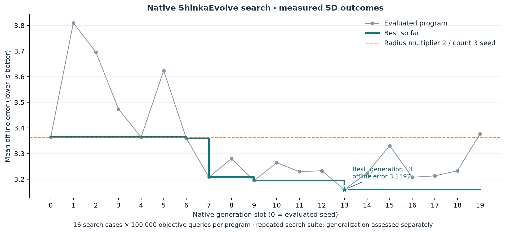
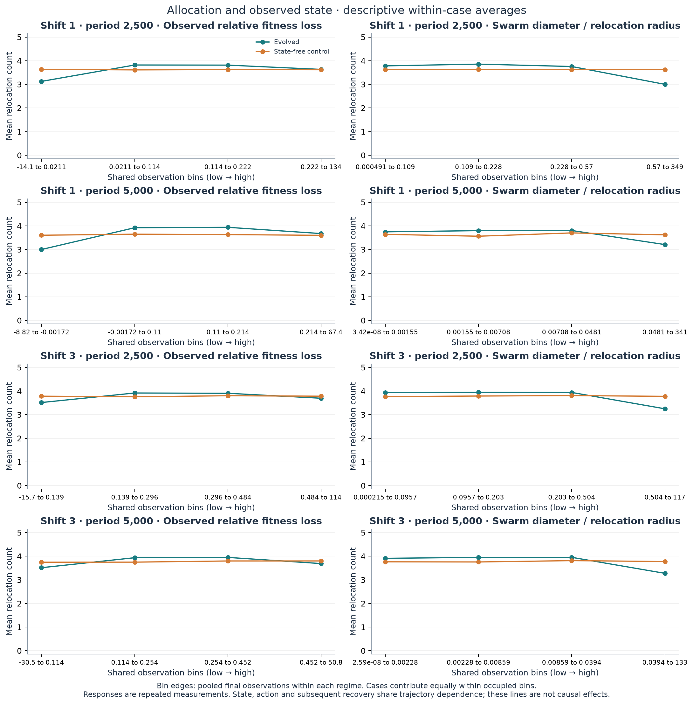
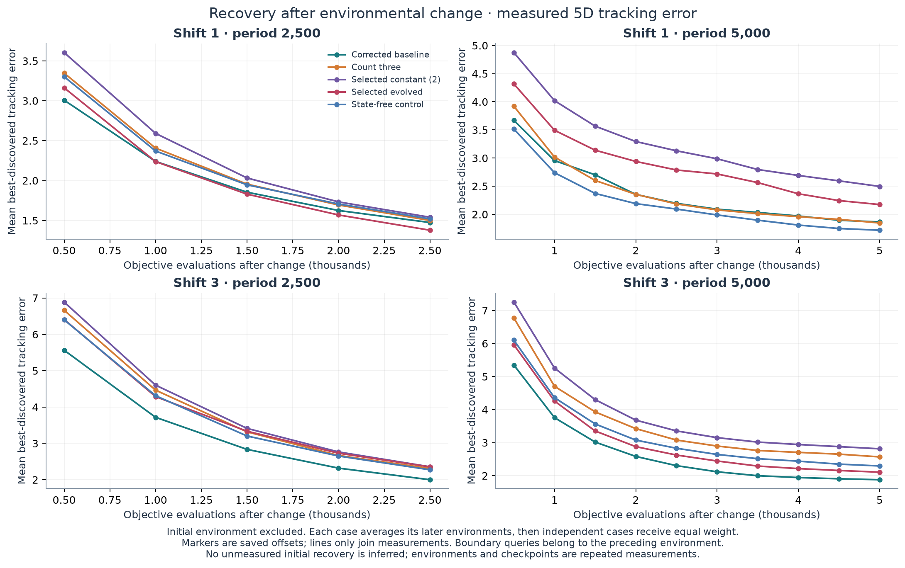
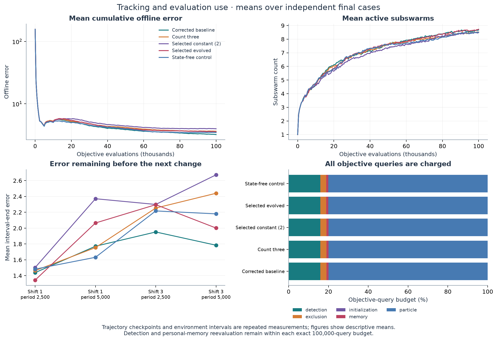

# When should a swarm relocate more particles?

**Completed, 16 September 2026.** The evolved allocation program beat the
validation-selected constant count two on 40 fresh paired histories: mean
offline error **3.5541 versus 3.9806**, paired difference **−0.4265**, with a
stratified bootstrap 95% interval **[−0.6903, −0.1829]**. It did **not** establish
an advantage over the control without current state, whose mean error was
**3.4700**. The original corrected baseline had lower mean error, **3.2146**.
Useful conditional allocation and overall algorithm superiority remain
unestablished.

The complete protocol used 20 native generation slots, 320 search cases,
144 validation method cases and 200 final method cases: **664 executions and
66.4 million objective queries**, with 19 recorded subscription-backed
mutation calls. Generation 13, constant two and the mechanism control were
frozen before final seed generation. All v1 results were preserved.

This study follows the [prospective v2 protocol](followup_relocation_allocation_v2.md).
It asks whether a program evolved by ShinkaEvolve can improve the allocation of
particles between exploratory relocation and ordinary particle-swarm motion,
at a fixed relocation-radius rule. The competing explanations are useful
conditional allocation, a sufficient constant allocation, and variation
explained by environmental regime rather than detailed current swarm state.

The [v1 comparison](comparison.md) motivated the question: its selected adaptive
program improved search performance without establishing an independent
advantage, while a predefined count-three control looked promising. Those
observations are development evidence for v2. V1 programs, numerical behavior,
completed runs and published results are preserved.

## Fixed simulator and evolved interface

The simulator retains the documented reconstruction of Blackwell, Branke and
Li's multi-swarm optimizer, using DEAP commit
`8a96fd3a75026f7b30e835f595a5199c75634ddf`. The experiment uses five dimensions,
ten conical Moving Peaks, five neutral particles per swarm, `NEXCESS=1`,
movement correlation zero and a domain of `[0,100]^5`. The [reproduction
record](reproduction.md) describes particle motion, exclusion, swarm birth and
removal, memory refresh, boundary conventions and objective accounting.

The corrected UVD sampling defect belongs to the baseline reconstruction. It
is not an evolutionary discovery. V2 adds an interface around the retained
numerical simulator; it does not retroactively change the floating-point
behavior of v1 programs.

The separate [allocation task](../tasks/relocation_allocation_v2/initial.py)
evolves only this function, initially constant three:

```python
def choose_relocation_count(observation: dict) -> int:
    return 3
```

The [fixed adapter](../src/adaptive_swarms/relocation_allocation.py) accepts a
Python integer from zero through the observed swarm size. It rejects Boolean,
floating-point and out-of-range results. Positive count `k` becomes the
interior fraction `(k - 0.5) / swarm_size`; zero becomes zero. The simulator's
unchanged `ceil(fraction * swarm_size)` rule therefore allocates exactly `k`
particles without the v1 boundary ambiguity.

All allocation programs use `radius_scale=2`, `memory="reevaluate"` and
`reset_velocity=False`. Their radius is twice the existing `default_radius`,
hence equal to configured movement severity. This deliberately retains the
baseline's severity scale; it does not test adaptation without that information.
Non-relocated particles continue ordinary PSO motion. All personal-best
memories are reevaluated and retained, so this experiment concerns allocation
between motion modes rather than stationary anchors or memory erasure.

The policy receives dimension, domain width, swarm size and count, swarm
diameter, previous and current observed best fitness, signed and relative
fitness loss, recent improvement, evaluations since the prior response,
previous response radius, default radius, observed best-position displacement
and remaining evaluations. Signed improvement is available by subtracting
previous from current fitness; `fitness_drop` uses the opposite sign. Landscape
peaks, true optimum, offline error, RNG seeds and held-out cases are absent
from observations. Source inspection is required before validation: ordinary
Python execution is not a security sandbox.

Each response records requested count and `executed_count`, the number of
indices selected by the simulator. A response can exhaust its budget before
all selected particles receive objective queries. Its `completed` flag and
`evaluated_relocation_count` preserve that distinction; an allocated particle
is not automatically reported as a completed, evaluated relocation.

## Case design, pairing and budgets

The four regimes cross movement severity 1 or 3 with change periods of 2,500
or 5,000 objective evaluations. Each case uses exactly 100,000 objective
evaluations at every stage. This is generalization to fresh histories within
the declared regime mixture, not extrapolation to new severities or dimensions.

| Stage | Independent cases per regime | Cases | Role |
|---|---:|---:|---|
| Search | 4 | 16 | Repeated native evolutionary feedback |
| Validation | 4 | 16 | One-time program and global constant selection |
| Final | 10 | 40 | Frozen-program comparison |

The pre-outcome seed audit was saved at **01:31:44 UTC on 16 September 2026**.
It checked all existing JSON and compressed JSON under `configs`, `results`
and `artifacts`: 32 proposed search/validation cases had no collisions with
32 distinct historical seed values, or with one another. No seed replacement
was necessary. Exclusion is stronger than pair uniqueness: a numeric seed
used in either RNG role is excluded from both new roles. Diagnostic seed
reservations are also retained for final generation.

Final seed generation is downstream of the program, constant and mechanism
control freeze. The generator re-inventories historical and current-study
seeds, records a fresh generation seed and saves all 40 pairs before final
execution. Final outcomes have no mutation or selection role.

The landscape uses its own RNG, independent of the optimizer RNG. Methods
share environment histories and paired optimizer seeds within each case;
they need not follow the same particle paths or consume optimizer draws in
the same order. Saved landscape hashes verify pairing. Initialization,
ordinary motion, relocation, exclusion, change detection and memory
reevaluation all consume the same exact objective-query budget.

## Native evolution and frozen selection

The search ran from **01:34:07 to 02:04:37 UTC on 16 September 2026**, using task
implementation commit `09cde5b037d9cc4bdbe144aca586187ec4494155`, in
`results/relocation_allocation_v2/evolution/20260916T013407.256962Z-search`.
It completed one native ShinkaEvolve search with 20 generation slots: generation
zero is the evaluated count-three seed and 19 slots are valid descendants.
The 21 database rows include one native seed island copy, an archive copy
rather than another evaluated program.

ShinkaEvolve remains pinned to
`9912af12d423504b8d580f4179fd15f5f88b8c50`. Native parent and inspiration
sampling, two islands, archive updates and diff/full/crossover proposals remain
enabled. One proposal and one evaluation run at a time. Text feedback is
enabled; embedding novelty, LLM novelty judgments, meta recommendations,
prompt evolution and W&B logging are disabled. The launcher adds task
selection, immutable source snapshots, checkpoint compatibility and visible
logging without replacing native evolutionary selection.

The recorded mutation route is **`headless/codex@gpt-6-astra`**, using the
existing subscription login and Headless 0.6.1. No inner reasoning-effort
override was sent; the actual effective default is unverified. This setting
is recorded separately from the user's requested supervising Astra/Ultra
workflow, which the launcher does not introspect. No paid API fallback is
authorized or configured. Validation and final simulation require no LLM
calls. Native call attempts and completed descendant slots are separate counts.

Fitness is `1 / (1 + mean_offline_error)`, with equal case and regime weights.
No complexity, branch-count or adaptation bonus applies. The actual first
mutation prompt was inspected, rather than only the template: it included
the integer interface, mechanism context, v1 finding, all 16 parent case
errors, recovery/query diagnostics and exact count distributions. The audit
found no validation seed values, seed-field names or validation-manifest
path in that prompt. Final cases did not yet exist.

The [study runner](../src/adaptive_swarms/allocation_study.py) implements these
durable boundaries:

1. Require the completed 20-slot v2 native search, then freeze the top three
   source-distinct valid programs by descending search score. Ties use
   earlier generation, then source hash. Use all available programs if
   fewer than three exist.
2. Review the exact frozen source hashes, then evaluate the shortlist and
   all six constant counts `0,...,5` on the same 16 validation cases.
3. Select one program and one global constant by equally weighted validation
   error. Program ties use earlier generation then source hash; constant
   ties use the smaller count. Freeze source, scores, rules and control
   distributions before final seed generation.
4. Generate final cases, execute the frozen methods, then analyze the saved
   final outcomes. Validation results never flow back into native mutation.

Every completed case is compressed and checkpointed before proceeding. Resume
checks cover source fingerprints, suite, program and method identity. The
numerical simulator, fixed adapter and comparison execution sources are
fingerprinted; the evaluator, task context, prompt and runner are retained.
Cache aliases require a proven identical execution, such as two literal
constant-count programs or a control distribution with single-count support.
Matching observed scores or distributions alone do not establish equivalence.

### Measured search and frozen shortlist

The [read-only native audit](../artifacts/relocation_allocation_v2/operations/native-search-audit.json)
verified the database, all 320 completed case checkpoints, exact query budgets,
paired landscape histories, program/source correspondence, fixed controls and
requested versus allocated counts. All 20 evaluated programs were valid. The
native archive retained 19 successful mutation attempts, one per descendant,
and no failed or additional recorded attempts. All 19 used the declared
subscription route; provider-internal network retries are not separately
instrumented. There were no incomplete final responses in the search cases.

The best search mean error was **3.1592**, versus **3.3642** for the count-three
seed, a **6.09%** decrease on the repeatedly used search suite. This is search
performance, not evidence of generalization or useful state dependence.

| Program | Mean search error | Native score | Source SHA-256 prefix | Parent lineage |
|---|---:|---:|---|---|
| Count-three seed, generation 0 | 3.364189 | 0.229138 | `e6e239ebc7fc` | 0 |
| Shortlist 1, generation 13 | 3.159207 | 0.240430 | `82252a5a115b` | 0 → 7 → 13 |
| Shortlist 2, generation 9 | 3.194478 | 0.238409 | `3adc332acb54` | 0 → 7 → 9 |
| Shortlist 3, generation 7 | 3.207433 | 0.237675 | `a2a16694afc7` | 0 → 7 |



*Measured five-dimensional search: 16 cases × 100,000 objective queries per
program. The native seed island copy is counted once. The seed uses radius
multiplier two and count three; its absolute radius depends on the regime.*

The [shortlist](../artifacts/relocation_allocation_v2/study_20260916/shortlist.json)
was frozen at **02:05:12 UTC**, from 20 source-distinct valid programs. Source
distinction does not imply distinct behavior: some differently written native
programs had identical executed outcomes. Generations 13, 9 and 7 were selected
in that search-score order; the seed did not qualify. Their
[source review](../artifacts/relocation_allocation_v2/study_20260916/source_review.json)
was recorded at **02:05:43 UTC**, before validation execution.

All three shortlisted programs normally allocate three particles, increasing
to four when observed loss exceeds nonnegative recent improvement and the
swarm diameter is below a threshold. Generation 7 uses the full relocation
radius as its threshold. Generation 9 uses half that radius. Generation 13
combines these choices: half-radius at movement severity 1, full radius at
severity 3, selected through the public `default_radius` value. Its proposal
was a native crossover, with generation 7 as the recorded parent. This
additional dependence on known severity scale must be distinguished from
dependence on detailed current state.

Exact frozen source inspection found only the allowed public observations
`swarm_size`, `default_radius`, `swarm_diameter`, `fitness_drop` and
`recent_improvement`, together with ordinary built-in scalar operations.
There were no imports, filesystem/network access, seed access, benchmark
internals or held-out inputs. Full source, mutation explanations, inspiration
records and lineage remain in the
[native archive](../artifacts/relocation_allocation_v2/evolution/20260916T013407.256962Z-search).

### Validation selection and final freeze

Validation completed at **02:12:38 UTC**: nine methods × 16 cases, **144
distinct evaluations and 14.4 million objective queries**, with no aliases.
The [saved validation summary](../artifacts/relocation_allocation_v2/study_20260916/validation/summary.json)
contains every case-level error. Equal case counts make the equally weighted
case mean and four-regime mean identical here.

| Validation method | Mean offline error | Selection role |
|---|---:|---|
| Constant 0 | 5.453081 | Constant candidate |
| Constant 1 | 4.144457 | Constant candidate |
| **Constant 2** | **3.392146** | **Selected global constant** |
| Constant 3 | 3.728268 | Original promising control |
| Constant 4 | 3.809076 | Constant candidate |
| Constant 5 | 3.497586 | Constant candidate |
| **Generation 13** | **3.610550** | **Selected evolved program** |
| Generation 9 | 3.645796 | Shortlisted program |
| Generation 7 | 3.690354 | Shortlisted program |

Generation 13 had the lowest validation error among the three shortlisted
programs. Constant two had the lowest among all six constants, and a lower
validation error than generation 13. These data determine selection; they
are not the final independent comparison. The constant is one global choice,
not a per-regime or per-case oracle.

The [selection record](../artifacts/relocation_allocation_v2/study_20260916/selection.json)
was frozen at **02:12:58.140032 UTC**. It retains selected source hash
`82252a5a115b1007882e633bf08ee35432f1318422b2aded08d7ebc3e097b0c9`, the
validation scores, tie rules and mechanism-control distributions. The
[40 final seed pairs](../artifacts/relocation_allocation_v2/study_20260916/final_cases.json)
were generated later, at **02:13:33.097156 UTC**, from a recorded new generation
seed after exclusions were checked. The final-stage manifest was created
at **02:13:33.128454 UTC**, downstream of that freeze and seed generation.

The selected [generation-13 source](../artifacts/relocation_allocation_v2/study_20260916/programs/shortlist_1.py)
uses the following decision body within its unchanged integer interface:

```python
swarm_size = int(observation["swarm_size"])
if swarm_size <= 0:
    return 0
default_radius = max(0.0, float(observation["default_radius"]))
diameter = max(0.0, float(observation["swarm_diameter"]))
loss = float(observation["fitness_drop"])
improvement = max(0.0, float(observation["recent_improvement"]))
threshold = default_radius
if default_radius > 1.0:
    threshold *= 2.0
count = 3
if diameter < threshold and loss > improvement:
    count = 4
return min(count, swarm_size)
```

The rule therefore combines a regime-scale choice of compactness threshold
with a conditional response to observed contraction and loss relative to
recent improvement. The final mechanism comparison tests the outcome value
of preserving that association with state, given a control supplied with
the selected program's validation action frequencies by regime.

### Retained search-feedback labeling deviation

An auxiliary feedback label was found to be misleading during the active
search, before validation or final execution. The frozen evaluator's
`mean_relocation_fraction` averages the adapter's **encoding fraction**, but
its text calls this the "relocated fraction." The seed consequently reported
0.5 under that label while correctly requesting and allocating three of five
particles, whose actual allocated fraction is 0.6.

For any positive count and swarm size five, the encoding is 0.1 below the
allocated fraction; for count zero both are zero. For a mixed policy, the
difference between their means is `0.1 × proportion of positive-count responses`.
The retained prompt also supplied the correct count distributions and adapter
formula. The simulator's integer allocation, objective accounting, measured
fitness and selection score are unaffected by this reporting label. Final
behavioral fractions use the actual selected indices.

The [operations note](../artifacts/relocation_allocation_v2/operations/search-feedback-label-note.json)
records source and actual-prompt hashes, the seed example and the checks.
The active run and frozen feedback were preserved without restarting search,
repeating completed evaluations or rewriting historical prompts. The
misleading label could have influenced proposal interpretation; correct
adjacent counts do not establish that it had no effect on evolutionary search.
This is an explicit experimental deviation, not an evolutionary improvement.

## Final methods and mechanism comparison

| Method | Frozen behavior and role |
|---|---|
| Original corrected baseline | Radius multiplier 1; all five particles relocated; continuity with v1 |
| Count three | Radius multiplier 2; exactly three particles allocated; original promising control |
| Selected constant | Radius multiplier 2; count two selected globally on validation; primary comparator |
| Selected evolved program | Radius multiplier 2; generation 13's conditional count-three/count-four function |
| Control without current state | Radius multiplier 2; samples a frozen known-regime count distribution |

For the last control, each selected-program validation case contributes its
own count proportions with equal weight within its regime. A no-response
validation case would contribute the initial count-three distribution and
be explicitly recorded. The control samples that fixed regime-specific
distribution at each response with its own recorded `random.Random` instance,
independent of environment and optimizer RNGs. Its per-case seed is derived
from a fixed recorded master seed and the case configuration. The count
sampler does not inspect current swarm observations.

The control deliberately retains known-regime information. It removes the
association of counts with current state and also changes temporal dependence.
It is therefore a targeted mechanism comparison, not a perfect intervention
on one causal variable. Its final count frequencies can differ from both the
validation target and the evolved program through sampling and changed
optimizer trajectories. Those differences must accompany the outcome
comparison. Genuinely identical methods are executed once with explicit
aliases; none of the v1 cases is repeated for this protocol.

The frozen control distribution is shown below. Its probability of counts
zero, one, two or five is zero in every regime. Each of the 16 selected-program
validation cases contained responses, so **no count-three fallback was used**.
The dedicated control RNG master seed is `2026091602`; the saved per-case
execution identities record derived seeds separately from the environment
and optimizer RNGs.

| Movement severity | Change period | Probability of count 3 | Probability of count 4 |
|---:|---:|---:|---:|
| 1 | 2,500 | 0.388842 | 0.611158 |
| 1 | 5,000 | 0.377041 | 0.622959 |
| 3 | 2,500 | 0.218019 | 0.781981 |
| 3 | 5,000 | 0.212049 | 0.787951 |

All five final methods have distinct execution identities: the baseline uses
a different radius rule, the constants allocate two or three particles,
generation 13 uses current state, and the control samples counts three/four
with its dedicated RNG. No method alias was used; the declared final work
was **200 method cases / 20 million objective evaluations** and all completed
at **02:20:57 UTC**. The saved final stage contains no aliases. The analysis
was recorded at **02:21:23 UTC**; no final outcome fed mutation or selection.

## Outcomes and uncertainty

The primary contrast is **evolved offline error minus selected-constant offline
error**. Negative favors the evolved program. The predeclared mechanism
contrast is evolved minus the control without current state. Comparisons with
the original baseline and count three are contextual; secondary confidence
intervals are descriptive.

Each independent case contributes one paired difference. The primary estimate
is the mean of the four regime means, each weighted one quarter. The
predeclared 95% percentile bootstrap uses **20,000 resamples**, NumPy analysis
seed **20260916**, paired case resampling within each regime, and the same
equal regime weights. The additional precision check is
`SE = sqrt(sum_r(s_r² / n_r)) / 4`, where `s_r²` is the sample variance of
paired case differences in regime `r`. Response events, environment intervals
and trace checkpoints are repeated measurements within a case, never extra
independent replicates.

The [saved final analysis](../artifacts/relocation_allocation_v2/study_20260916/analysis.json)
contains the following results. Every method used all 40 final cases with
exact budgets and matching landscape histories. No case was discarded.
The [independent final audit](../artifacts/relocation_allocation_v2/operations/final-analysis-audit.json)
recomputed all four contrasts, regime estimates, standard errors and bootstrap
intervals to within `1e-12`; it verified all 200 final budgets/count records
and reproduced the 40 dedicated control action sequences. Frozen sources
remained unchanged. This was a read-only audit, without new objective queries.

| Final method | Mean offline error |
|---|---:|
| Original corrected baseline, multiplier 1 / count 5 | **3.214605** |
| Count three, multiplier 2 | 3.626680 |
| Validation-selected constant two, multiplier 2 | 3.980588 |
| Selected evolved generation 13, multiplier 2 | 3.554065 |
| Control without current state, multiplier 2 | 3.469960 |

| Evolved minus comparator | Paired mean | Stratified bootstrap 95% interval | Stratified SE | Cases improved / worsened |
|---|---:|---|---:|---:|
| **Selected constant two — primary** | **−0.426523** | **[−0.690272, −0.182927]** | **0.136577** | **28 / 12** |
| Control without current state — mechanism | +0.084105 | [−0.178679, +0.409602] | 0.159411 | 23 / 17 |
| Original corrected baseline — contextual | +0.339460 | [+0.053050, +0.659607] | 0.162416 | 11 / 29 |
| Count three — contextual | −0.072615 | [−0.317470, +0.167732] | 0.129591 | 22 / 18 |

There were no tied cases in these four contrasts. The primary result is a
10.72% lower mean error relative to the frozen selected constant. Its interval
lies below zero, supporting an advantage over **that selected comparator**
within this experiment. Count two's favorable validation ranking did not
persist on the final cases: count three and the control also had lower final
means. The protocol kept the comparator fixed; it did not retrospectively
choose a more favorable constant. Constants zero, one, four and five at
multiplier two were not run on the final suite, so this does not demonstrate
superiority over the best possible constant allocation.

The mechanism contrast provides no established advantage for current-state
dependence. Its interval includes both gains and losses; that is not evidence
of equivalence. Although the evolved program improved 23 of 40 cases versus
the control, its larger losses produced a positive mean difference. Case 16,
for example, had evolved-minus-control error **+5.099403** and is retained in
the analysis and figure. The original corrected baseline, which relocates all
five particles at half the allocation task's radius, had lower error in every
regime mean. These findings do not support overall optimizer superiority or
an attribution of the primary gain specifically to useful conditional choice.


*Forty independent five-dimensional cases, ten per regime. Dots are paired
case differences; diamonds are regime or equally weighted pooled means. Only
the pooled rows carry the declared stratified intervals. Negative favors
evolved allocation; the mechanism interval is descriptive.*

The complete regime means are below; each cell averages ten independent
histories. Baseline uses multiplier one; every other method uses multiplier two.

| Severity | Period | Baseline | Count 3 | Selected count 2 | Evolved | Control |
|---:|---:|---:|---:|---:|---:|---:|
| 1 | 2,500 | 2.686951 | 2.835303 | 2.973887 | 2.694141 | 2.824611 |
| 1 | 5,000 | 2.646949 | 2.681185 | 3.503552 | 3.137825 | 2.499529 |
| 3 | 2,500 | 4.365863 | 4.992609 | 5.130044 | 4.888937 | 4.880354 |
| 3 | 5,000 | 3.158656 | 3.997623 | 4.314870 | 3.495356 | 3.675347 |

| Severity | Period | Evolved − selected count 2 | Evolved − control |
|---:|---:|---:|---:|
| 1 | 2,500 | −0.279745 | −0.130470 |
| 1 | 5,000 | −0.365727 | +0.638297 |
| 3 | 2,500 | −0.241107 | +0.008582 |
| 3 | 5,000 | −0.819514 | −0.179991 |

These regime estimates describe heterogeneity; they are not four independent
confirmatory findings. All 40 case-level primary and mechanism effects appear
in the table below, with exact-precision values and paired optimizer seeds
retained in the published analysis and final-case manifest.

### Executed allocation and recovery

Behavioral analysis compares count distributions by regime and observed state.
Plots average each independent case's proportions equally; state-bin plots
average occupied-bin means within cases before averaging cases. Associations
between state, counts and recovery are descriptive because state and the
optimizer trajectory affect both decisions and outcomes.

The evolved program allocated count four in **5,688 of 8,238 responses** and
count three in the remaining 2,550. The control allocated count four in
**5,699 of 8,143 responses** and count three in the remaining 2,444. These are
descriptive event counts, not independent sample sizes. All final responses
were complete. No no-response case needs imputation in the final distribution
plots, and the exact requested and allocated count records agree.

The table reports **equal-case count-four percentages** rather than pooling
responses. Count-three percentages are the complement, and all other counts
are zero. Differences are percentage points.

| Severity | Period | Frozen validation target | Final evolved | Final control | Control − target | Evolved − control |
|---:|---:|---:|---:|---:|---:|---:|
| 1 | 2,500 | 61.12% | 59.92% | 62.24% | +1.12 | −2.32 |
| 1 | 5,000 | 62.30% | 63.69% | 61.93% | −0.37 | +1.77 |
| 3 | 2,500 | 78.20% | 76.76% | 77.88% | −0.32 | −1.12 |
| 3 | 5,000 | 78.80% | 78.70% | 78.08% | −0.71 | +0.62 |

The control approximately retained its frozen regime-specific distribution;
it did not reproduce the evolved program's exact final action sequence or
trajectory. Its departure from the frozen count-four target ranged from
−0.71 to +1.12 percentage points. This supports the intended action-frequency
matching without making the comparison a perfect intervention on state alone.


*Within-case count proportions, averaged equally across cases. Regime
frequencies are close but not identical; those differences remain part of
the mechanism-control interpretation.*

Saved state bins show that the chosen program changes actions as intended:
the largest-diameter bin has a lower mean count than compact-swarm bins in
every regime, while the control stays near its regime-specific mean. In the
severity-one/period-2,500 regime, for example, the evolved mean count falls
to 3.00 in the largest-diameter bin, versus 3.62 for the control. This confirms
behavioral dependence on current state. It does not establish that dependence
improves tracking; the matched final mechanism contrast remains inconclusive.



*Bin edges come from pooled final observations within each regime. Each case
contributes equally within bins it occupies. These descriptive conditional
means are not causal effects or independent-replicate error estimates.*

Recovery plots use saved `trace.current_error`: best-discovered tracking error
within the current environment. They exclude the initial environment, place a
query at a change boundary in the preceding environment, and calculate offset
`((evaluations - 1) % period) + 1`. Each case first averages later environments
at each shared measured offset; cases then receive equal weight. Markers show
saved offsets, and straight lines only join those measurements. They do not
infer unrecorded immediate recovery after a change. Cumulative offline error,
swarm counts, interval-end error and objective-query shares provide additional
descriptive diagnostics.



*Initial environments are excluded. The first saved post-change offset is
500 objective evaluations, followed by 500-query increments; no immediate
post-change curve is reconstructed. Averages use 39 later environments per
case at period 2,500 and 19 at period 5,000, then ten equally weighted cases
per regime. Differences between these curves remain descriptive.*



*Detection consumed 15.88–15.90% of final objective queries and personal-memory
reevaluation 1.00–1.03%, depending on method. All are charged to the exact case
budget. Swarm counts and trajectory checkpoints are repeated measurements.*

### All 40 paired final effects

Negative differences favor the evolved program. Case indices are zero-based
and match the final manifest. The [machine-readable case table](../artifacts/relocation_allocation_v2/study_20260916/final_case_outcomes.csv)
also contains both seeds, every method's error, contextual differences and
budgets at saved precision.

| Case | Severity / period | Environment seed | Evolved − count 2 | Evolved − control |
|---:|---|---:|---:|---:|
| 00 | 1 / 2,500 | 680007739 | -0.136358 | -0.089482 |
| 01 | 1 / 2,500 | 938451240 | -0.280126 | -0.222849 |
| 02 | 1 / 2,500 | 1570092213 | +0.485781 | -0.156124 |
| 03 | 1 / 2,500 | 47533377 | -0.114524 | -0.484739 |
| 04 | 1 / 2,500 | 84418169 | -0.562716 | -0.326544 |
| 05 | 1 / 2,500 | 1398378102 | -0.233410 | -0.353952 |
| 06 | 1 / 2,500 | 711877735 | -0.317741 | +0.058705 |
| 07 | 1 / 2,500 | 422830471 | -0.790352 | -0.417951 |
| 08 | 1 / 2,500 | 1326119522 | -1.030144 | +0.703825 |
| 09 | 1 / 2,500 | 1306316915 | +0.182135 | -0.015584 |
| 10 | 1 / 5,000 | 634773509 | -1.666426 | -0.733471 |
| 11 | 1 / 5,000 | 1419359176 | -0.956831 | +0.408853 |
| 12 | 1 / 5,000 | 1816335251 | -0.092882 | +0.041669 |
| 13 | 1 / 5,000 | 741492678 | +0.310482 | -0.397549 |
| 14 | 1 / 5,000 | 1400339336 | +0.174981 | +1.489903 |
| 15 | 1 / 5,000 | 2133210799 | -1.080712 | -0.036031 |
| 16 | 1 / 5,000 | 1104551374 | +0.071470 | +5.099403 |
| 17 | 1 / 5,000 | 104192522 | -0.085640 | -0.098880 |
| 18 | 1 / 5,000 | 2104172076 | -0.315228 | +0.310375 |
| 19 | 1 / 5,000 | 1788146820 | -0.016486 | +0.298692 |
| 20 | 3 / 2,500 | 1090776892 | +0.013812 | -0.361309 |
| 21 | 3 / 2,500 | 824296029 | -0.317870 | -0.777047 |
| 22 | 3 / 2,500 | 128181277 | -1.570158 | +0.156018 |
| 23 | 3 / 2,500 | 1873970169 | -0.078963 | -0.654068 |
| 24 | 3 / 2,500 | 341167087 | -0.493528 | -0.923023 |
| 25 | 3 / 2,500 | 1721118993 | -0.837176 | +2.101708 |
| 26 | 3 / 2,500 | 944052848 | -0.254679 | -0.088292 |
| 27 | 3 / 2,500 | 1337189749 | +1.197006 | +0.898735 |
| 28 | 3 / 2,500 | 554186975 | +0.272778 | -0.247672 |
| 29 | 3 / 2,500 | 379674654 | -0.342295 | -0.019229 |
| 30 | 3 / 5,000 | 1963538557 | -1.041274 | -0.686690 |
| 31 | 3 / 5,000 | 624250263 | -0.115053 | +0.091621 |
| 32 | 3 / 5,000 | 1841057387 | +0.201095 | +0.214000 |
| 33 | 3 / 5,000 | 1697938325 | +0.224597 | +0.085128 |
| 34 | 3 / 5,000 | 1643717435 | -2.249330 | -1.213757 |
| 35 | 3 / 5,000 | 1285691646 | -1.770042 | -0.172754 |
| 36 | 3 / 5,000 | 1056942644 | +0.037543 | +0.365938 |
| 37 | 3 / 5,000 | 286565268 | +0.517998 | +0.450860 |
| 38 | 3 / 5,000 | 1404015417 | -0.301408 | +0.038717 |
| 39 | 3 / 5,000 | 586629214 | -3.699267 | -0.972975 |

## Interpretation limits

Source fidelity, successful execution, optimizer performance and scientific
discovery are distinct claims. A native search completing successfully does
not establish an independent performance gain. A gain against the selected
constant alone does not establish useful dependence on current state; the
mechanism contrast is needed for that interpretation. A constant winner or
an imprecise interval is an informative result, without implying that all
adaptation is ineffective.

There is one native search realization, one fixed radius rule and four known
regimes in a synthetic benchmark. Even 40 fresh paired cases do not establish
search reliability across replications, an optimal radius, extrapolation to
other dimensions or conditions, or superiority over the stronger permanent
quantum `(5+1)` literature baseline. The retained auxiliary feedback-label
deviation further limits claims about an idealized, perfectly communicated
allocation search. No claim of geopolitical or other application effectiveness
follows from these simulations.

The intervals condition on these frozen selected methods. They do not include
variation in search and validation selection across replicated studies. Here
the substantive result is a final advantage over the validation-selected
constant alongside an unestablished mechanism benefit and better performance
from the original corrected baseline. It warrants neither a claim that the
conditional rule is causally beneficial nor a claim that all adaptation fails.

## Live evidence and reproduction

Timestamped terminal output and persistent native/evaluator logs report actual
proposal, evaluation and checkpoint activity. Heartbeats identify waiting;
they do not imply access to model-token streaming or hidden reasoning. The
v2 native WebUI was verified on the actual search database at
**http://localhost:8889**, while v1's port-8888 WebUI was retained.

```bash
# Attach to existing progress; this does not launch another controller.
bash scripts/progress.sh

# Start only if the v2 native WebUI has stopped.
bash scripts/webui.sh \
  results/relocation_allocation_v2/evolution/20260916T013407.256962Z-search 8889

# Regenerate final figures using saved outcomes only.
.venv/bin/python scripts/plot_allocation_study.py \
  --run results/relocation_allocation_v2/study_20260916 \
  --output assets/relocation_allocation_v2
```

The local comparison-stage sequence is below. The native search is already
finished and does not need to be restarted. The source-review input is the
[exact recorded review](../artifacts/relocation_allocation_v2/operations/shortlist-source-review.json)
of the three frozen source hashes; it is not a generic approval for arbitrary
replacement code.

```bash
v2_study=results/relocation_allocation_v2/study_20260916
v2_search=results/relocation_allocation_v2/evolution/20260916T013407.256962Z-search
.venv/bin/python -m adaptive_swarms.allocation_study freeze-shortlist \
  --run "$v2_study" --search-run "$v2_search"
.venv/bin/python -m adaptive_swarms.allocation_study review \
  --run "$v2_study" \
  --review-record artifacts/relocation_allocation_v2/operations/shortlist-source-review.json
.venv/bin/python -u -m adaptive_swarms.allocation_study validate --run "$v2_study"
.venv/bin/python -m adaptive_swarms.allocation_study select --run "$v2_study"
.venv/bin/python -u -m adaptive_swarms.allocation_study final --run "$v2_study"
.venv/bin/python -m adaptive_swarms.allocation_study analyze --run "$v2_study"
```

The comparison runner has no `--resume` flag. Repeating a stage command with
the same saved inputs verifies and reuses completed checkpoints; a completed
validation or final stage performs no objective evaluations again. A partial
stage continues its remaining cases. Frozen sources or settings that differ
are rejected. `analyze` recomputes the declared statistics from saved data.

The native archive preserves candidate source, lineage, explanations, actual
mutation prompts and feedback. Completed case files retain observed states,
allocation counts, full objective accounting, per-environment records and
sampled trajectories. The [published v2 archive](../artifacts/relocation_allocation_v2)
retains these results and their provenance alongside this report;
authentication files and credentials are excluded. The six PNG/SVG figure
pairs (native search plus five final-comparison figures) have input/output
hashes in the [search figure record](../assets/relocation_allocation_v2/figure_provenance.json)
and [comparison figure record](../assets/relocation_allocation_v2/allocation_figure_provenance.json).
