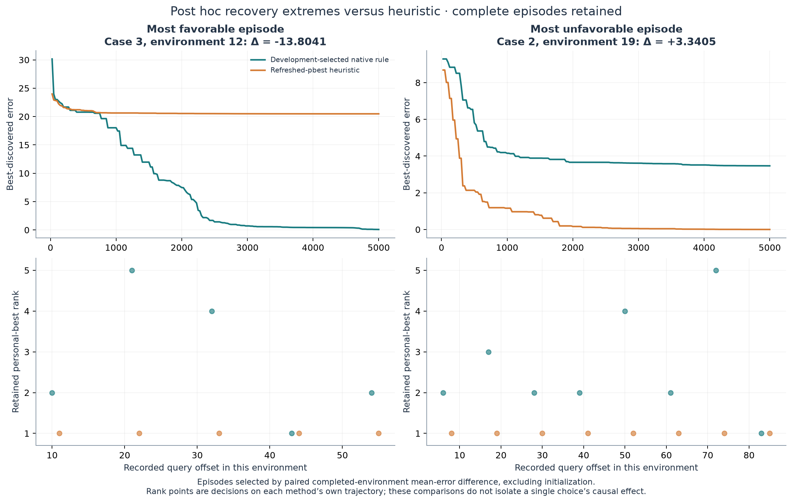

# Which particle should continue after a change?

**Particle-retention discovery study, 16 September 2026.** Native ShinkaEvolve
selected a simple score that favors proximity to the refreshed swarm best, with
half as much penalty on speed. Its development error was **3.567500**, versus
**3.722188** for random selection and **3.901685** for retaining the strongest
refreshed personal best. Against random, it improved all four histories with
5,000-query change periods and worsened all four with 2,500-query periods.
One favorable history supplies about **80% of the net mean benefit**.

This is an interpretable development candidate, not established generalization
or a demonstrated causal mechanism. The same eight histories informed evolution,
selection and these comparisons. The study contains no fresh validation stage.

Run: `particle_retention_v1/20260916T132022Z`; native search seed **630001**.
[Protocol](../../particle_retention_v1_protocol.md) · [interim decision](INTERIM.md) ·
[complete evidence](../../../artifacts/particle_retention_v1/20260916T132022Z) ·
[exact executable](../../../artifacts/particle_retention_v1/20260916T132022Z/programs/selected.py).
The preceding V3 null result and inconclusive radius/velocity pilot remain unchanged.

## Hypothesis and intervention

When four particles relocate after detected environmental change, can a feature-based
score choose the one ordinary-PSO trajectory to continue more effectively than random
choice or strongest refreshed personal-best quality? **All five memories already
survive and are reevaluated.** The exemption neither protects an otherwise-erased
memory nor creates a stationary anchor or permanent leader.

The separate optional hook follows all existing counted memory reevaluations and
freezes the five particles before any movement. One pure function scores each
particle; the highest finite score selects the exemption. Exactly four relocate
at radius multiplier **1.25**, retaining velocity. Ordinary PSO, asynchronous movement
order, swarm birth/removal, exclusion and objective accounting remain unchanged.
The unused hook preserves historical numerical behavior, checked against the
reviewed simulator. V1–V3 and the previous sprint were not rerun or overwritten.

Features include latest reevaluated personal-best quality, competition rank
(one is best; equal quality shares rank), distance to the refreshed swarm-best
position, speed and velocity alignment. Quality is **not current-position fitness**.
Geometry and speed normalize by `max(default_radius, 1e-12)`; alignment is the cosine
toward the refreshed best, zero at zero speed or distance. Memories are sequential
observations: there is no oracle freshness flag if a change occurs during refresh.
The benchmark supplies `default_radius = 0.5 * configured movement severity`.
Unknown-severity adaptation is outside this experiment.

Candidates receive no particle identity, seeds, hidden peaks, optimum, future changes
or evaluation error, and consume no simulator RNG. A separate RNG, derived from the
optimizer seed by a recorded SHA256 rule, draws one five-index tie permutation at
every selection whether tied or not. Random reference A returns zero for all five
scores. Heuristic B returns negative refreshed personal-best rank and also supplies
the native seed. Later trajectories and RNG consumption can diverge across methods;
paired comparisons are between complete closed-loop methods, not identical states.

Eight newly recorded development histories cover severity {1,3} × change period
{2,500,5,000}, two per regime, in five dimensions with ten peaks. Every execution
uses exactly **100,000 counted objective queries** and trace interval 25. Full
configurations and landscape-history hashes match across paired methods. Cases,
task and source fingerprints were registered before outcomes; the prospective
implementation was committed at `d9ddafc`. Measured reference context and analysis
settings were committed at `3a0d1ad` before native
descendants. Fitness remains `1/(1 + mean_offline_error)` with no complexity bonus.

## Exact selected rule and actual behavior

Generation **7** won the frozen mean-error ranking, including the seed. Its source
SHA256 is `10611ee221370c70172d45b7f4e9508254943f616918cff54e0011333c46f1a4`.
The executed function is:

```python
def retention_priority(particle_features, swarm_features) -> float:
    """Favor proximity with a reduced penalty on retained speed."""
    distance = particle_features["distance_to_best_normalized"]
    speed = particle_features["speed_normalized"]
    speed_weight = 0.5
    return 1.0 / (1.0 + distance + speed_weight * speed)
```

In plain terms, choose the particle with the smallest **distance + 0.5 × speed**.
Both quantities share the same scale within a snapshot. The rule ignores quality,
rank, velocity direction and swarm features. Its inherited module docstring still
describes the heuristic seed; the function above and measured choices establish
what actually executed. The full source is preserved unchanged.

Across **1,509** saved selections, equal-case rank frequencies for ranks one through
five are **33.89%, 21.70%, 20.35%, 16.14%, 7.92%**. Agreement with the heuristic is
**33.89%**, evaluated counterfactually on this rule's own snapshots and tie orders.
Mean chosen normalized distance is **4.5944**, speed **10.7600**, and alignment
**−0.1548**. Thus it often continues a particle with an inferior refreshed memory,
and does not consistently choose one already moving toward the refreshed best.
The corresponding random means are distance **14.8757**, speed **14.0980**, rank
**2.9883**; heuristic means are **6.1543**, **12.3578**, rank **1**. These describe
different reached trajectories, not a controlled isolation of a feature's effect.


*Five-dimensional saved measurements, equal case weighting. Individual decisions
are not independent replicates. The continued particle takes ordinary PSO motion.*

## All paired outcomes

Differences below are selected minus comparator; negative favors the selected rule.
The declared descriptive bootstrap resamples within regimes, gives each regime
equal weight, and uses 2,000 draws with analysis seed **2026091607**.

| Contrast | Mean | Paired SD | Descriptive 95% interval | Better / worse histories |
|---|---:|---:|---:|---:|
| Selected − random | −0.154688 | 0.408065 | [−0.305334, −0.006405] | 4 / 4 |
| Selected − heuristic | −0.334185 | 0.497167 | [−0.525500, −0.142869] | 6 / 2 |
| Heuristic − random | +0.179497 | 0.575626 | [−0.155292, +0.514285] | 2 / 6 |

**These intervals do not account for selecting the winner on these same data.**
Their endpoints below zero are not a fresh confirmation or evidence of reliability
across repeated searches. With only two histories per regime, uncertainty is poorly
resolved. The selected-minus-random median is **−0.036208**, range
**[−0.993605, +0.208645]**; versus heuristic, median **−0.092537**, range
**[−1.109076, +0.193761]**.

| Case | Severity / period | Random | Heuristic | Selected | Δ random | Δ heuristic |
|---|---|---:|---:|---:|---:|---:|
| 000 | 1 / 2500 | 4.032990 | 4.120103 | 4.064582 | +0.031592 | −0.055521 |
| 001 | 1 / 2500 | 2.389689 | 2.652032 | 2.598305 | +0.208616 | −0.053728 |
| 002 | 1 / 5000 | 3.361632 | 2.497580 | 2.368027 | −0.993605 | −0.129553 |
| 003 | 1 / 5000 | 4.294608 | 5.299676 | 4.190600 | −0.104008 | −1.109076 |
| 004 | 3 / 2500 | 5.282704 | 5.473700 | 5.491349 | +0.208645 | +0.017649 |
| 005 | 3 / 2500 | 3.824904 | 3.720148 | 3.913909 | +0.089005 | +0.193761 |
| 006 | 3 / 5000 | 2.261717 | 3.095942 | 2.051937 | −0.209780 | −1.044005 |
| 007 | 3 / 5000 | 4.329264 | 4.354300 | 3.861295 | −0.467969 | −0.493005 |

Selected-minus-random regime means, in table order, are **+0.120104, −0.548807,
+0.148825, −0.338875**. The complete split by change period is more informative
than a single pooled mean. It motivates testing the frozen rule across both periods;
it does not justify adding a period-conditioned branch from these eight outcomes.
Case 002 contributes **−0.124201** to the pooled mean, approximately 80% of the net
benefit versus random. All cases, including the selected rule's losses, remain in
every estimate. There is no post hoc removal of an influential history.

A separately recorded **post hoc** event-contribution check distinguishes a whole
history from one change episode: case 002/environment 17 contributes **−0.054712**
to the pooled selected-minus-random mean, **35.4%** of its net benefit. Its paired
environment mean difference is **−8.753885**. One history dominates more than any
single event; all 240 initial and subsequent environment contributions were retained
and reconstruct the total contrast. This diagnostic changes neither selection nor
the predeclared intervals.


*Measured 5D histories. Recovery uses actual saved query offsets, excluding initial
environments and averaging environments within case before cases. No unrecorded
immediate value is interpolated. These are development-selected comparisons.*

## Concrete continuation and unfavorable recovery

Examples were captured by a rule set before outcomes: each case's first completed
response and first completed decision at or after 50,000 queries. All **16 examples
per method** are saved. The first two below are case 000, chosen by case order,
not because its selected-minus-random outcome was favorable—it was slightly worse.

| Decision query | Retained rank | Normalized distance / speed | Actual ordinary-PSO displacement | Subsequent error at actual query offsets |
|---|---:|---|---:|---|
| 2,506 | 2 | 0.341758 / 0.147085 | 0.223123 | +44: 5.119938; +119: 4.647348; +519: 4.145540 |
| 50,011 | 4 | 0.045759 / 0.023693 | 0.630612 | +39: 4.249387; +114: 2.488747; +514: 1.431569 |

Displacement is the Euclidean length of the saved five-dimensional ordinary step.
These particles moved; neither was a stationary anchor. The second particle's small
pre-update speed does not fix its next velocity: ordinary PSO attraction still acts.
The error measurements describe the subsequent complete optimizer, during which
other particles and swarms also update. They are not the causal effect of one choice.

The prospectively specified post hoc episode rule retains both extremes versus
the heuristic. In case 003/environment 12, queries 60,001–65,000, selected mean
error **7.184762** versus heuristic **20.988872** gives **−13.804110**, contributing
**−0.086276** to the pooled mean. In the contrasting case 002/environment 19,
queries 95,001–100,000, selected **4.226032** versus heuristic **0.885531** gives
**+3.340502**; final errors were **3.469495** and **0.002714**, respectively.
The selected method can lose an entire recovery episode even in an otherwise
favorable history. These are descriptive extrema on diverged trajectories.



## What native evolution actually explored

| Generation | Executed behavior | Mean error |
|---|---|---:|
| 0 | Strongest refreshed personal-best rank; exact cached heuristic seed | 3.901685 |
| 1 | Equal scores: random-reference rediscovery | 3.722188 |
| 2 | Minimize distance + speed | 3.680712 |
| 3 | Proposed damped inertial projection; admission failure | No numerical result |
| 4 | Integrated damped-inertial path-distance proxy | 3.724536 |
| 5 | PSO second-moment distance proxy with coincident-attractor approximation | 3.746311 |
| 6 | Separately square-root-compressed distance and speed | 3.724363 |
| **7** | **Minimize distance + half speed** | **3.567500** |
| 8 | Quantized distance/half-speed cost with random ties in the best bin | 3.907393 |

The [interim](INTERIM.md) reviewed four descendant slots before continuing the
remaining original four. More elaborate motion proxies and randomized cost bins
did not improve the best mean. This short search does not exhaust the space.


*Generation 3 has no numerical point; its invalid node remains in the archive.
The seed's native island copy is not a second evaluation.*

Actual selected lineage is **seed 0 → generation 2 → generation 7**. Selected ID
`626b0267-9e2b-44e4-aed7-b470707d0143` is a native full patch from parent
`d3c896c4-6e43-4a69-8c8e-7ba17aa9779f` on island 1, with seed-copy archive
inspiration `b1ab0e69-ded7-4dd7-a3c0-6a044097165c` and no top-ranked inspiration
for that particular proposal. The parent sources, exact feedback and prompts are
preserved, including `gen_7/attempts/novelty_1/resample_1/patch_1/headless_prompt.md`.
An actual parent-feedback excerpt supplied to that proposal is:

```text
case_000 severity=1.0,period=2500: error=3.963754,
delta random=-0.069236, delta heuristic=-0.156349;
heuristic agreements=63/245
```

Native meta-memory recommended tuning the distance/speed weight, compressing the
individual penalties, and other hypotheses. The first completed recommendation
was actually inserted into later mutation prompts; generation 6 tested separately
compressed penalties and generation 7 tested half the speed weight. This establishes
use of meta-memory, not its causal performance benefit. No engine-feature ablation
or alternative search-method comparison was run.

## Accounting, limitations and next decision

The named task profile preserves pinned Shinka revision
`9912af12d423504b8d580f4179fd15f5f88b8c50`: weighted parents, two islands,
archive/top inspirations, diff/full/crossover probabilities 0.5/0.3/0.2,
embedding-plus-LLM novelty with three attempts, and meta updates every five programs.
Migration is configured at 0.1 every ten generations; no extra slots activate it.
Prompt co-evolution is off and mutation uses a fixed single model, not an ensemble.

| Stage | New full executions | Counted objective queries |
|---|---:|---:|
| Random reference | 8 | 800,000 |
| Heuristic reference | 8 | 800,000 |
| Native seed | 0; eight exact source/configuration/hash cache reuses | 0 |
| Native descendants | 56 | 5,600,000 |
| **Total physical research work** | **72** | **7,200,000** |

There are **nine terminal native slots**, including seed: **seven valid descendants
and one invalid proposal**. The database has ten rows because native initialization
copies the seed to the second island. All **80 case records** remain saved: 72
physical executions plus eight cached seed records. Generation 1's eight case files
are byte-identical to the random reference; those **eight repeated executions /
800,000 queries remain included** in the physical total. There were no interrupted,
truncated or failed numerical research executions. The static rejection used zero
queries. Separate implementation fixtures used **5,109 queries**, including an
intentional invalid-score failure after 109 queries; synthetic checks add none.

| Native model role | Wrapper calls | Requested logical responses | Usable responses |
|---|---:|---:|---:|
| Mutation | 8 | 8 | 8 |
| Novelty | 8 | 8 | 8 |
| Meta-memory | 6 | 13 | 13 |
| **Total** | **22** | **29 / 40 allowed** | **29** |

The meta total includes nine individual-program summaries and four global/recommendation
responses. There were zero exposed retries, missing responses or degraded mechanisms.
Provider-hidden retries and supervising Codex usage are unobserved by this counter.
All roles used the subscription route, with no paid API fallback. Ultra was requested
but the pinned Shinka/Headless parsers reject it; the strongest supported task-local
setting, **gpt-6-astra / xhigh**, was explicitly selected before research and verified
in actual CLI arguments for all three roles. This is not independent provider-side
attestation of effort, nor verification of supervising Astra/Ultra. The native
`reasoning_efforts=disabled` client field does not describe the route's explicit
Codex effort override. Native dollar fields are estimates, not subscription charges.

Actual machinery included **nine 768-dimensional local embeddings, eight accepted
novelty decisions, two completed meta updates, three verified recommendation
insertions, and zero migrations**. All eight saved mutation prompts contain frozen
scientific context, with all 17 sampled source/feedback references verified. The
existing quantized Jina code-embedding service was reused at
`local/jina-code-v2-q8@http://127.0.0.1:8910/v1`, with its existing threshold
0.830958258366903; no model download or recalibration occurred. Generation 7's maximum
similarity was **0.984572**; the native judge accepted the changed speed weight as
capable of altering particle rankings. Acceptance is not execution validation or
scientific novelty. The selected rule and generation 2 agree on **84.50%** of the
selected rule's snapshots, confirming a real, limited decision change.

The first two full reference cases measured **2.1056 seconds/case** before further
launches. Session start was **13:20:22 UTC**; first measurement **13:34:23**, last
numerical evaluation **14:01:12**, and native completion **14:07:07**. Native UTC timestamps
span **27m35.3s**; its monotonic logger records **26m09.9s**. Both clocks are retained
rather than claiming subsecond timing precision. Research accounting closed at
**14:10:24 UTC**, 50.0 minutes into the 120-minute session ceiling; publication follows
without further research. Bounds were 80 executions / 8 million queries and 40 native
responses. No allowance was enlarged or made a permanent account restriction.

Focused checks covered refresh-before-movement snapshots, exact four/one allocation,
rank direction, finite-score failure, immutable/order-independent features, consistent
tie draws, unchanged unused-hook behavior, checkpoint reuse and freeze ordering.
Ten final synthetic checkpoint/analysis regression checks passed without objective
or model calls. Independent audits verified all native cases, saved choices, examples,
landscapes, selection arithmetic and bootstrap intervals. Raw query categories for
the selected eight cases are initialization **40**, detection **126,509**, memory
**7,545**, particle **636,721**, exclusion **29,185**, summing to **800,000**.

Generation 3 failed before any objective query because its function-local `math`
import violates the frozen checker. The prompt permits pure math but did not
disclose that module-scope restriction or the complete builtin allowlist (`zip`
was also outside it). This limits the probe of that proposed behavior. The error
entered native meta summaries; the slot was retained, never relaxed or replaced.

Other limits are the small reused development suite, selection optimism, known
environmental scale, synthetic landscape, and one search. Feature associations and
recovery episodes do not identify a mediator; no overshoot explanation is established.
The inherited module docstring is stale but retained for exact provenance. The only
pre-search analysis correction resolved an extrema tie order before descendants;
both freeze records remain saved. A separate post hoc event-contribution diagnostic
is explicitly labeled and does not alter selection, intervals or retained cases.
The wrapper does not restore native proposal RNG state across restarts; this search
did not restart. Existing historical payloads were verified byte-identical.

**Next decision:** keep this simple frozen score as a candidate and random retention
as an essential comparator. The justified next experiment is a modest fresh paired
comparison of **selected, random and heuristic**, balanced across both change periods
and severities, with sources frozen before new histories. Its purpose is to determine
whether the period split and benefit survive independent histories. Another larger
evolutionary search, radius tuning or a collective-mechanism claim is not supported
by this sprint alone. That follow-up is not executed here.

## Inspect and reproduce the saved study

```bash
# Attach to the preserved timestamped progress.
bash scripts/progress.sh results/particle_retention_v1/20260916T132022Z/operations
bash scripts/progress.sh results/particle_retention_v1/20260916T132022Z/evolution/search_seed_630001

# Existing native viewer; launch only if the correct instance is absent.
bash scripts/webui.sh results/particle_retention_v1/20260916T132022Z/evolution 8895

# Rebuild measured analysis from the published archive; no objective/model calls.
.venv/bin/python scripts/analyze_particle_retention.py \
  --run artifacts/particle_retention_v1/20260916T132022Z \
  --output /tmp/particle-retention-analysis
```

Browser: <http://localhost:8895/viz_tree.html?db_path=search_seed_630001%2Fprograms.sqlite>.
The actual selected source and parent/inspiration links were checked against SQLite
and the HTTP API; browser verification passed. Operations screenshots and process
receipts stay in the artifact archive, outside the measured scientific figures.
