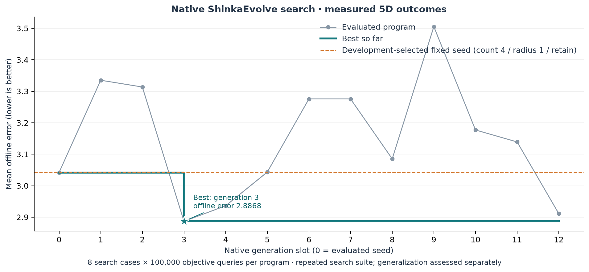
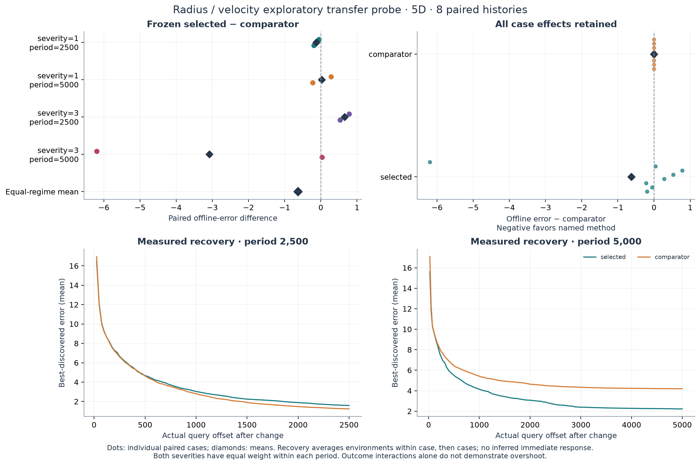

# Radius and retained velocity: bounded discovery sprint

**Completed numerical study, 16 September 2026.** Native ShinkaEvolve selected a
simple constant: relocate **four particles at radius multiplier 1.25, retaining
velocity**. It improved development error, but the eight-history fresh pilot
is inconclusive: selected minus original baseline **−0.6303**, descriptive 95%
interval **[−1.4721, +0.2241]**, four wins and four losses. One large baseline
loss drives much of the mean benefit. The radius–velocity diagnostic shows
heterogeneous interactions, not evidence that overshoot explains performance.
No useful conditional recovery mechanism or reliable superiority is established.

Run identity: `radius_velocity_sprint/20260916T113359Z`; native search seed
`620001`. [Complete saved evidence](../../../artifacts/radius_velocity_sprint/20260916T113359Z),
[prospective protocol](../../radius_velocity_sprint_protocol.md),
[pre-search INTERIM](INTERIM.md). V1–V3 results remain intact; V3's fresh-history
null result is unchanged.

## Hypothesis and paired diagnostic

Blackwell, Branke and Li (2008), printed p.215, propose retained velocities as an
explanation for relocation overshoot and preferred sampling radius
([chapter](https://doi.org/10.1007/978-3-540-74089-6_6)). This is a hypothesis;
we did not measure a causal overshoot mediator. Changed spread, subsequent PSO
motion, query allocation and policy-dependent random draws are competing explanations.

Eight recorded development cases are balanced over severity {1,3} × change
period {2500,5000}. Every method has five dimensions, ten peaks and exactly
100,000 counted objective queries. Environment and optimizer seeds are paired;
complete landscape histories match. Later optimizer draws and decision states
can diverge. Memory reevaluation stays fixed. The new thin adapter fixes exact
count four while exposing radius and velocity reset; it preserves V3's distinction
between allocated fraction 0.8 and adapter encoding fraction 0.7. The simulator,
V3 task and historical sources/scores were not changed.

| Count / radius multiplier / velocity | Mean offline error ↓ |
|---|---:|
| 4 / 1 / retain | 3.041839 |
| 4 / 1.5 / retain | 3.089088 |
| 4 / 1 / reset | 3.329122 |
| 4 / 1.5 / reset | 3.332410 |
| Original baseline: 5 / 1 / retain | 3.423599 |
| Exact frozen V3 selected policy | 3.152140 |

The historical V3 source was copied byte-for-byte, not reconstructed: count three
when relative loss ≤0.075 and diameter >3×default radius, otherwise four; radius
1.5 and retained velocity throughout. Count three occupies **7.26%** of responses
with equal case weighting. Its difference from direct constant 4/1.5 is +0.063052
(SD 0.391413, range [−0.559022,+0.832095]). This development subset does not
confirm a constant advantage or replace V3's final comparison.

Within each case, `I = (1.5/reset − 1/reset) − (1.5/retain − 1/retain)`.
All effects below are paired before aggregation; SD describes between-case dispersion.

| Paired effect in offline error | Mean | SD |
|---|---:|---:|
| Radius 1.5 − 1, retain | +0.047249 | 0.365551 |
| Radius 1.5 − 1, reset | +0.003288 | 0.570773 |
| Reset − retain, radius 1 | +0.287283 | 0.581054 |
| Reset − retain, radius 1.5 | +0.243322 | 0.513206 |
| Radius × velocity interaction | -0.043961 | 0.836208 |
| V3 − direct constant 4/1.5 | +0.063052 | 0.391413 |

The interaction spans **[−1.815428,+0.930971]**. Regime means, in severity/period
order 1/2500, 1/5000, 3/2500, 3/5000, are **−0.934186, +0.019149, +0.217791,
+0.521403**. Opposing effects dominate the small aggregate. Eight cases are an
exploratory diagnostic, not a significance gate or an equivalence test.


Recovery uses actual saved offsets `((queries−1) % period)+1`, excluding the
initial environment, averaging environments within case then cases equally.
Trace interval 25 leaves numerical outcomes unchanged in focused fixtures.
No immediate post-change value is inferred. For example, at offset 100 in
severity1/period2500, errors for retain1, retain1.5, reset1, reset1.5 are
**6.8394, 6.9869, 7.3328, 6.9858**; at offset500 they are
**3.2804, 3.6060, 4.4220, 3.7563**. The full curves and regime-specific samples
are saved in `phase_a/analysis.json`.

| Response | Particle queries | Detection | Memory | Exclusion |
|---|---:|---:|---:|---:|
| 4 / 1 / retain | 80.294% | 15.952% | 1.178% | 2.570% |
| 4 / 1.5 / retain | 80.193% | 15.935% | 1.124% | 2.743% |
| 4 / 1 / reset | 80.200% | 15.935% | 1.115% | 2.746% |
| 4 / 1.5 / reset | 80.192% | 15.937% | 1.146% | 2.721% |
| Original baseline: 5 / 1 / retain | 80.037% | 15.900% | 1.081% | 2.978% |
| Exact frozen V3 selected policy | 80.144% | 15.936% | 1.106% | 2.808% |

Initialization adds 0.005% for every method. Categories include all charged
queries; relocation is part of particle evaluation. No method receives a free
memory refresh or extra objective budget. Action distributions and case-level
shares remain in the analysis artifact.

## Native discovery and exact executable result

Phase A selected radius1/retain as the best count-four seed. The committed task
and paired feedback then stayed frozen for **13 native slots: seed plus twelve
valid descendants**. Fitness remained `1/(1+mean_offline_error)` with the same
eight full-horizon cases. Constants were valid candidates. Reviews after four
and eight descendants inspected measured feedback and continued the bounded run.

Generation3 won at **2.886761**, versus seed **3.041839** and baseline **3.423599**.
It improved seven of eight cases against the seed, but lost one by **+0.503702**;
against baseline it lost three cases, including both severity3/period2500 cases.
The exact selected source (SHA256
`726852b55db9a8ee90301b138f1252ee689ecbc5c5f5431417db4f2f113833e0`) is:

```python
"""Count-four recovery policy; memory reevaluation is fixed by the adapter."""

# EVOLVE-BLOCK-START
def choose_recovery(observation: dict) -> dict:
    return {"radius_scale": 1.25, "reset_velocity": False}
# EVOLVE-BLOCK-END
```

The adapter supplies exact count four and memory reevaluation. The rule ignores
current state and keeps velocity; its developmental benefit is parameter tuning.

Actual lineage: selected ID `995b37f2-f893-4b64-b8a8-71a8d825bdea`, native diff
from seed parent `5e5834c9-be1b-4c76-825f-553b7284e930`; archive inspiration
`5a64af5a-337d-4dea-bf1b-ab7ef8aed5c6` was generation2's radius0.5/retain.
No top-ranked inspiration was supplied to this particular mutation. Full sources,
patches, explanations and lineage are in the native SQLite archive.

An excerpt actually supplied in its parent feedback was:

```text
case_000 severity=1.0,period=2500: error=2.990329,
delta baseline=-1.518465, delta fixed seed=+0.000000;
reset on 0/275 responses; 1 observed action pairs;
most frequent [radius=1,reset=False: 275 (100.0%)]
```

The complete supplied prompt is
`evolution/search_seed_620001/gen_3/attempts/novelty_1/resample_1/patch_1/headless_prompt.md`.
Feedback also carried regime summaries, query shares and interval-end errors.
Occupancy means observed output actions, not syntactic branch coverage.



Native exploration did test conditional behavior. Generation9 reset at relative
loss >0.15 on **1090/1754** responses and scored **3.505294**. Generation10 used
continuous state-dependent radius (1808 distinct observed outputs), scoring
**3.177064**. Generation12 used radius1.25 at compactness<2, otherwise1.2
(**1556/1842** versus **286/1842** responses), scoring **2.911215**. None beat
the constant. The matched native radius1.25/reset probe was worse than retain
by **+0.388882**, SD **0.555274**, on seven of eight development histories.
These selected developmental contrasts cannot rule out other conditional rules.

## Frozen transfer probe

Selection and the **original baseline comparator** froze at **12:07:37 UTC**,
using development results only. After inventorying 10,020 saved JSON/GZ files,
eight fresh paired histories were generated at **12:09:15 UTC**, excluding all
591 recorded seed values across roles. The dedicated generator seed and exact
case identities are in `pilot/manifest.json`. Evaluation ran 12:09:30–12:09:55;
there were no later model calls, policy revisions or pilot-informed selection.
The final native meta update ended before pilot generation.

Selected mean error was **3.562580**, baseline **4.192856**. The paired difference
was **−0.630275**, SD **2.277171**; the descriptive stratified paired bootstrap
used equal regime weights, 2,000 resamples and frozen seed2026091605, yielding
**[−1.472066,+0.224123]**. With only two histories per regime this interval is
unstable. The comparison assesses overall closed-loop transfer, not the separate
contribution of count, radius, conditional behavior or any engine feature.

| Case index | Severity / period | Development interaction | Fresh pilot: selected − baseline |
|---|---|---:|---:|
| 000 | 1 / 2500 | -1.815428 | -0.196633 |
| 001 | 1 / 2500 | -0.052945 | -0.050256 |
| 002 | 1 / 5000 | +0.050192 | -0.223099 |
| 003 | 1 / 5000 | -0.011894 | +0.277967 |
| 004 | 3 / 2500 | +0.781191 | +0.532652 |
| 005 | 3 / 2500 | -0.345610 | +0.779896 |
| 006 | 3 / 5000 | +0.930971 | +0.035263 |
| 007 | 3 / 5000 | +0.111834 | -6.197993 |

*Development and pilot columns contain different histories; index only denotes
position within each balanced suite.* In pilot case007 the baseline error
**11.713630** versus selected **5.515637** contributes **−6.197993**. It remains
in every estimate. The pilot also retains the selected rule's largest loss,
**+0.779896**. Regime means are **−0.123445, +0.027434, +0.656274, −3.081365**.
Neither average improvement nor four wins establishes reliable superiority.



*Selected is constant4/1.25/retain; comparator is the original5/1/retain baseline.
All eight effects are shown. Recovery reflects complete trajectories, not a
measured overshoot mediator.*

## Machinery, accounting and limitations

The sprint retained the named `research_v3` engine settings under its own profile:
pinned Shinka `9912af12d423504b8d580f4179fd15f5f88b8c50`, weighted parents,
two islands, archive/top inspiration, migration0.1 every10 generations,
diff/full/crossover0.5/0.3/0.2, three novelty attempts, meta everyfive programs,
and measured textual feedback. Prompt co-evolution remained off; one fixed
mutation model is not an adaptive ensemble. No engine-feature effect is identified.

Actual evidence: **33/33** parent/inspiration source-and-feedback references in
13 prompts; **14 embeddings of 768 dimensions**; **12 novelty accepts and one
rejection**, no fallback; **three meta updates**, 13 individual summaries plus
six global/recommendation responses, 15 recommendations and seven verified
prompt injections; **two migration transfers**. Native patch types were nine
diff, two full and one crossover. The existing
`local/jina-code-v2-q8@http://127.0.0.1:8910/v1` service and threshold
**0.830958258366903** were reused without download or recalibration.

| Native role | Wrapper calls | Requested logical responses | Usable responses |
|---|---:|---:|---:|
| Mutation | 13 | 13 | 13 |
| Novelty | 13 | 13 | 13 |
| Meta | 9 | 19 | 19 |
| Total | 35 | **45 / 60** | 45 |

All roles used subscription `headless/codex@gpt-6-astra`; an active CLI invocation
verified that model flag. Inner effort had no override and its effective default
is unverified, distinct from requested supervising Astra/Ultra. Native client
settings were mutation temperature0/max_tokens16384 and novelty/meta0.75/4096,
with `reasoning_efforts="disabled"`; the pinned Headless builder does **not**
forward those settings as Codex CLI parameters. They are not verified provider
settings. Native dollar fields are estimates, not paid charges. There were zero
exposed transport retries or degraded mechanisms; hidden provider retries and
supervising usage are unobserved by these receipts. One rejected novelty proposal
caused the extra mutation/judgment pair.

| Stage | Completed case records | New full executions | Counted new queries |
|---|---:|---:|---:|
| Six-method diagnostic | 48 | 48 | 4,800,000 |
| Native seed + twelve descendants | 104 | 96 | 9,600,000 |
| Frozen two-method pilot | 16 | 16 | 1,600,000 |
| Total | 168 | **160 / 168** | **16,000,000 / 16,800,000** |

Eight seed cases reused exact Phase A checkpoints. Native generation7 exactly
repeated generation6: **eight executions / 800,000 queries included above**.
Novelty rejected the identical proposal in island0, then accepted the resampled
proposal against island1's seed. Island-local visibility and a cache limited to
own checkpoints/exact Phase A seed allowed repetition; no replacement slots were
added. The original duplicate audit's erroneous whitespace explanation is retained
with an explicit correction receipt. There were no failed or shortened full cases,
no terminal failures, and no controller restart. The 14 native DB rows include
one seed island copy, not a fourteenth evaluation.

Separately recorded small fixtures used **14,000 queries** (including 6,000 repeated
fixture queries). The first Phase A launch used the resolved base interpreter and
failed before any case/query; its venv invocation was corrected. Focused tests
covered exact counts/reset semantics, trace invariance, checkpoint/failed-slot
reuse, response ceilings/retries and analysis. Final focused regression passed;
read-only audits checked all native actions and historical payload preservation.
No V1–V3 campaign, embedding calibration or unrelated test campaign was rerun.

The first six full cases measured **2.29s/case** on this host; the first complete
diagnostic was available roughly **11.5 minutes** after session start. Native
runtime was **18m48s by UTC** (18m10s logged monotonic; clock discrepancy cause
unmeasured). Model waits, especially batched meta work, dominated numerical
execution. All research execution finished about **36 minutes** after the
11:33:59 session start, within the 180-minute ceiling; remaining time was used
for audit, interpretation and publication. No allowance was exhausted. Checkpoints
and sources are durable, but the wrapper does not restore native proposal RNG
state across a process restart. Native “validation tests” log wording denotes
search-evaluator correctness, not fresh validation.

## Decision and reproducibility

**Retain the simple constant as the native candidate, without replacing the
baseline on this evidence.** Next, compare fixedcount4/radius1 against
fixedcount4/radius1.25, both retaining velocity, on a modest new balanced paired
suite (for example16 histories). This isolates the radius tuning left unresolved
by the baseline pilot. Freeze that comparison before generating its histories;
keep large losses and regime effects. There is no present reason to expand
conditional-search complexity or claim that the broader research direction fails.

Repository remote was verified as `ReloadLightly/shinka-adaptive-swarms`; the
checkout initially matched reviewed `9562e754e4f32c144e31bae04ad316b60031b79c`.
Prospective native implementation/settings were committed as
`9a909f209030aa80144a385baf58123879357437` before native outcomes. Historical
payload hashes were checked unchanged. The published archive includes all
cases, sources, configuration, attempts, receipts, logs, analysis and a consistent
SQLite backup. Credentials, caches, model weights and the copyrighted book are
excluded. Final publication SHA is verified against origin and supplied with the
completion message; the local operations receipt records that verification.

```bash
# Attach without starting another controller; completed runs emit no new events.
bash scripts/progress.sh results/radius_velocity_sprint/20260916T113359Z/operations
bash scripts/progress.sh results/radius_velocity_sprint/20260916T113359Z/evolution/search_seed_620001

# Existing native viewer is on 8894. Launch only if that instance is stopped.
bash scripts/webui.sh results/radius_velocity_sprint/20260916T113359Z/evolution 8894

# Reanalyze saved published outcomes without objective/model calls.
.venv/bin/python scripts/analyze_radius_velocity_sprint.py \
  --run artifacts/radius_velocity_sprint/20260916T113359Z --phase-a \
  --output /tmp/radius-velocity-phase-a
.venv/bin/python scripts/analyze_radius_velocity_sprint.py \
  --run artifacts/radius_velocity_sprint/20260916T113359Z --pilot \
  --output /tmp/radius-velocity-pilot
```

Open the [native sprint database](http://localhost:8894/viz_tree.html?db_path=search_seed_620001%2Fprograms.sqlite),
select generation3 and **Code** for the exact rule and parent identity. Browser
verification loaded the actual archive, selected the candidate and displayed its
source/lineage without console errors. Terminal tabs and the native viewer remain
available; operational screenshots are evidence of UI access, not scientific figures.
