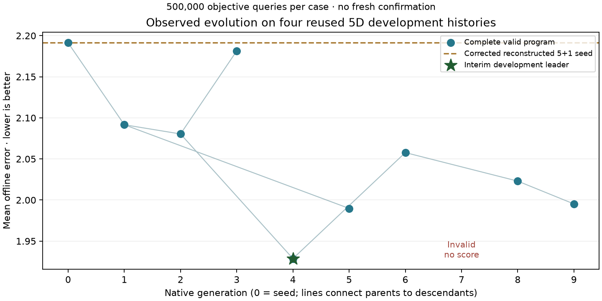

# Corrected 200-peak campaign — Session 2 continuation

**WSL continuation, 18 September 2026, 09:17 UTC:** generations 8 and 9 completed
all four cases, bringing the count to **eight valid descendants plus seed
generation 0**, across nine completed descendant slots. Generation 7 remains an
operational failure without a comparable score. Shinka is updating meta-memory before proposing generation 10.
Generation 9 required the reviewed fourth-case recovery below. The native WebUI
is available on the actual database.

**Session 2 was launched on 18 September 2026 at 08:18:43 UTC from the
published Session 1 checkpoint.** This is a running-session record, not final
selection or a completed-session publication. The launch inherited six valid
descendants (generations 1–6), seed generation 0, all seven constant controls,
and 44 completed physical cases / 22 million objective queries.

The native controller resumes generation 7 and allows at most six further
terminal slots, through generation 12. It retains the 50-descendant campaign,
400-response campaign ceiling and 80-response session allowance. The research
cutoff is 10:58:43 UTC, with the final 20 minutes of the 180-minute ceiling
reserved. No subsequent session or fresh comparison is automatically launched.

## Restoration and actual continuation

This workspace had no live run or Python environment. All 303 files in the
immutable Session 1 manifest passed SHA-256 and size checks before copying to
`results/book_mpso_population_200_v2/20260917T065325Z`. SQLite integrity was `ok`,
with seven valid program rows. The archived `publication_ready` session status
was reconciled to `published` in the live copy using the already-published
Session 1 receipt; the archive was not modified.

The pinned Shinka revision and local embedding model were restored. The initial
optimizer restoration incorrectly used Python 3.10.12 / NumPy 2.2.6, the embedding
service's runtime; the optimizer actually required Python 3.13.5 / NumPy 2.5.3.
This mistake was corrected as documented below. The checkpoint validated five processed and two pending
meta programs. At 08:19:01 UTC, the real native controller logged
`campaign_restored`, including `rng_restored=True`, before generation 7 sampling.
This observes an actual restart with retained state; it does not promise identical
future LLM responses. Completed controls were checked and reused without new
objective evaluations.

The first generation-7 attempt selected generation 4 as parent and used a full
rewrite. It repeated generation 6's capped-workload rule. Native novelty rejected
it at 08:20:15 UTC before numerical evaluation, then sampled generation 5 as
parent for a second attempt within the same slot. Rejected attempts consume their
actual model responses and retain their prompts/sources; they are not counted as
completed generations or new optimizer findings.

The second attempt, `soft_refresh_discount`, was accepted and entered numerical
evaluation around 08:22 UTC. It replaces generation 5's hard residual-loss cap
with `0.75 * detected_loss + 0.25 * min(detected_loss, residual_loss)`, leaving
the unbounded workload penalty and thresholds unchanged. This tests partial
discounting by refreshed memories. It is a hypothesis about recovery, not an
established gain; a complete four-history score is required before ranking.

The running Codex child was directly observed with `gpt-6-astra` and
`model_reasoning_effort=xhigh`. `codex login status` confirmed ChatGPT subscription
authentication. These are inner settings; supervising Astra/Ultra remains the
client-requested setting and is not inferred from child receipts. No paid API
fallback is enabled. Shinka's displayed dollar amounts are estimates.

## What each program tests and what the logs explain

Every admitted program chooses an integer neutral target from 2 through 8 after
detected change and counted memory refresh. The fixed adapter changes population
by at most one, retaining the permanent quantum particle and corrected engine.
The same four five-dimensional, 200-peak development histories each receive
500,000 objective queries. Detection and memory refresh count toward that budget;
environment RNGs remain independent of optimizer RNGs. Mean offline error is the
ranking criterion, with frozen evolutionary feedback against targets three/five.

The added observational logger records:

- `scientific_test`: intervention, fixed mechanisms, histories, budgets and
  development-only interpretation.
- `program_under_test` and `program_change`: exact parent/inspiration identities,
  mutation type, author's hypothesis, source hash, referenced observation fields
  and line-by-line executable differences.
- `program_measured`: validity, completed cases, observed mean error and difference
  from the actual parent; invalid/partial programs do not claim an improvement.

Native sampling, novelty, evaluation, per-case checkpoints and meta updates retain
their existing logs. Timestamped, flushed heartbeats mean a process is waiting for
a result; they do not represent token streaming or access to hidden reasoning.
The hypothesis text is attributed to the proposing model and is distinct from
observed behavior and performance. This logging adds no candidate observations,
scientific changes, objective evaluations or model calls.

Twenty-three focused resume/control checks initially passed; those checks did
not enforce the archived numerical runtime. The narrative logger was
checked on archived generation 4 and on an invalid-outcome fixture, using zero
additional objective/model calls. The browser displayed all seven existing native
programs, the actual generation-4 source and its lineage, with no reported errors.

## Observed runtime failure and bounded recovery

Generation 7's first case completed 500,000 objective queries at 08:24:18 UTC.
The subsequent pairing check rejected its environment hashes. The initial
environment matched; the first change differed in four coordinates, by at most
3.56e-15, and later change hashes differed. This is an operational runtime error,
not an invalid population function or evidence of inferior optimizer behavior.
The saved partial result is not compared or ranked against the controls.

The supervising agent stopped scheduling, identified the recorded versions in
`operations/numerical-runtime.json`, and restored Python **3.13.5**, NumPy **2.5.3**
and Shinka **0.0.7**. An environment-only diagnostic then regenerated all **404**
recorded initial/change snapshots over the four histories with exactly matching
hashes and **zero objective evaluations or model calls**. Pairing tolerances,
scientific sources, candidate interfaces and benchmark inputs were unchanged.
The separate local encoder remains on Python 3.10.12 / NumPy 2.2.6.

A tested controller preflight now rejects a mismatch against the saved optimizer
runtime before creating a session or making model/evaluation calls. All **25**
focused resume/control checks pass under the restored runtime. The failed source,
full case, logs and counted attempt remain unchanged. A consistent SQLite backup
preserves the original failure row; its live feedback and metadata now explicitly
attribute the failure to runtime restoration, so it does not claim a candidate
defect. Its validity and score were not promoted. The checkpoint IDs remain valid.

Generation 7 remains a consumed terminal slot, with **500,000 queries retained in
the ledger**. It was not silently replayed or replaced. The interrupted generation-8
proposal had no accepted source or numerical case; its request reservation and
interrupted evidence remain retained. The normal resume mechanism retries that
unaccepted slot without promising the same LLM output. The controller restarted
at 08:30:26 UTC, but npm package resolution timed out in the no-model availability
check. A second restart at **08:33:15 UTC** uses the already-installed, verified
Headless **0.6.1** executable directly; its `--check` succeeds. At 08:33:40 the
native controller restored state and began generation 8. Provider, subscription
authentication and the explicit `gpt-6-astra/xhigh` route are unchanged. Both
restarts retain the same Session 2 response baseline, generation-12 stop and
10:58:43 research cutoff. No allowance was reset and no completed control rerun.

[Recovery evidence](../../../artifacts/book_mpso_population_200_v2_publication/session_002_runtime_recovery/MANIFEST.json)
contains the version check, landscape diagnostic, original failed database state,
failure explanation and restart receipt. This is an operational snapshot, not a
drained final-session archive or a scientific improvement.

## Measured evolution after WSL returned

Generation 8, `exceptional_four_recovery`, completed at 08:49:53 UTC. Its parent
is generation 6, with generations 4 and 5 as inspirations. It removes the parent's
workload cap and permits target four under unusually high workload-adjusted loss
(entry threshold 0.20, retention threshold 0.12); otherwise it retains the
two/three-target hysteresis. Its four-case mean is **2.023027**, compared with
**2.057724** for its parent and **1.928740** for the still-leading generation 4.
It improves on its parent by 0.034697 but does not establish a new leader. The
two simultaneous edits do not isolate the effect of allowing target four.

| Development case | G8 offline error | Difference from corrected target 5 |
|---|---:|---:|
| 000 | 2.125693 | −0.622631 |
| 001 | 2.142308 | +0.220792 |
| 002 | 1.768030 | −0.039608 |
| 003 | 2.056076 | −0.231578 |

Generation 8 requested targets two/three/four **6,421 / 3,300 / 354** times.
Target four was therefore used, rather than merely present in source. These are
policy decisions, not realized population counts: the adapter moves by at most one.
The four cases consumed two million queries on the same development histories;
they are not fresh confirmation. Its [verified completed-generation snapshot](../../../artifacts/book_mpso_population_200_v2_publication/session_002_generation_008/MANIFEST.json)
contains its executed source, exact diff, native proposal evidence, all four cases
and a consistent database backup. It is an interim snapshot, not a drained session
archive.



Lines connect actual parents and children; invalid generation 7 has no plotted
score. This is a plot of measured five-dimensional experiments, not a 2D swarm
illustration. It was generated from the saved database with zero new model calls
or objective evaluations.

Generation 9, `two_three_fast_release`, descends from generation 8. It removes
target four and increases the target-three retention threshold from 0.04 to 0.05,
testing earlier population shrinkage after recovery. The workload normalization
remains unbounded. This compares whole policies; it cannot separately identify
the causal effect of either edit.

After the recovery below, the native evaluator reused all four saved artifacts and
recorded generation 9 at **09:16:15 UTC**, with mean **1.995239**, worst-case error
**2.124206**, and case standard deviation **0.177222**. Its mean is 0.027787 lower
than parent generation 8 and 0.066499 higher than leader generation 4. The native
database contains the original accepted lineage. The
[generation-9 snapshot](../../../artifacts/book_mpso_population_200_v2_publication/session_002_generation_009/MANIFEST.json)
retains all cases, source/proposal evidence, consistent database, recovery review,
original interrupted ledger, recovery script/log and viewer verification.

Through this checkpoint, the cumulative ledger has **54 full-budget attempts**:
**53 completed physical cases / 26.5 million known completed queries**, plus the
interrupted attempt reserved at 500,000 queries. Conservative charged work is
**27 million queries**; the interrupted attempt's observed lower bound adds
140,000 to the known completed total, but its exact total is unavailable. These
counts include generation 7's full failed-runtime case and generation 9's replay.
Cached records add no objective queries. Historical `stage_complete` control log
fields labeled `new_executions` reported cumulative totals; all 20 requested
control checks on this restart reused saved cases. The logger now distinguishes
per-invocation work from cumulative totals explicitly.

## Evaluation-timeout recovery and viewer repair

At 09:07:30 UTC, the controller correctly stopped without scoring generation 9
because its evaluator had not produced final metrics. The native scheduler log
records an explicit **00:16:33 timeout**. Inspection showed that the scheduler
compares this evaluation limit against `job.start_time`, which includes earlier
mutation and novelty work. Three complete cases were checkpointed; the fourth
last recorded **140,000 queries**. Its exact final query count is unknown.

The resume compatibility layer now passes the evaluation start time to that
scheduler check, preserving the native proposal timestamps elsewhere. Four focused
checks pass, including a regression that allows an evaluation within its own
limit, still stops one over its limit, and preserves the original job timestamps.
This is an infrastructure correction, not an evolutionary improvement.

A written recovery review preserves the original partial ledger and logs. The
interrupted fourth attempt keeps its full **500,000-query reservation**, an
observed lower bound of 140,000, and an unknown exact total. One additional full
500,000-query attempt runs only the fourth case using the exact accepted source,
frozen evaluator helpers, unchanged config, scientific fingerprints and recorded
Python 3.13.5 / NumPy 2.5.3 runtime. The three completed case files are hash-checked
before and after; native resume reuses them. No model call generates a replacement
program, and no session allowance or deadline is reset.

The fourth-case replay completed at **09:15:29 UTC** and passed pairing against
both frozen feedback references. The controller resumed at **09:15:54 UTC**;
its four `case_reused` events and full native score establish successful recovery.
The ordinary interval-five meta update then began; generation 10 is queued under
the original session ceiling.

Separately, an idle browser socket blocked the pinned viewer's single-connection
TCP server. `scripts/native_webui.py` retains native handlers/pages and switches
only the viewer's transport to concurrent connections. Browser verification
opened the actual generation-8 lineage/source/score and reported no page errors.
A native API request returned nine program rows while a separate idle socket
remained open, reproducing and resolving the specific failure. The first wrapper
attempt failed during import due to a standard-library class conflict; its log
is preserved. The corrected wrapper limits the substitution to the viewer module.
Automated browser sessions were closed after verification; the viewer stays up.

## Watch the running session

[Native Shinka WebUI](http://localhost:8899/viz_tree.html?db_path=search_seed_670001%2Fprograms.sqlite)

```bash
# Complete session terminal, including child output and explanatory events:
tail -F results/book_mpso_population_200_v2/20260917T065325Z/operations/session_002-terminal.log

# Focused native progress and persistent explanations:
bash scripts/progress.sh results/book_mpso_population_200_v2/20260917T065325Z/evolution/search_seed_670001

# Only if the existing viewer has ended and port 8899 is free:
bash scripts/webui.sh results/book_mpso_population_200_v2/20260917T065325Z/evolution 8899
```

Do not launch a second controller while this one is active. If interrupted before
its deadline, resume with the existing session allowance:

```bash
.venv/bin/python -u scripts/run_population_campaign.py session \
  --run results/book_mpso_population_200_v2/20260917T065325Z --minutes 180
```

The current launch sets `SHINKA_HEADLESS_COMMAND` to the installed pinned binary
at `/home/roland/.npm/_npx/e33d60c9345e504d/node_modules/.bin/headless` to avoid
another npm-resolution wait. Its package version and entry-point hash are in the
restart receipt; this is the same CLI and provider route, not a model fallback.

Restoration, process launch, actual model arguments and browser verification
receipts are retained in the live `operations/` directory. Session metadata is
under `sessions/session_002/`; each completed numerical case is independently
checkpointed. The unchanged [Session 1 report](REPORT.md) remains the completed
historical record.

The separately requested [cross-substrate emergence research](../../emergence_across_substrates.md)
distinguishes collective dynamics inside an imposed cooperative optimizer from
voluntary cooperation and institution formation. It proposes falsifiable future
tests without adding them to this campaign.
