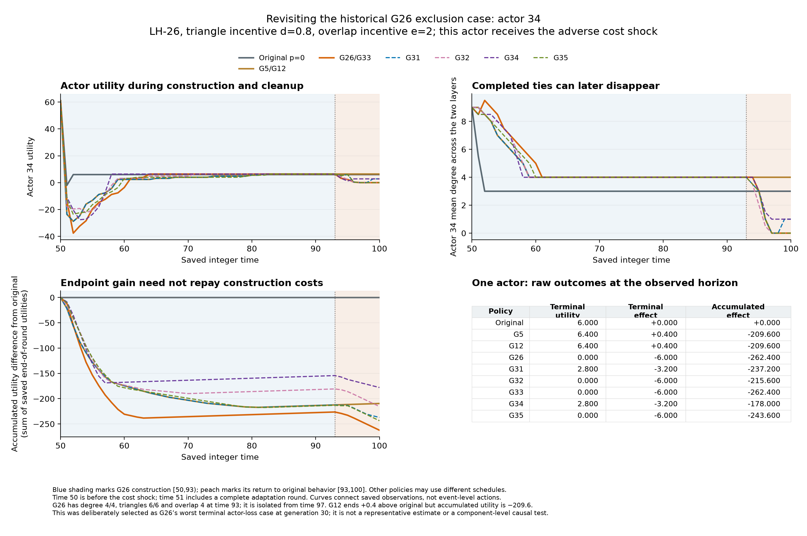

# Cooperation under Partial Shocks

> **Separate cooperative-network study — not PSO results.** This report and its selected Java policy come from [`shinka-cooperative-network` at `42ccaaf`](https://github.com/ReloadLightly/shinka-cooperative-network/commit/42ccaaf4b4f9c361f671cf54b6d874bc4d442359). Generation 35 is the review boundary; **generation 34 is the selected program**. Scientific claims and checkpoint descriptions refer to that source study. This small publication contains reports, the selected source and four figures; supporting records remain linked to the source commit. It does not change the adaptive-swarms campaign or publish a runnable campaign checkpoint. [File provenance](PROVENANCE.json).

### Evolving decentralized decision rules in multiplex networks

*A computational study of coordination, adaptation, and exclusion, based on Burghardt–Maoz and ShinkaEvolve.*

[Latest scientific review: generation 35](generation35_review.md) · [Preserved generation-30 review](https://github.com/ReloadLightly/shinka-cooperative-network/blob/42ccaaf4b4f9c361f671cf54b6d874bc4d442359/docs/paper_trajectory_v2/generation30_review.md) · [Selected program: generation 34](selected_program/main.java) · [Experimental contract](https://github.com/ReloadLightly/shinka-cooperative-network/blob/42ccaaf4b4f9c361f671cf54b6d874bc4d442359/experiments/paper_trajectory_v2/task_prompt.md) · [Reproducibility](#8-reproducibility-and-research-status)

## Abstract

Cooperation depends on relationships that are costly to build, valuable in combination, and vulnerable to disruption. This project investigates whether program evolution can discover local decision rules that improve the reorganization of overlapping cooperation networks. We reconstruct the executable model of Burghardt and Maoz and use ShinkaEvolve to evolve partner choice, offer acceptance and tie revision. Across 35 proposal slots, 32 valid descendants establish and refine a shared convention: scheduled investment in dense, overlapping groups, followed by a return to immediate utility-seeking behavior. The selected generation-34 policy changes group membership from contiguous actor IDs to round-robin assignment. On the frozen 288-condition development panel, it raises mean terminal utility to 682.0605, compared with 75.0391 for the original policy, but adds only 0.0075 over the generation-30 winner. It leaves 271 paired actor-case observations worse off and 118 isolated; the retained generation-12 alternative has five losses and three isolates. Two of the five new proposals reproduce earlier saved trajectories exactly. These findings support effective network reorganization within the model, while exposing a search plateau and tradeoffs among population utility, exclusion and costs along the path. The actors execute locally, but common code, identity conventions and public timing supply coordination. Generalization and empirical implications for international cooperation remain open.

**Keywords:** multiplex networks · partial shocks · decentralized cooperation · program evolution · collective systems · weaponized interdependence

## 1. Why cooperation networks matter

International cooperation takes place through overlapping relationships. The same countries may trade, coordinate security, finance infrastructure, and share technology. A relationship in one domain can support cooperation in another; it can also transmit vulnerability. A disruption affecting a subset of participants may therefore change the choices available to the wider network.

This tension is particularly important in an age of **weaponized interdependence**. Farrell and Newman show how control over central nodes in economic networks can give states opportunities to monitor or restrict others' access. Connectivity creates opportunities for both cooperation and coercion; its consequences depend on the structure of the network and the distribution of control. [1](https://doi.org/10.1162/ISEC_a_00351)

Japan's updated Free and Open Indo-Pacific vision provides a contemporary motivation for studying these questions. It connects supply-chain resilience, infrastructure, common rules, and multilayered security cooperation with countries' capacity to make their own choices. This raises a substantive question for network research: **how can cooperation be reorganized when partners face different pressures, and who gains or loses in the process?** [2](https://www.mofa.go.jp/files/101022859.pdf)

The present experiment isolates one part of that problem: decentralized network formation under changing relationship costs. It does not model a strategic coercer or calibrate actors to Japan and its partners. Its purpose is to discover and inspect possible mechanisms of collective adaptation before making claims about a particular international system.

Building a valuable arrangement, maintaining it, and distributing its benefits are different problems. A common local rule can generate a useful network while leaving some members worse off. The executable policies and saved trajectories let us inspect those distinctions rather than infer cooperation solely from network density or average performance.

> **Research question:** Can locally informed decision rules improve the outcomes of cooperative multiplex networks under partial cost shocks—and what distributional consequences accompany that improvement?

## 2. From the original study to an evolutionary experiment

Burghardt and Maoz's *Partial Shocks on Cooperative Multiplex Networks with Varying Degrees of Noise* studies how cooperative relationships form and respond to changing costs. Actors can create, dissolve, or replace connections in two network layers. Forming a tie requires both parties' consent; either party may end it. Their decisions produce the network without a central authority assigning its edges. [3](https://doi.org/10.1038/s41598-018-31960-y)

Three features make the model useful for studying coordination:

| Mechanism | Meaning in the model |
|---|---|
| Costly relationships | Each connection provides a benefit, while the cost of maintaining many connections rises quadratically. |
| Triangle closure | Cooperation with mutually connected partners creates an additional benefit. |
| Multiplex reinforcement | A relationship appearing in both layers creates an additional benefit. |

An actor can consequently face a **coordination barrier**: a connection that initially reduces its utility may be needed to create a more valuable structure later. The authors investigate how random behavior can help networks move beyond purely short-term choices. Our extension asks whether an evolved, state-dependent program can find a more selective route through such barriers.

The actor's utility is

$$
u_i = \sum_{\ell=1}^{2}\left[k_{i\ell}-c_{i\ell}k_{i\ell}^{2}+d\,z_{i\ell}\right]+e\,v_i,
$$

where $k$ is degree, $c$ is the actor's tie-cost coefficient, $z$ counts triangles involving that actor, and $v$ counts its partners connected on both layers. The parameters $d$ and $e$ control triangle and overlap benefits. These are model utility units, not monetary values or calibrated national welfare.

**The comparison uses the authors' pinned Java implementation as its primary behavioral reference.** Paper-derived settings specify the experimental conditions. The full observation horizon and independently seeded shock recipients are disclosed overrides; disagreements between executable code and prose remain documented. Numerical reproduction of every published result is unfinished. [Source fidelity and reconstruction](#appendix-a-source-fidelity-and-earlier-experiments)

## 3. Experimental design

### 3.1 Formation, intervention, and recovery

Forty actors begin with two empty, undirected networks. They form relationships through time 50. A cost intervention then affects 13, 26, or all 40 actors, and the simulation continues to time 100. A partial shock changes an actor's costs in both layers; partners whose own costs remain unchanged may still be affected through network reorganization.

The development panel independently crosses six triangle incentives and six overlap incentives with eight cost/shock/control conditions. Every valid candidate runs the same **288 conditions**, with one repetition per condition. The eight related cases within each incentive combination form one history family: there are **36 independent history families**, not 288 independent replications.

| Experimental component | Frozen specification |
|---|---|
| Adverse cost change | 0.2 → 0.6 for 13, 26, or 40 actors |
| Favorable cost change | 0.6 → 0.2 for 13, 26, or 40 actors |
| Controls | Costs remain at 0.2 or at 0.6 |
| Triangle and overlap incentives | Each independently takes 0, 0.4, 0.8, 1.2, 1.6, or 2 |
| Primary outcome | Mean utility across actors at time 100, averaged equally over conditions |
| Comparator | One globally selected original fixed-noise policy: $p=0$ |

The comparator was selected before evolution from the four completed original fixed-noise variants. It is the same policy in every condition. Shock recipients are paired across policies; different decisions can still produce different endogenous random trajectories. The original-behavior seed reproduced the comparator on all development cases before discovery began. [Frozen design and seed evidence](https://github.com/ReloadLightly/shinka-cooperative-network/blob/42ccaaf4b4f9c361f671cf54b6d874bc4d442359/docs/paper_trajectory_v2/amended_discovery_freeze.md)

### 3.2 What ShinkaEvolve changes

A candidate is an executable **Java decision policy**, with two entry points:

```java
void act(Turn turn, Memory memory);
Decision accept(Offer offer, Memory memory);
```

The same code is used by every actor, each with separate private memory. It can choose partners, propose or delete ties, rewire, decline to act, and accept or reject incoming offers. It sees permitted local information and public parameters; it cannot inspect other actors' private costs, the global network, or hidden shock recipients. Utility, shocks, the evaluator, and action/search limits remain outside the editable program. [Complete policy interface](https://github.com/ReloadLightly/shinka-cooperative-network/blob/42ccaaf4b4f9c361f671cf54b6d874bc4d442359/experiments/paper_trajectory_v2/task_prompt.md)

ShinkaEvolve supplies native parent and inspiration selection, code mutation, novelty checks, island populations, migration, model selection, meta recommendations, and prompt evolution. Numerical simulation provides the fitness used to select programs. This is an optimization extension of the authors' explanatory model. [4](https://arxiv.org/abs/2509.19349)

The selection score is the raw mean utility difference divided by one frozen positive scale. **It is not a percentage improvement.** The results below use raw utility and structural outcomes; [search and execution details](#appendix-b-search-accounting) are kept separate.

## 4. The discovered mechanism: scheduled construction and cleanup

The selected program, **generation 34**, refines a mechanism established before the generation-30 checkpoint. It implements three phases:

| Phase | Behavior |
|---|---|
| Formation: before time 50 | Follow the original immediate-improvement policy. |
| Construction: time 50 to before 93 | When triangle benefits are sufficiently strong, build overlapping cooperation groups, accepting some temporary losses. |
| Cleanup: from time 93 | Return to the original immediate-improvement policy. |

During construction, each actor estimates a preferred partition using **its own costs** and the public incentives. It compares hypothetical homogeneous populations; it does not observe everyone else's costs. Generation 34 assigns membership by public actor ID modulo the chosen number of groups:

```java
return actor % cohortCount == other % cohortCount;
```

This distributes successive IDs across groups instead of using contiguous blocks. The change preserves the optimized group count and multiset of group sizes, while changing partners and sometimes a particular actor's group size. Actors with different costs can still prefer incompatible memberships after a partial shock. Round-robin assignment does not establish anonymous coordination or better mixing by itself.

Actors remove outside-group ties, add missing within-group ties and preferentially choose partners already connected on the other layer. They accept finite within-group offers even if the immediate gain is negative, reject outside offers and remember rejecting partners. Generation 34 retains parent 30's paired outside-tie cleanup, overlap priority and private rejection memory. If triangle incentives are below 0.4, it retains original behavior throughout.

The historical sequence clarifies what evolved. Generation 5 established randomized cohort construction. Generation 12 explicitly compared balanced partitions under the observing actor's own costs; generation 20 also adopted that calculation, and its child generation 26 added overlap-first partner selection. G12 is an alternative branch, not G26's direct ancestor. G26 remained the winner through proposal 30. G34 changes the membership convention within this established construction family. [G5](https://github.com/ReloadLightly/shinka-cooperative-network/blob/42ccaaf4b4f9c361f671cf54b6d874bc4d442359/results/paper_trajectory_v2/search/gen_5/main.java) · [G12](https://github.com/ReloadLightly/shinka-cooperative-network/blob/42ccaaf4b4f9c361f671cf54b6d874bc4d442359/results/paper_trajectory_v2/search/gen_12/main.java) · [G26](https://github.com/ReloadLightly/shinka-cooperative-network/blob/42ccaaf4b4f9c361f671cf54b6d874bc4d442359/results/paper_trajectory_v2/search/gen_26/main.java) · [G34](selected_program/main.java)

A rejected construction proposal is cached permanently by partner ID, across both layers. It prevents further initiated offers during construction but does not prohibit later incoming acceptance. This is observed rejection avoidance, not demonstrated reciprocity or punishment.

**Interpretation:** temporary local sacrifice and shared membership rules can support structures that myopic bilateral improvement does not readily build. Code and saved trajectories support this account; no ablation has isolated each component's contribution.


*Figure 1. Membership changes redistribute an exclusion outcome.* These are actual saved time-100 networks in the historical G26 worst actor-loss case: 26 actors face higher costs, with incentives $d=0.8$, $e=2$. The policies share the time-50 network. Actor 34 ends with utility 6.0 under the original, zero under G26, and 2.8 with one overlapping partner under G34. This case's population means are respectively 12.700, 41.220 and 41.140: helping this actor does not imply increasing the case mean. The example was deliberately selected for an adverse outcome and is not a prevalence estimate. [Data and provenance](https://github.com/ReloadLightly/shinka-cooperative-network/blob/42ccaaf4b4f9c361f671cf54b6d874bc4d442359/assets/readme/generation35-network-example.json) · [Renderer](https://github.com/ReloadLightly/shinka-cooperative-network/blob/42ccaaf4b4f9c361f671cf54b6d874bc4d442359/scripts/analysis/generation35_network_figure.py) · [Historical illustration](https://github.com/ReloadLightly/shinka-cooperative-network/blob/42ccaaf4b4f9c361f671cf54b6d874bc4d442359/assets/readme/generation30-network-example.svg)

## 5. Results: collective gains and individual losses

### 5.1 Large gains were established before the continuation

The selected policy produces substantially denser and more overlapping networks than the original. Its additional improvement over the generation-30 winner is small:

| Terminal outcome | Original policy | G26: historical winner | G34: selected winner |
|---|---:|---:|---:|
| Mean actor utility | 75.0391 | 682.0530 | **682.0605** |
| Mean degree per actor per layer | 5.2673 | 25.1033 | 25.1095 |
| Mean local clustering | 0.5834 | 0.7505 | 0.7540 |
| Mean cross-layer overlap fraction | 0.6541 | 0.9356 | 0.9384 |
| Isolated actor-case observations | 45 | 105 | **118** |

Clustering and overlap assign zero to undefined ratios; the review also retains defined-only measures. Actor-case observations span related simulations and are not independent people.

G34's raw mean utility gain over the original is **607.021389 units**, only **0.007465278** above G26. Dividing by the frozen scale 213.28963331061775 gives native fitness **2.845995745160629**. This score is not a percentage. Selection uses recorded native fitness, with the previous winner retained on an exact tie.

The historical payoff decomposition explains the large gain already present in G26: regimes with strong triangle benefits, $d\geq1.2$, contribute **92.88%** of its aggregate gain. Increased triangle benefits outweigh substantially higher quadratic tie costs. These are triangle-rich construction outcomes, reinforced by overlap; they do not establish that denser networks are generally preferable. [Historical incentive regimes and payoff decomposition](https://github.com/ReloadLightly/shinka-cooperative-network/blob/42ccaaf4b4f9c361f671cf54b6d874bc4d442359/docs/paper_trajectory_v2/generation30_review.md#which-incentives-drive-the-result)

### 5.2 A higher average does not imply shared benefit

G34 leaves **271 of 11,520 paired actor-case observations** worse off by more than $10^{-9}$ utility units. Of these losses, 171 occur among directly shocked actors under adverse shocks and 100 among unshocked actors under favorable partial shocks. None occurs in its unchanged-cost controls. Thus partners can lose even when their own costs do not rise.

| Policy | Mean terminal utility | Terminal-loss observations | Isolated observations | Cumulative-loss observations |
|---|---:|---:|---:|---:|
| Original | 75.0391 | — | 45 | — |
| G5: initial construction reference | 681.1689 | 31 | 3 | 1,533 |
| G6: historical no-terminal-loss alternative | 638.8533 | **0** | See historical review | See historical review |
| G12: retained lower-harm alternative | 681.1948 | **5** | **3** | **1,500** |
| G26: winner through proposal 30 | 682.0530 | 287 | 105 | 1,531 |
| **G34: selected winner through proposal 35** | **682.0605** | **271** | **118** | **1,549** |

Loss counts compare each policy with the original, using differences below $-10^{-9}$. G34 has 368 strictly negative terminal differences if rounding-sized effects are included; the sensitivity threshold never changes fitness. G6 has no strictly negative terminal comparison on this panel. Cumulative utility sums saved end-of-round utilities through time 100 without discounting; it is a path outcome, not another optimized objective.


*Figure 2. Small differences in mean utility coexist with substantial distributional differences.* Every valid program is measured on the same development conditions. Counts describe dependent actor-case observations, not independent replications or preferences for inequality.

Relative to G26, G34 reduces terminal losses but increases isolation and cumulative losses. Its mean cumulative gain rises by only 0.641493 to 14,118.029132. Against G26, 337 actor-case observations gain and 310 lose beyond the descriptive tolerance; 10,873 tie within it. A change in a count need not identify the same actors switching status.

**Generation 12 remains a meaningful distributional alternative.** It achieves nearly the same average as G34 with far fewer terminal losses and isolates. The frozen objective still selects G34. Retaining this alternative does not retrospectively change the winner-selection rule. [Current distributional findings](generation35_review.md#gains-exclusion-and-costs-along-the-path) · [Historical G6 and other alternatives](https://github.com/ReloadLightly/shinka-cooperative-network/blob/42ccaaf4b4f9c361f671cf54b6d874bc4d442359/docs/paper_trajectory_v2/generation30_review.md#measured-utility-and-distributional-effects)

### 5.3 Reorganization is not the same as shock resilience

The current winner shares the original time-50 graphs and actor utilities in all 288 saved development cases, then follows its construction schedule. It also reorganizes unchanged-cost controls. Improvement therefore does not require detection of a shock.


*Figure 3. Preserved generation-30 formation and recovery curves.* LH denotes an adverse cost increase; HL a favorable decrease; LL and HH are unchanged-cost controls. Curves average the 36 incentive combinations. Open circles are the exact immediate cost effect calculated on the saved time-50 graph; subsequent observations include adaptation. This historical panel supplies context rather than new G34 path estimates.

The earlier full-panel curves show prolonged construction costs, including negative mean utility in the unchanged high-cost control before recovery. The continuation inspects complete paths only in fixed historical examples, so it does not estimate new panel-wide trough timing.

Under a 13-actor adverse shock, G34's mean terminal utility is **285.911111 units below its own unchanged-low-cost control**; the corresponding original-policy penalty is **29.459722**. Higher absolute utility in the shock condition therefore does not establish a smaller adverse-shock penalty. These comparisons also differ from the original paper's normalized resilience and flexibility measures. [Current contrasts](https://github.com/ReloadLightly/shinka-cooperative-network/blob/42ccaaf4b4f9c361f671cf54b6d874bc4d442359/results/paper_trajectory_v2/report/generation-35-review/review.json) · [Historical recovery analysis](https://github.com/ReloadLightly/shinka-cooperative-network/blob/42ccaaf4b4f9c361f671cf54b6d874bc4d442359/docs/paper_trajectory_v2/generation30_review.md#formation-immediate-shock-and-recovery)

### 5.4 What proposals 31–35 added

All five new proposals were valid. They explore the established construction family through handoff timing, partner priority, membership and layer choice:

| Proposal; parent | Executable change | Raw gain over original | Difference from parent | Difference from incumbent then |
|---|---|---:|---:|---:|
| G31; G15 | Remove early construction; use a completion-aware handoff | 607.013681 | +0.012639 | −0.000243 |
| G32; G21 | Rank overlapping partners by common cohort neighbors | 607.011493 | −0.000174 | −0.002431 |
| G33; G29 | Restore fixed cleanup from time 93 instead of 95 | 607.013924 | +0.011597 | Exact tie |
| **G34; G30** | **Replace contiguous membership with round-robin groups** | **607.021389** | **+0.008646** | **+0.007465** |
| G35; G16 | Break equal-degree layer ties by eligible overlap availability | 607.009479 | −0.001458 | −0.011910 |

The incumbent was G26 for proposals 31–34 and G34 for proposal 35. Rounded utility differences summarize the results; exact native fitness determines selection. G34's accepted proposal used a full-program patch. All results are evaluated outcomes, not assigned scores for failures.


*Figure 4. The continuation finds one small objective improvement.* The changes are measured on a repeatedly used development panel; no fresh-history superiority or statistical significance follows.

Two apparent variations are exact saved-behavior rediscoveries. All 288 compressed trajectory hashes for G31 match G22; all 288 for G33 match G26. This establishes identity of retained paths and endpoints, not an unrecorded action-level trace. G31 also changes several components relative to parent 15, so its large change in cumulative outcomes cannot be causally assigned to removing early construction alone. G32 changes path outcomes but loses the terminal objective; G35's layer-choice refinement loses to both parent and incumbent. G34 supplies a different membership convention within the existing architecture, with mixed effects on exclusion.

Most of the large objective gain arose early: G5 already achieved **99.854% of G26's raw gain**. G13-to-G26 improvement was only **0.0009375** mean utility units. The additional search supports **local refinement with repeated behavioral rediscovery**, rather than discovery of a new cooperation architecture. [Historical search curve](https://github.com/ReloadLightly/shinka-cooperative-network/blob/42ccaaf4b4f9c361f671cf54b6d874bc4d442359/results/paper_trajectory_v2/report/generation-30-review/search-progress.png)

Code novelty, terminal novelty and path novelty remain different. Historically, G25 reproduced G12's terminal utilities and adjacency while changing cumulative payoff; G26 improved its parent by only 0.001875 terminal units but changed mean cumulative recovery utility by 191.596181. In the new window, G33 passed a parent-relative novelty check while reproducing an older archived policy's saved behavior. Native novelty admission does not establish novel social behavior. [Lehman and Stanley, 2011](https://doi.org/10.1162/EVCO_a_00025) · [Trajectory comparisons](https://github.com/ReloadLightly/shinka-cooperative-network/blob/42ccaaf4b4f9c361f671cf54b6d874bc4d442359/results/paper_trajectory_v2/report/continuation-trajectory-equivalence.json)

The [generation-35 scientific review](generation35_review.md) gives every proposal's parent, inspirations, island, actual model, executable change and outcome. The [generation-30 review](https://github.com/ReloadLightly/shinka-cooperative-network/blob/42ccaaf4b4f9c361f671cf54b6d874bc4d442359/docs/paper_trajectory_v2/generation30_review.md) remains unchanged historical evidence.

## 6. Discussion: cooperation, emergence and exclusion

Three parallel research reviews inspected the code, retained results and primary literature without changing the frozen discovery context. The following interpretation integrates their strongest findings while retaining rival explanations; repeated interpretations are not independent validation. [Integrated research memo and source reports](https://github.com/ReloadLightly/shinka-cooperative-network/blob/42ccaaf4b4f9c361f671cf54b6d874bc4d442359/docs/paper_trajectory_v2/research_synthesis.md)

### 6.1 A supplied convention can operate without centralized edge control

Each actor controls its own proposals, possesses private memory and can refuse additions; either endpoint can leave an existing relationship. No actor has global information or authority over another's consent. Nevertheless, every actor receives the same externally selected program, including its public-ID membership rule and phase schedule. Actors do not negotiate adoption or evolve separate policies during a trajectory. The search evolves complete shared policies; its islands are not independently evolving actor species. This differs from cooperative coevolution of separately represented, interacting subcomponents. [Actor deployment and permissions](https://github.com/ReloadLightly/shinka-cooperative-network/blob/42ccaaf4b4f9c361f671cf54b6d874bc4d442359/java-paper/agents/PaperSimulation.java) · [Potter and De Jong, 2000](https://direct.mit.edu/evco/article/8/1/1/859/Cooperative-Coevolution-An-Architecture-for).

These observations reconcile decentralized execution with supplied coordination. In international relations, anarchy means absence of common government, not absence of organization. The simulation represents bilateral consent and unilateral exit, but does not establish how independently strategic states would negotiate or sustain the evolved convention. Bargaining, implementation and enforcement remain different problems. In particular, accepting an immediately costly offer because shared code requires it does not demonstrate that adopting the code is individually advantageous. [Axelrod and Keohane, 1985](https://websites.umich.edu/~axe/Axelrod%20and%20Keohane%20Coop%20.pdf) · [Fearon, 1998](https://www.web.stanford.edu/group/fearon-research/cgi-bin/wordpress/wp-content/uploads/2013/10/Bargaining-Enforcement-and-International-Cooperation.pdf).

### 6.2 Emergence is a claim about particular outcomes

Programmed local behavior can generate unscripted collective trajectories, as Reynolds's flocking model illustrates. Here offers, refusals, deletion externalities and activation order generate realized networks. The intended cohort blueprint and phase schedule are explicit, however; they are not institutions invented by the actors. The most precise description is **interaction-generated outcomes under an evolved common protocol**. A simulation alone does not establish a stronger claim of computational irreducibility or universal self-organization. [Reynolds, 1987](https://www.red3d.com/cwr/papers/1987/SIGGRAPH87.pdf).

The distinction matters because the rule evaluates an ideal overlapping clique, whose payoff advantage is already supplied by strong triangle incentives. At sufficiently high triangle benefits it favors one population-wide cohort. Dense networks and high clustering therefore do not establish discovery of modular organization. The less predetermined outcomes—construction delays, incomplete structures, cost sorting and local collapse—may reveal more about how the protocol interacts with heterogeneous incentives. Shared time and ordered public IDs are coordination resources, not merely administrative labels. This is also a useful connection to distributed computing's study of how information and symmetry affect coordination, without importing an impossibility theorem into this stochastic interface. [Angluin, 1980](https://doi.org/10.1145/800141.804655).

### 6.3 Building a group and sustaining it are different achievements

A disputed interpretation is whether exclusion mainly reflects failed construction or failed maintenance. One retained counterexample narrows that dispute. Under historical G26 in the published LH-26 worst-loss case, actor 34 belongs to a complete overlapping five-actor clique at time 70 and again at time 93, with utility 6.4. It becomes isolated by time 97 and ends at zero; the original ends at 6.0. Its terminal exclusion is consequently not simply unfinished construction. Collapse follows the return to immediate improvement, but the missing event trace prevents identifying its initiating deletion or establishing the handoff's causal effect. Earlier construction differences and particular cleanup opportunities remain rival explanations. [Historical case and outcomes](https://github.com/ReloadLightly/shinka-cooperative-network/blob/42ccaaf4b4f9c361f671cf54b6d874bc4d442359/docs/paper_trajectory_v2/generation30_review.md).

The same historical G26 terminal graph has no ties between high- and low-cost actors, although the candidate cannot observe partners' costs. Exact saved-graph arithmetic shows an access barrier: isolated actor 34 would gain 0.4 from tying to low-cost actor 30, while actor 30 would lose 4.4 and reject under the final original rule. This is counterfactual payoff arithmetic, not a recorded offer. Cost sorting is observed in selected examples, not established as a universal outcome. As in Schelling's analysis, aggregate separation does not by itself reveal individual motives; here cost-based separation is distinct from the explicitly programmed ID convention. [Schelling, 1971](https://doi.org/10.1080/0022250X.1971.9989794).



*Figure 5. A selected construction-and-collapse example.* G26's actor 34 belongs to a complete overlapping five-actor clique at time 70 and again at time 93; these snapshots do not establish unchanged membership. It is isolated from time 97. G34 ends with utility 2.8 and cumulative effect −178.0 versus the original. G12 ends at 6.4, yet its cumulative effect is −209.6. A better endpoint does not necessarily repay losses along the path.

The formation–maintenance distinction also connects directly to the source literature. Smaldino, D'Souza and Maoz describe **structural entrenchment**: relationships built under earlier incentives can remain viable after costs change. Burghardt and Maoz extend that framework to partial shocks and noisy exploration. Here the evolved policy adds deliberate construction under a common convention followed by its withdrawal. The collapse example asks when an assembled structure becomes sustainable under ordinary local choices; it does not refute entrenchment, because policies and conditions differ. [Smaldino, D'Souza and Maoz, 2018](https://doi.org/10.1017/nws.2017.35) · [Burghardt and Maoz, 2018](https://doi.org/10.1038/s41598-018-31960-y)

### 6.4 Collective gains do not settle distribution, stability or feasibility

G34 improves terminal mean over G12 by 0.865729 units, while terminal-loss observations rise from 5 to 271 and isolates from 3 to 118. Historical G26 already exposed the same tension, with 287 losses and 105 isolates. Neither comparison establishes a Pareto improvement. The shared evolutionary objective selects for population mean; it does not explain why every affected actor would choose the resulting convention. Network efficiency and individual stability are distinct even in simpler formation models; a finite original-policy cleanup phase is not a pairwise-stability proof. [Jackson and Wolinsky, 1996](https://doi.org/10.1006/jeth.1996.0108).

A second disputed interpretation concerns “temporary sacrifice.” Some construction losses precede eventual gains, but G34 has 1,549 actor-case cumulative losses against the original, compared with 271 terminal losses; G12 has 1,500 cumulative losses despite only five terminal losses. The model contains no budget, borrowing limit or survival constraint: utility is not spendable wealth. An attractive endpoint therefore establishes neither repayment for everyone nor the feasibility of financing the path. Liquidity research supplies a useful missing-mechanism comparison, not a diagnosis of a simulated financial crisis. [Holmström and Tirole, 1998](https://doi.org/10.1086/250001).

Unequal outcomes are also not evidence of relative-gains preferences. The payoff depends on the actor's own network position and costs, not on outranking another actor or preventing its accumulation of power. Treating unequal effects as strategically relative gains would add a motivation not represented here. [Snidal, 1991](https://doi.org/10.2307/1963847).

### 6.5 International connections are hypotheses with identifiable missing evidence

Maoz's network approach motivates studying interaction among security, trade and institutional relations rather than treating bilateral relationships as independent. This model makes cross-domain reinforcement and indirect exposure concrete, but does not calibrate the two layers to those empirical domains. Unshocked partners can be affected through others' responses; identifying those effects requires a specified exposure comparison, not treating all actors with unchanged costs as unexposed controls. [Maoz, 2010](https://www.cambridge.org/core/books/networks-of-nations/D648F66AF4B78F8E086C931618C2CC52) · [Aronow and Samii, 2017](https://doi.org/10.1214/16-AOAS1005).

Japan's multilayer partnerships motivate questions about reinforcement and unequal access, but actor-ID groups are not Japan, ASEAN or the Quad. Weaponized interdependence additionally requires asymmetric network positions and institutional or jurisdictional authority over access through consequential hubs—mechanisms absent here. An isolate is an exclusion outcome, not automatically evidence of coercion. The [Indo-Pacific mapping memo](https://github.com/ReloadLightly/shinka-cooperative-network/blob/42ccaaf4b4f9c361f671cf54b6d874bc4d442359/docs/indo_pacific_research/model_mapping_memo.md) specifies necessary empirical distinctions between offers, consent, delivery, use and withdrawal. These are research questions, not policy recommendations. [Japan MOFA](https://www.mofa.go.jp/policy/pageite_000001_01612.html) · [Farrell and Newman, 2019](https://doi.org/10.1162/ISEC_a_00351).

## 7. Limitations and next decision

- **Development selection.** The same one-repetition panel guided search and winner selection. No fresh-history confirmation has been run. A descriptive bootstrap over whole history families does not correct for that selection or establish generalization.
- **Strong coordination conventions.** The winner depends on public time, public IDs, and adoption of the same code by all actors. Unexpected shock times, changed horizons, alternative identity conventions, and heterogeneous adoption have not been tested.
- **A particular payoff model.** Strong triangle rewards favor dense cliques. Directional dependence, unequal national capabilities, strategic coercion, and institutional constraints are not represented.
- **A terminal objective.** Temporary losses and terminal inequality matter substantively but do not change the selection score. Complete event-level traces are unavailable, so the report does not identify every causal action behind an outcome.
- **Incomplete paper reproduction.** Original code and paper-derived conditions are retained, but discrepancies and unfinished reference work prevent a claim of exact historical numerical replication.

**Paused after generation-35 review; further discovery and fresh confirmation await a subsequent decision.** All 35 proposal slots are accounted for; the eventual fifty-proposal ceiling leaves fifteen unused. No proposal 36 was admitted and no accepted work remains unfinished.

The most useful next study is a **predeclared fresh, paired-history confirmation of G34, G12 and the original comparator**, measuring terminal utility, actor losses, isolation, cumulative outcomes and shock-minus-own-control contrasts. Independent history families should be the sampling units. This would test whether the small objective advantage and the lower-harm alternative persist beyond selection data. If attribution to membership rematching is the primary question, parent G30 supplies an additional planned diagnostic contrast.

Separately authorized diagnostics could change only G26's time-93 handoff in the documented collapse case, test one actor's deviation from costly acceptance, or relabel public membership IDs while preserving physical histories and shocks. These distinguish maintenance, individual stability and dependence on conventions. Common seeds do not guarantee identical endogenous random-draw consumption once policies diverge. These studies are proposed future work; none was executed during this continuation.

## 8. Reproducibility and research status

The latest review records the current selected program, completed proposals, case evidence and consistent native continuation state. The preserved generation-30 materials remain available as historical evidence. Any authorized continuation reuses the same campaign rather than restarting from generation zero.

| Read or inspect | Artifact |
|---|---|
| Latest scientific review and research synthesis | [Generation-35 review](generation35_review.md) · [Research memo](https://github.com/ReloadLightly/shinka-cooperative-network/blob/42ccaaf4b4f9c361f671cf54b6d874bc4d442359/docs/paper_trajectory_v2/research_synthesis.md) |
| Historical scientific review through proposal 30 | [Generation-30 review](https://github.com/ReloadLightly/shinka-cooperative-network/blob/42ccaaf4b4f9c361f671cf54b6d874bc4d442359/docs/paper_trajectory_v2/generation30_review.md) |
| Selected executable through proposal 35 | [Generation 34 Java](selected_program/main.java) |
| Historical selected program and lower-harm alternative | [Generation 26 Java](https://github.com/ReloadLightly/shinka-cooperative-network/blob/42ccaaf4b4f9c361f671cf54b6d874bc4d442359/results/paper_trajectory_v2/search/gen_26/main.java) · [Generation 12 Java](https://github.com/ReloadLightly/shinka-cooperative-network/blob/42ccaaf4b4f9c361f671cf54b6d874bc4d442359/results/paper_trajectory_v2/search/gen_12/main.java) |
| Current numerical analysis and native search evidence | [Review JSON](https://github.com/ReloadLightly/shinka-cooperative-network/blob/42ccaaf4b4f9c361f671cf54b6d874bc4d442359/results/paper_trajectory_v2/report/generation-35-review/review.json) · [Native mechanism audit](https://github.com/ReloadLightly/shinka-cooperative-network/blob/42ccaaf4b4f9c361f671cf54b6d874bc4d442359/results/paper_trajectory_v2/report/generation-35-review/native-mechanisms.json) |
| Current database checkpoint and native state | [programs-036.sqlite](https://github.com/ReloadLightly/shinka-cooperative-network/blob/42ccaaf4b4f9c361f671cf54b6d874bc4d442359/results/paper_trajectory_v2/search/checkpoints/programs-036.sqlite) · [native-036](https://github.com/ReloadLightly/shinka-cooperative-network/blob/42ccaaf4b4f9c361f671cf54b6d874bc4d442359/results/paper_trajectory_v2/search/checkpoints/native-036) |
| Experimental constraints and model context supplied to evolution | [Frozen task](https://github.com/ReloadLightly/shinka-cooperative-network/blob/42ccaaf4b4f9c361f671cf54b6d874bc4d442359/experiments/paper_trajectory_v2/task_prompt.md) |
| Historical outcomes through proposal 30 | [Progress CSV](https://github.com/ReloadLightly/shinka-cooperative-network/blob/42ccaaf4b4f9c361f671cf54b6d874bc4d442359/results/paper_trajectory_v2/report/generation-30-review/progress.csv) |
| Historical paired actor outcomes | [Actor-effects CSV](https://github.com/ReloadLightly/shinka-cooperative-network/blob/42ccaaf4b4f9c361f671cf54b6d874bc4d442359/results/paper_trajectory_v2/report/generation-30-review/actor-effects.csv) |
| Historical analysis and figure provenance | [Review JSON](https://github.com/ReloadLightly/shinka-cooperative-network/blob/42ccaaf4b4f9c361f671cf54b6d874bc4d442359/results/paper_trajectory_v2/report/generation-30-review/review.json) · [Figure provenance](https://github.com/ReloadLightly/shinka-cooperative-network/blob/42ccaaf4b4f9c361f671cf54b6d874bc4d442359/results/paper_trajectory_v2/report/generation-30-review/figure-provenance.json) |
| Preserved generation-30 database and native state | [Database checkpoint](https://github.com/ReloadLightly/shinka-cooperative-network/blob/42ccaaf4b4f9c361f671cf54b6d874bc4d442359/results/paper_trajectory_v2/search/checkpoints/programs-031.sqlite) · [Native state](https://github.com/ReloadLightly/shinka-cooperative-network/blob/42ccaaf4b4f9c361f671cf54b6d874bc4d442359/results/paper_trajectory_v2/search/checkpoints/native-031) |
| Latest checkpoint, setup, pause state and exact conditional continuation | [Session handoff](https://github.com/ReloadLightly/shinka-cooperative-network/blob/42ccaaf4b4f9c361f671cf54b6d874bc4d442359/docs/NEXT_SESSION.md) |

The [live Shinka WebUI](http://localhost:8902/viz_tree.html?db_path=programs.sqlite) serves the active v2 database, verified through proposal 35. Its managed server is expected to remain available until about 00:45 UTC on 19 September 2026 while WSL stays running. The [discovery journal](https://github.com/ReloadLightly/shinka-cooperative-network/blob/42ccaaf4b4f9c361f671cf54b6d874bc4d442359/results/paper_trajectory_v2/report/discovery_journal.md) records timestamped tests and findings; the [handoff](https://github.com/ReloadLightly/shinka-cooperative-network/blob/42ccaaf4b4f9c361f671cf54b6d874bc4d442359/docs/NEXT_SESSION.md) gives the viewer command and preserved log.

Both scientific reviews and the README figures analyze retained outputs. Analysis adds no research simulations, evaluator invocations or model calls. The five new proposals themselves required 1,440 numerical trajectories. Retained [analysis scripts](https://github.com/ReloadLightly/shinka-cooperative-network/blob/42ccaaf4b4f9c361f671cf54b6d874bc4d442359/scripts/analysis/README.md) document the data-producing and rendering procedures. Original upstream code, attribution, and license information remain preserved.

<details>
<summary><strong>Recorded checkpoint status</strong></summary>

<!-- V2_CONTINUATION_STATUS_START -->
The same `paper_trajectory_v2` campaign is paused at proposal **35**, with **32 valid descendants**, seed 0 separate, and **15 unused proposal slots**. G34 is selected with native fitness **2.845995745160629** and raw utility gain **607.021388889**. Historical failed and invalid proposals retain their slots. No proposal 36 or unfinished accepted job remains.

The consistent checkpoint is `programs-036.sqlite`, with matching `native-036` state. The target count 36 includes seed 0; it does not authorize proposal 36. Population, lineage, islands, archive, model-selection state, meta memory, prompt evolution, usage and evaluation caches remain preserved. The pending native meta buffer retains generations **32–35** without a forced boundary call.

Paused after generation-35 review; further discovery and fresh confirmation await a subsequent decision. The [session handoff](https://github.com/ReloadLightly/shinka-cooperative-network/blob/42ccaaf4b4f9c361f671cf54b6d874bc4d442359/docs/NEXT_SESSION.md) gives current viewer status and the exact conditional continuation command. Any later authorization resumes this campaign rather than resetting it.
<!-- V2_CONTINUATION_STATUS_END -->

</details>

## Appendix A. Source fidelity and earlier experiments

This repository preserves three distinct bodies of evidence:

| Study | What it establishes |
|---|---|
| Source-anchored reconstruction | An executable comparison grounded in the authors' Java, with explicit differences from paper prose and historical metadata gaps. |
| Historical `adaptive_exploration_v1` | A completed focal-actor experiment with a narrower exploration interface; its scores are not v2 results. |
| Current `paper_trajectory_v2` | The all-actor policy extension, preserved generation-30 findings and subsequent generation-35 review. |

<!-- V2_REFERENCE_PROGRESS_START -->
Reference reconstruction is paused at **4,559 of 34,560 declared trajectories**. Remaining repetitions, supplementary methods, and full-paper numerical comparison are deferred; their completion is not a prerequisite for the authorized v2 discovery experiment.
<!-- V2_REFERENCE_PROGRESS_END -->

The executable reference preserves the original shuffled schedule, swap-search behavior, and possible extra deletion. A separate paper-directed interpretation bundles different scheduling and action-search choices. The tracks produce different noise effects; those differences cannot be assigned to one mechanism without further evidence. The dormant source-smart method has an unresolved adapter incompatibility involving self-proposals/diagonal edges; it is separate from the source/random environment used for discovery.

[Source record](https://github.com/ReloadLightly/shinka-cooperative-network/blob/42ccaaf4b4f9c361f671cf54b6d874bc4d442359/docs/paper_trajectory_v2/source_provenance.json) · [Engine contract](https://github.com/ReloadLightly/shinka-cooperative-network/blob/42ccaaf4b4f9c361f671cf54b6d874bc4d442359/java-paper/ENGINE_CONTRACT.md) · [Reconstruction coverage](https://github.com/ReloadLightly/shinka-cooperative-network/blob/42ccaaf4b4f9c361f671cf54b6d874bc4d442359/docs/paper_trajectory_v2/coverage.md) · [First source repetition](https://github.com/ReloadLightly/shinka-cooperative-network/blob/42ccaaf4b4f9c361f671cf54b6d874bc4d442359/results/paper_trajectory_v2/checkpoints/reference-report-1152-source-rep0/characterization.md) · [Interpretation comparison](https://github.com/ReloadLightly/shinka-cooperative-network/blob/42ccaaf4b4f9c361f671cf54b6d874bc4d442359/results/paper_trajectory_v2/checkpoints/interpretation-comparison-N40-rep0/interpretation_findings.md) · [Source-smart discrepancy](https://github.com/ReloadLightly/shinka-cooperative-network/blob/42ccaaf4b4f9c361f671cf54b6d874bc4d442359/docs/paper_trajectory_v2/smart_defect_review.md)

The [executed three-actor barrier illustration](https://github.com/ReloadLightly/shinka-cooperative-network/blob/42ccaaf4b4f9c361f671cf54b6d874bc4d442359/results/paper_trajectory_v2/reference-report/Figure4_executed_barrier.png) distinguishes individual strict-improvement and aggregate-welfare thresholds. The [historical v1 paper](https://github.com/ReloadLightly/shinka-cooperative-network/blob/42ccaaf4b4f9c361f671cf54b6d874bc4d442359/docs/adaptive_exploration_v1_paper.md) retains its separate design, findings, and tradeoffs. Additional saved-results figures show [representative paths](https://github.com/ReloadLightly/shinka-cooperative-network/blob/42ccaaf4b4f9c361f671cf54b6d874bc4d442359/results/paper_trajectory_v2/report/generation-30-review/representative-paths.png), [multiplex snapshots](https://github.com/ReloadLightly/shinka-cooperative-network/blob/42ccaaf4b4f9c361f671cf54b6d874bc4d442359/results/paper_trajectory_v2/report/generation-30-review/network-snapshots.png), and [incentive regimes](https://github.com/ReloadLightly/shinka-cooperative-network/blob/42ccaaf4b4f9c361f671cf54b6d874bc4d442359/results/paper_trajectory_v2/report/generation-30-review/incentive-regimes.png).

## Appendix B. Search accounting

<details>
<summary><strong>Native events and numerical work through generation 35</strong></summary>

The campaign uses pinned ShinkaEvolve revision `9912af12d423504b8d580f4179fd15f5f88b8c50` and original Java revision `b3d7737613578da260fee561b6f73122dc4f2ab0`.

All five new proposals used native parent/inspiration sampling, island assignment, mutation, admission and UCB reward updates. Sol/xhigh generated G31, G33 and G34; Astra/xhigh generated G32 and G35. Three populated islands and the archive remain preserved. No migration occurred during G31–35; eight earlier moves at generations 10, 20 and 30 remain recorded. Conditional island spawning was enabled but did not trigger.

Local embeddings checked all five proposals. G33 alone exceeded the source-similarity threshold and triggered an Astra novelty judgment. That parent-only comparison admitted a program with saved behavior identical to G26. This is evidence about the scope of the check, not archive-wide behavioral novelty.

One native meta update completed after G31, processing the retained G22–30 buffer plus G31 through ten summaries, a scratchpad synthesis and recommendations. Advice was transmitted into later proposals, without a controlled test of its causal benefit. The third prompt evolution completed after G32; its prompt was used for G33–35. At the boundary, G32–35 remain in the pending four-program meta buffer. The research team's literature did not enter discovery prompts.

| Accounting category | Added during G31–35 | Campaign total |
|---|---:|---:|
| Descendant proposal slots | 5 | 35 |
| Valid descendants | 5 | 32 |
| Returned native model responses | 19 | 76 |
| Logical completions including archived late G1 reply | 19 | 77 |
| Completed descendant trajectories | 1,440 | 9,216 |
| Completed reference trajectories | 0 | 4,559 |
| Independent seed trajectories | 0 | 288 |
| Operational benchmark trajectories | 0 | 12 |
| **Total completed physical trajectories** | **1,440** | **14,075** |
| Evaluator invocations | 5 | 38 |
| Exact-cache reuses | 0 | 495 |

The 19 new responses comprise five mutation, twelve meta, one novelty and one prompt-evolution response. Totals are 34 mutation, 36 meta, three novelty and three prompt responses, plus the separately archived late G1 response. The historical failed numerical attempt and failed/invalid proposal slots remain recorded; they are not successful simulations or fabricated zero scores.

Inference used the authorized ChatGPT-authenticated Headless 0.6.1 routes with Astra/xhigh and Sol/xhigh, plus local embeddings. Meta, novelty and prompt evolution retained Astra/xhigh. No paid fallback was used; viewer cost estimates are nominal bookkeeping, not an observed API bill. Enabled features and triggered events are distinguished, and observing a mechanism does not isolate its contribution to search performance.

The [generation-35 review](generation35_review.md) retains exact operational accounting and the focused preflight repair. The [native audit](https://github.com/ReloadLightly/shinka-cooperative-network/blob/42ccaaf4b4f9c361f671cf54b6d874bc4d442359/results/paper_trajectory_v2/report/generation-35-review/native-mechanisms.json) binds events to receipts and database evidence. Historical [generation-30 accounting](https://github.com/ReloadLightly/shinka-cooperative-network/blob/42ccaaf4b4f9c361f671cf54b6d874bc4d442359/docs/paper_trajectory_v2/generation30_review.md#accounting-failures-and-native-mechanisms) remains unchanged.

</details>

## References

1. Farrell, H., & Newman, A. L. (2019). **Weaponized Interdependence: How Global Economic Networks Shape State Coercion.** *International Security, 44*(1), 42–79. [Article](https://doi.org/10.1162/ISEC_a_00351)
2. Ministry of Foreign Affairs of Japan. (2026). **The Updated Free and Open Indo-Pacific.** Announced 2 May 2026. [Official announcement](https://www.mofa.go.jp/policy/pageite_000001_01612.html) · [Overview](https://www.mofa.go.jp/files/101022859.pdf)
3. Burghardt, K., & Maoz, Z. (2018). **Partial Shocks on Cooperative Multiplex Networks with Varying Degrees of Noise.** *Scientific Reports, 8*, 13619. [Article](https://doi.org/10.1038/s41598-018-31960-y) · [Original implementation](https://github.com/KeithBurghardt/MultiplexShockCode)
4. Lange, R. T., Imajuku, Y., & Cetin, E. (2025). **ShinkaEvolve: Towards Open-Ended And Sample-Efficient Program Evolution.** arXiv:2509.19349. [Paper](https://arxiv.org/abs/2509.19349) · [Implementation](https://github.com/SakanaAI/ShinkaEvolve)
5. Axelrod, R., & Keohane, R. O. (1985). **Achieving Cooperation under Anarchy: Strategies and Institutions.** *World Politics, 38*(1), 226–254. [Author-hosted article](https://websites.umich.edu/~axe/Axelrod%20and%20Keohane%20Coop%20.pdf)
6. Fearon, J. D. (1998). **Bargaining, Enforcement, and International Cooperation.** *International Organization, 52*(2), 269–305. [Author-hosted article](https://www.web.stanford.edu/group/fearon-research/cgi-bin/wordpress/wp-content/uploads/2013/10/Bargaining-Enforcement-and-International-Cooperation.pdf)
7. Reynolds, C. W. (1987). **Flocks, Herds, and Schools: A Distributed Behavioral Model.** *Computer Graphics, 21*(4), 25–34. [Author-hosted article](https://www.red3d.com/cwr/papers/1987/SIGGRAPH87.pdf)
8. Potter, M. A., & De Jong, K. A. (2000). **Cooperative Coevolution: An Architecture for Evolving Coadapted Subcomponents.** *Evolutionary Computation, 8*(1), 1–29. [Article](https://direct.mit.edu/evco/article/8/1/1/859/Cooperative-Coevolution-An-Architecture-for)
9. Angluin, D. (1980). **Local and Global Properties in Networks of Processors.** *Proceedings of STOC*, 82–93. [Article](https://doi.org/10.1145/800141.804655)
10. Schelling, T. C. (1971). **Dynamic Models of Segregation.** *Journal of Mathematical Sociology, 1*(2), 143–186. [Article](https://doi.org/10.1080/0022250X.1971.9989794)
11. Jackson, M. O., & Wolinsky, A. (1996). **A Strategic Model of Social and Economic Networks.** *Journal of Economic Theory, 71*(1), 44–74. [Article](https://doi.org/10.1006/jeth.1996.0108)
12. Holmström, B., & Tirole, J. (1998). **Private and Public Supply of Liquidity.** *Journal of Political Economy, 106*(1), 1–40. [Article](https://doi.org/10.1086/250001)
13. Snidal, D. (1991). **Relative Gains and the Pattern of International Cooperation.** *American Political Science Review, 85*(3), 701–726. [Article](https://doi.org/10.2307/1963847)
14. Maoz, Z. (2010). **Networks of Nations: The Evolution, Structure, and Impact of International Networks, 1816–2001.** Cambridge University Press. [Publisher](https://www.cambridge.org/core/books/networks-of-nations/D648F66AF4B78F8E086C931618C2CC52)
15. Aronow, P. M., & Samii, C. (2017). **Estimating Average Causal Effects under General Interference, with Application to a Social Network Experiment.** *Annals of Applied Statistics, 11*(4), 1912–1947. [Article](https://doi.org/10.1214/16-AOAS1005)
16. Lehman, J., & Stanley, K. O. (2011). **Abandoning Objectives: Evolution through the Search for Novelty Alone.** *Evolutionary Computation, 19*(2), 189–223. [Article](https://doi.org/10.1162/EVCO_a_00025)

17. Smaldino, P. E., D’Souza, R. M., & Maoz, Z. (2018). **Resilience by Structural Entrenchment: Dynamics of Single-Layer and Multiplex Networks Following Sudden Changes to Tie Costs.** *Network Science, 6*(2), 157–175. [Article](https://doi.org/10.1017/nws.2017.35) · [Author-hosted version](https://smaldino.com/wp/wp-content/uploads/2018/03/SmaldinoEtAl2018-NetworkShocks-FVwSuppl.pdf)
