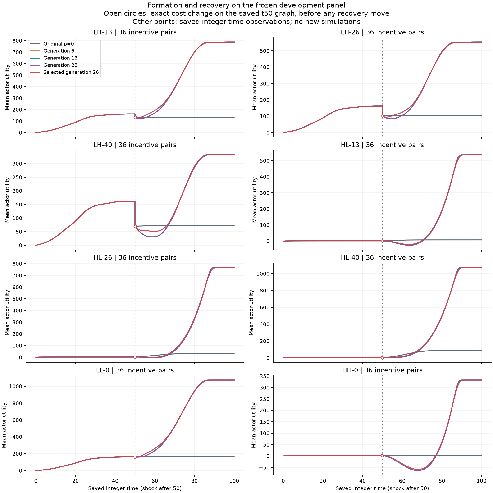
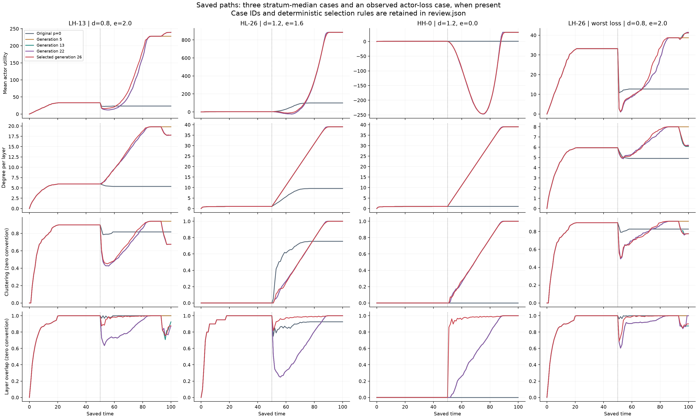
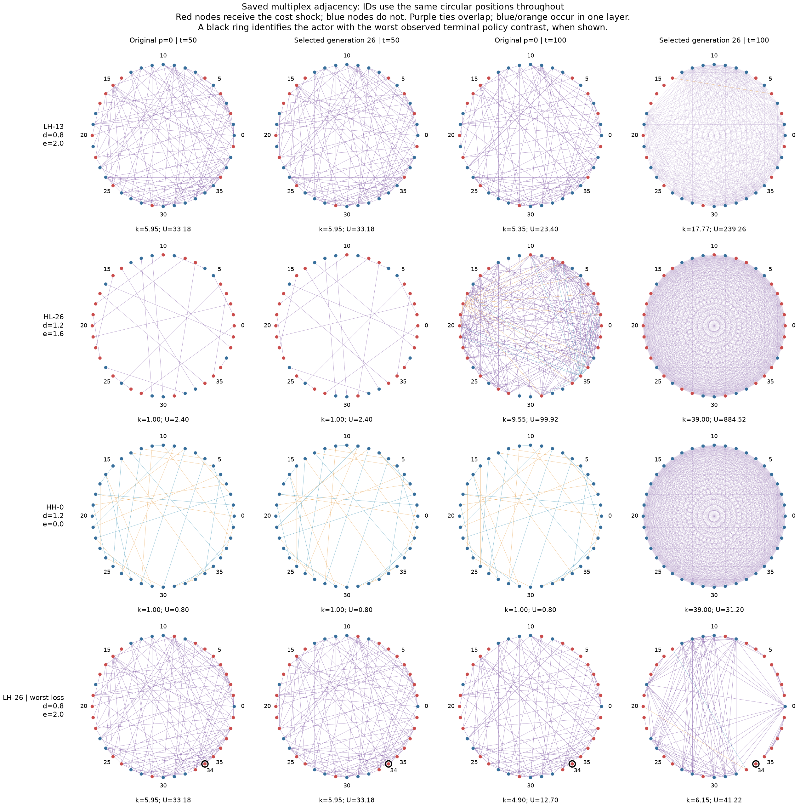
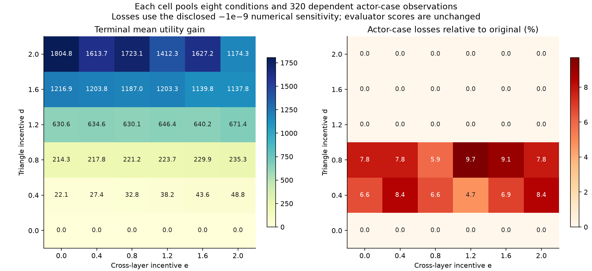
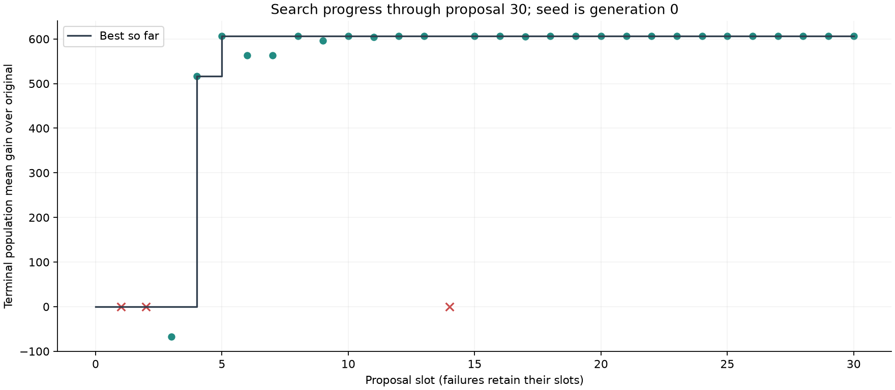

# Generation-30 scientific review: scheduled multiplex reorganization

> **Separate Burghardt–Maoz cooperative-network study; not PSO results.** Published from [source commit `42ccaaf`](https://github.com/ReloadLightly/shinka-cooperative-network/commit/42ccaaf4b4f9c361f671cf54b6d874bc4d442359). Generation 35 is the review boundary; generation 34 is the selected policy. [Program index](PROGRAM_INDEX.md) · [Final checkpoint](checkpoint/README.md) · [Included and omitted evidence](CONTENTS.md) · [File hashes](PROVENANCE.json). Original checkpoint descriptions concern the source study. This compact publication preserves its final native state but does not include every raw trajectory or a complete runnable environment.

**18 September 2026. Paused for generation-30 review.** All proposal slots 1–30 are terminal alongside seed 0: **27 valid descendants**, one guard-invalid policy (g2), and two failed proposals (g1, g14). No generation 31 was admitted. Twenty slots remain under the unchanged fifty-proposal ceiling. The consistent checkpoint retains all native continuation state. This is a review boundary, not campaign completion.

Generation **26** is the selected executable: mean terminal actor utility **682.0530208333**, versus **75.0390972222** for the original p=0 policy; raw improvement **+607.0139236111**, scaled score **2.8459607445014**. The evidence supports large, scheduled structural reorganization on the reused development panel, with concentrated actor losses. It does not yet establish robust adaptation to unforeseen shocks or generalization. **Recommendation: keep discovery paused for interpretation and separately authorized confirmation before allocating another twenty proposals.**

## Question, design and evidence

Can a bounded, locally informed decision rule used by every actor improve population outcomes during formation, partial cost shocks and recovery in the Burghardt–Maoz utility model? Each of forty actors has private memory and bilateral consent over additions; deletions are unilateral. Two layers start empty, form through time 50, receive the cost intervention after the time-50 snapshot, and continue through 100. Payoff rewards direct ties, incident triangles and overlapping ties, minus quadratic degree costs. The unchanged fitness is the candidate-minus-original difference in terminal population mean utility, averaged equally across external conditions and divided by the frozen positive scale 213.28963331061775.

Every valid descendant completed all **288 frozen conditions**: independently crossed d,e∈{0,.4,.8,1.2,1.6,2}, adverse costs .2→.6 (LH) or favorable costs .6→.2 (HL) affecting 13, 26 or all 40 actors, and unchanged-cost LL/HH controls. There is one repetition per cell and **36 independent history families**, each containing eight related shock/control cases. A single global p=0 comparator was selected before descendants. Its valid independent interface-seed replay is retained; neither it nor the reference grid was rerun for this review.

The development environment follows pinned source-executable behavior, preserving its random partner sampling and action-search quirks. Paper-derived settings fix N=40 and the time-100 horizon. Independently seeded shock-recipient draws are an explicit experimental override of the upstream action-RNG-dependent draw; changed policies may consume the action stream differently. The paper-directed track is separate sensitivity evidence, not the candidate comparator. The [frozen task](source/experiments/paper_trajectory_v2/task_prompt.md) records these differences.

This [analysis source](https://github.com/ReloadLightly/shinka-cooperative-network/blob/42ccaaf4b4f9c361f671cf54b6d874bc4d442359/scripts/analysis/generation30_review.py) read existing compressed trajectories for the original and all 27 valid descendants, checked source/engine/case identities and compressed hashes, reconciled scores and payoff components, and saved [machine-readable findings](https://github.com/ReloadLightly/shinka-cooperative-network/blob/42ccaaf4b4f9c361f671cf54b6d874bc4d442359/results/paper_trajectory_v2/report/generation-30-review/review.json), [all proposal outcomes](tables/generation30-progress.csv) and [11,520 paired actor observations](https://github.com/ReloadLightly/shinka-cooperative-network/blob/42ccaaf4b4f9c361f671cf54b6d874bc4d442359/results/paper_trajectory_v2/report/generation-30-review/actor-effects.csv). It ran **zero new research simulations, evaluator invocations or model calls**. A [separate renderer](https://github.com/ReloadLightly/shinka-cooperative-network/blob/42ccaaf4b4f9c361f671cf54b6d874bc4d442359/scripts/analysis/generation30_review_figures.py) corrects the compact 780-bit upper-triangle adjacency decoding for the figures; [figure provenance](figures/generation30-figure-provenance.json) binds the unchanged analysis JSON and all PNG hashes. The data analysis also read the complete 101-point paths for the original, g5, g13, g22 and g26. Raw adjacency exists only at 0, 50 and 100; intermediate network/actor summaries exist at every integer time.

The paired mean gain is +607.0139. A descriptive bootstrap resampling the 36 whole history families gives [419.3577, 805.5171], not an actor-level or 288-independent-case interval. This reflects substantial fixed-grid heterogeneity. With one reused history per incentive cell and selection on these same observations, uncertainty about new histories, new settings and the selected winner is **not resolved** by that interval. No fresh-history or selection-adjusted inference is claimed.

## What the executable winner does

[Generation 26's Java](programs/gen_26/main.java) uses the original p=0 action and acceptance rules before time 50, from time 93 onward, and whenever the triangle incentive is below 0.4 (d=0 on this grid). In the intervening construction phase it:

1. Uses its **own** two costs and the public triangle/spillover incentives to compare balanced partitions of the forty actor IDs into contiguous cohorts. It chooses the partition with the highest estimated total utility if everybody had those same costs and each cohort became a perfectly overlapping clique. This is a local calculation with a homogeneous-cost assumption, not access to other actors' costs or a global planner.
2. Removes ties outside its cohort, favoring the more connected layer for pruning. It adds missing within-cohort ties on the less connected layer, preferring partners already tied on the other layer and randomly sampling among eligible partners. It falls back to the other layer when needed.
3. Rewires when both an addition and deletion are available, and can make the permitted extra outside-cohort deletion after a successful rewire. A failed offer is remembered permanently during construction; it does not repeatedly propose to that partner.
4. Accepts a finite incoming offer from its own cohort even if the immediate payoff falls, and rejects outsiders. At time 93 it returns to the original immediate-improvement rule for both action and acceptance.

For degree k in an ideal clique present on both layers, the assumed payoff is `u(k) = (2+e)k − (c0+c1)k² + d·k(k−1)`. The actual code compares the population-weighted utility of each possible balanced cohort count. At low costs, d≥0.4 makes the quadratic coefficient nonnegative; at high costs that happens at d≥1.2. Strong triangle rewards consequently favor very large cliques in this particular utility model. Under partial shocks, actors with different costs can choose incompatible cohort boundaries. Bilateral consent does not guarantee protection from outsiders' unilateral deletions.

The original policy instead searches bounded random opportunities for an immediate strict utility improvement and requires the recipient's immediate improvement. It has no deliberate cohort-building phase or willingness to accept a temporary loss. Source swap-search and extra-deletion quirks are preserved in both the comparator and `originalTurn()`.

Generation 5 established randomized cohort construction; generation 10 added a return to the original rule at 95; generation 13 moved that return to 93. Generation 12 supplied the explicit balanced-cohort utility calculation, inherited through later descendants. Generation 26 adds an overlap-first partner preference to its actual parent, generation 20. Generation 22 uses a completion-dependent late handoff instead. These are related refinements of a shared architecture. Generation 30 adds preferential deletion of the same outside-cohort relationship on the other layer after rewiring; it does not beat generation 26.

## Measured utility and distributional effects

All figures in the following table are **paired terminal utility gains over the original policy**, not before/after-shock changes. Each row contains 36 histories and 1,440 dependent actor-case observations. A dash means the group does not exist. “Loss” means a difference below −1e−9 for descriptive roundoff sensitivity; the evaluator and score retain their original arithmetic.

| Cost direction | Shocked / 40 | Population gain | Directly shocked gain | Unshocked gain | Actor losses |
|---|---:|---:|---:|---:|---:|
| LH | 13 | 654.7922 | 260.6197 | 844.5790 | 85 / 1,440 |
| LH | 26 | 450.1236 | 260.4282 | 802.4151 | 90 / 1,440 |
| LH | 40 | 260.6333 | 260.6333 | — | 2 / 1,440 |
| HL | 13 | 528.8106 | 943.1684 | 329.3049 | 47 / 1,440 |
| HL | 26 | 734.2975 | 957.2598 | 320.2246 | 63 / 1,440 |
| HL | 40 | 985.2356 | 985.2356 | — | 0 / 1,440 |
| LL | 0 | 911.2664 | — | 911.2664 | 0 / 1,440 |
| HH | 0 | 330.9522 | — | 330.9522 | 0 / 1,440 |

Across the panel, **399 strict negative actor differences** include **287 losses below −1e−9** (2.49%). These are observations across related cases, not that many independent actors. The worst observed effect is **-6.0000**, actor 34 in `f4477faf0cefc316a6433134` (LH-26, directly shocked: true). In the original terminal network it has three neighbors on each layer, all overlapping, and utility 6; under g26 it is isolated and has utility 0. Its saved endpoint data are retained in `review.json`. Positive population means do not establish mutual benefit or a Pareto improvement.

All 287 substantive terminal losses occur at d=0.4 or 0.8 among actors facing the high cost: 177 directly shocked actors in LH cases and 110 unshocked actors in HL cases. Neither unchanged-cost control has such terminal losses. Thus a favorable partial shock can still leave high-cost, unshocked partners worse off under the selected policy than under the original.

For adverse partial shocks the average gain is larger for unaffected actors; for favorable partial shocks it is larger for directly shocked actors. That describes policy-versus-original outcomes under each shock, not an estimate that the shock itself helps the group. Unchanged costs can still leave an actor indirectly affected by a partner's response. Fixing partner-group membership to the **original time-50 graph**, the unshocked actors linked on either layer to a future shock recipient have:

| Partial shock | Unshocked pre-shock partners: n | Mean gain | Losses |
|---|---:|---:|---:|
| LH-13 | 859 | 937.1297 | 0 |
| LH-26 | 494 | 813.0883 | 0 |
| HL-13 | 418 | 321.0249 | 18 |
| HL-26 | 392 | 319.0908 | 53 |

These held-fixed groups prevent redefining “partner” after the candidate reorganizes the network. They do not isolate a causal exposure effect: baseline network positions, incentives and shock membership jointly determine the comparisons. The complete actor table retains shocked status and this exposure label, including losses.

## Formation, immediate shock and recovery

All **288/288** saved time-50 adjacency matrices and actor utilities match between the original and each plotted policy. Thus this winner preserves original formation on this panel. Immediately changing a shocked actor's two costs changes its utility by `−(cost_after−cost_before)·(degree0²+degree1²)` on that fixed graph; unaffected actors have no instantaneous direct cost change. There is no separately observed shock-only snapshot. The derived time-50+ values below are exact payoff arithmetic on saved data; time 51 already includes one complete adaptation round.

| Condition | Before shock t50 | Derived immediate t50+ | Observed t51 | t75 | t100 |
|---|---:|---:|---:|---:|---:|
| LH-13 | 162.0319 | 132.3217 | 129.2561 | 552.0408 | 787.3978 |
| LH-26 | 162.0319 | 101.6225 | 95.8889 | 381.9181 | 552.9083 |
| LH-40 | 162.0319 | 69.1631 | 60.9281 | 206.1572 | 332.6594 |
| HL-13 | 1.7233 | 2.0150 | 1.6914 | 68.6181 | 536.3408 |
| HL-26 | 1.7233 | 2.3008 | 2.6142 | 166.6625 | 767.8050 |
| HL-40 | 1.7233 | 2.6144 | 3.9408 | 271.5067 | 1,073.3044 |
| LL-0 | 162.0319 | 162.0319 | 162.3350 | 736.7483 | 1,073.3317 |
| HH-0 | 1.7233 | 1.7233 | 0.8853 | -22.9514 | 332.6767 |

Recovery is not uniformly beneficial along the way. The LH-40 mean falls from the immediate post-cost value 69.1631 to 49.6406 at time 60 before rising to 332.6594. Even favorable HL-13 costs are followed by a construction trough of −20.7103 at time 63. HH controls, with no shock at all, fall from 1.7233 to −58.8006 at time 68 before reaching 332.6767. The terminal objective tolerates these prolonged investment losses.

Recovery entails much denser, more overlapping networks, not just a different terminal number. The following endpoint means use the source convention of zero for undefined local clustering/overlap. Defined-only means and missing-ratio counts are also retained in `review.json`.

| Terminal measure | Original p=0 | g5 | g13 | g26 |
|---|---:|---:|---:|---:|
| Mean utility | 75.0391 | 681.1689 | 682.0521 | 682.0530 |
| Degree per actor per layer | 5.2673 | 25.2729 | 25.1010 | 25.1033 |
| Clustering, zero convention | 0.5834 | 0.7857 | 0.7532 | 0.7505 |
| Overlap fraction, zero convention | 0.6541 | 0.9592 | 0.9351 | 0.9356 |
| Isolated actor-case observations | 45 | 3 | 110 | 105 |

The examples are selected deterministically: the nearest median policy gain among the 36 incentive pairs in LH-13, HL-26 and HH-0, plus the worst observed actor-loss case. Case IDs, recipient sets, selection rules and values are in `review.json`; these are illustrations, not additional independent evidence. IDs retain the same circular positions; red nodes receive the cost shock, purple ties appear on both layers, and blue/orange ties occur in one layer. The black ring identifies the worst-loss actor. Intermediate adjacency and an action-by-action explanation are unavailable.

Shocked and control cases share their history families and matched pre-shock networks. Comparing each LH condition with LL, and each HL condition with HH, gives the following terminal contrasts:

| Shock | Original: shock minus unchanged-cost control | g26: same contrast | Extra policy gain under shock |
|---|---:|---:|---:|
| LH-13 | -29.4597 | -285.9339 | -256.4742 |
| LH-26 | -59.2806 | -520.4233 | -461.1428 |
| LH-40 | -90.0392 | -740.6722 | -650.6331 |
| HL-13 | 5.8058 | 203.6642 | 197.8583 |
| HL-26 | 31.7831 | 435.1283 | 403.3453 |
| HL-40 | 86.3444 | 740.6278 | 654.2833 |

For example, an adverse 13-actor shock reduces g26 terminal utility by 285.9339 relative to its LL control, compared with only 29.4597 under the original. G26 still has a higher absolute terminal payoff in that shock condition, but this comparison does **not** support a claim of a smaller adverse-shock utility penalty. Favorable shocks produce larger positive contrasts under g26.

These contrasts distinguish the numerical cost intervention within this design from the overall gain of changing the policy. They still bundle all endogenous actor responses and all components of the evolved rule. Large control gains show that the rule reorganizes networks even without cost shocks; a recovery curve alone cannot establish shock-specific adaptation.

## Which incentives drive the result?

| Triangle d | Mean utility gain over original | Share of total gain | Actor losses / 1,920 |
|---|---:|---:|---:|
| 0 | 0.0000 | 0.00% | 0 |
| 0.4 | 35.4871 | 0.97% | 133 |
| 0.8 | 223.7110 | 6.14% | 154 |
| 1.2 | 642.2119 | 17.63% | 0 |
| 1.6 | 1,181.4348 | 32.44% | 0 |
| 2 | 1,559.2387 | 42.81% | 0 |

**92.88% of the total raw gain comes from d≥1.2**; all substantive terminal actor losses occur at d=0.4 or 0.8. The payoff accounting adds 1,174.1311 mean triangle-benefit units while incurring 626.8799 additional quadratic-cost units. Overlap benefits add 20.0906 units. This is primarily a triangle-rich construction result, with multiplex reinforcement.

The full d/e heatmap retains the independently varied overlap incentive. At d=0 the winner explicitly uses the original rule, so zero improvement there is a feature of this policy, **not evidence that spillover incentives cannot help**. Increasing d makes dense closure especially valuable; e rewards overlap linearly and influences preferred cohort sizes in concave regimes. These jointly varied cases do not constitute an ablation of the winner's overlap-first partner heuristic.

The terminal payoff decomposition below uses the exact saved degrees, costs, triangle counts and overlaps. Quadratic cost is shown as a positive amount **subtracted** from utility; the other rows are added. Their differences sum to the reported mean policy gain.

| Mean payoff component | Original | g26 | Change |
|---|---:|---:|---:|
| direct_links | 10.5345 | 50.2066 | 39.6720 |
| quadratic_cost | 49.5818 | 676.4617 | 626.8799 |
| triangles | 109.0178 | 1,283.1490 | 1,174.1311 |
| overlap | 5.0685 | 25.1592 | 20.0906 |

This accounts for how added triangle/overlap benefits offset increased tie costs. It does not by itself prove which code component caused the reorganization or that more densely connected networks are desirable outside this utility model.

## Search progress and the next twenty slots

| New leader | Raw gain over original | Increment over previous best |
|---|---:|---:|
| 4 | 516.391041667 | +516.391041667 |
| 5 | 606.129756944 | +89.738715278 |
| 10 | 607.001041667 | +0.871284722 |
| 13 | 607.012986111 | +0.011944444 |
| 22 | 607.013680556 | +0.000694444 |
| 26 | 607.013923611 | +0.000243056 |

Generation 5 already achieves **99.854%** of the final raw gain. The total improvement from generation 13 to 26 is only **0.000937500** mean utility units. Generation 30 does not improve the incumbent. That is evidence of small recent development gains within the explored architecture, not proof that further search cannot help.

The last ten valid descendants all completed 288 conditions:

| Generation (parent) | Source change | Raw terminal gain | Losses vs original | Change from parent |
|---|---|---:|---:|---:|
| 21 (18) | Rank outside-cohort deletions by local degree-cost relief and direct/overlap loss | 607.011666667 | 309 | -0.001319444 |
| 22 (20) | Completion-dependent handoff between 93 and 95 | 607.013680556 | 289 | +0.001631944 |
| 23 (21) | Prefer paired removal of an external relationship on the other layer | 607.011805556 | 307 | +0.000138889 |
| 24 (23) | Degree-balanced first deletion with paired second deletion | 607.012083333 | 314 | +0.000277778 |
| 25 (12) | Prioritize the layer with more eligible missing cohort ties | 606.155659722 | 5 | +0.000000000 |
| 26 (20) | Prefer missing cohort partners already linked on the other layer; fixed 93 handoff | 607.013923611 | 287 | +0.001875000 |
| 27 (22) | Paired external deletion with completion-dependent handoff | 607.012569444 | 301 | -0.001111111 |
| 28 (22) | Deficit-first layer selection with completion-dependent handoff | 607.012291667 | 295 | -0.001388889 |
| 29 (19) | Overlap-first partner selection with fixed 95 handoff | 607.002326389 | 337 | +0.002951389 |
| 30 (26) | Add paired external deletion to g26 | 607.012743056 | 295 | -0.001180556 |

These recent programs largely recombine layer choice, overlap preference, pruning and late handoff within the same ID-cohort mechanism. Generation 25 exactly matches parent 12 in every terminal actor utility and terminal adjacency, while its cumulative utility is 0.757674 lower per actor on average; 632 actor-case cumulative differences are below −1e−9 and 617 are positive beyond that tolerance. Its path comparison is retained in the machine-readable report. Similar scores therefore should not be interpreted automatically as distinct mechanisms.

Small terminal changes can still conceal meaningful path changes. Relative to parent 20, g26 increases mean cumulative recovery utility by 191.5962 (about 3.832 per recovery round), alongside its terminal gain of only 0.001875; 3,156 actor-case cumulative contrasts lose beyond the roundoff tolerance. G30 loses 0.001181 terminal utility versus g26 but adds 1.9502 cumulative utility on average. These are measured secondary outcomes, not a claim that recent variants are behaviorally identical.

The terminal objective also leaves substantive alternatives. Generation 12 has mean utility 681.194757, 5 losses and 3 isolates, versus the winner's 287 losses and 105 isolates. This is a lower-mean distributional alternative, not a newly selected winner. Generation 15 has the same terminal actor utilities and adjacency as parent 10 but a different formation path; its cumulative whole-life gain over the original is 38505.0914, versus 14117.3876 for g26. Cumulative utility is a saved secondary description and does not change fitness. The review preserves recovery-only cumulative differences as well. Generation 6 is another useful contrast: its terminal mean is 638.8533 and **none of its 11,520 saved terminal actor comparisons is negative**, including strict signs. Its simpler rule starts densification during formation only in sufficiently high-triangle regimes, accepts finite offers there, and retains original behavior elsewhere. This observed distributional advantage on the fixed panel does not establish universal safety or replace the terminal-objective winner.

**Recommendation: pause discovery for interpretation and separately authorized confirmation.** The early large gain, tiny later increments, repeated shared mechanism, actor-level tradeoffs and dependence on known timing/IDs make additional unconfirmed development optimization less informative than establishing what this rule accomplishes. A future twenty proposals could still discover another mechanism; the observed plateau cannot rule that out. Continuing should follow an explicit research decision about the value of that search, not the fact that fifty was the original ceiling. No extra discovery, altered objective, ablation or confirmation was launched for this recommendation.

## Accounting, failures and native mechanisms

| Research model role | Returned responses | Recorded attempts | Elapsed attempt seconds |
|---|---:|---:|---:|
| meta | 24 | 24 | 3184.0 |
| mutation | 29 | 39 | 3513.7 |
| novelty | 2 | 2 | 26.6 |
| prompt | 2 | 2 | 162.4 |

There are **57 returned native responses**, plus the preserved late generation-1 response, giving **58 observed logical completions**. Astra/xhigh returned 40 native responses and Sol/xhigh 17. Native receipts record 740,522 input and 141,465 output tokens; the archived late reply separately records 262,666 input (217,472 cached) and 8,632 output tokens. These are recorded provider counters, not independent training observations or a paid API bill. There are 67 recorded attempts, including six retry flags and nine local allowance denials. The pinned Headless 0.6.1 subscription routes and local pinned embeddings remain in use; no paid fallback was used. UI “cost” fields are nominal price-based bookkeeping with monetary reward weight zero, not observed paid expenditure.

Thirty proposal slots are distinct from seed initialization, two administrative island copies, 29 original evaluated database records and 27 valid descendants. Numerical accounting is **12,635 completed physical trajectories**: 4,559 reference, 12 benchmark, 288 independent seed and 7,776 descendant cases. One failed numerical attempt, **33 evaluator invocations** and **495 exact-cache reuses** are separate. Recorded serial numerical time is **6.147 hours** across the entire v2 ledger; elapsed model-attempt time totals **1.913 hours**. These totals are not the wall duration of this one continuation, because work and roles can overlap. The last ten full-panel evaluations each took 476.7–532.5 seconds (about 7.9–8.9 minutes), before additional mutation, novelty or native bookkeeping time. Per-policy evaluation and native-window times are retained in `review.json`.

Failed proposal 1 exhausted the old provider allowance; its late completion stays archived and unevaluated. Generation 2 failed the capability guard and ran no numerical cases. Proposal 14 failed on local embedding infrastructure after a mutation/prepared source but before an accepted job. Those are different outcomes, not three scientifically tested inferior policies. Earlier generation-10 compilation and generation-18 numerical interruptions completed their exact-source, exact-lineage, exact-case recovery paths without extra proposal slots or duplicate rewards. The generation-18 numerical-timeout cause remains unproved; the failure receipt is preserved. No new discovery interruption occurred during this continuation through 30. A read-only review-script ledger-format error was corrected by attributing the old timeout through its recovered exact cache key; it changed no research output or count.

Native telemetry records three populated islands, migration at generations 10/20/30 (eight moves total), 28 UCB reward events, parent/inspiration sampling, local novelty checks, two returned LLM novelty queries, two meta updates processing twenty programs, and two prompt evolutions. Nine programs remain in the native meta buffer; the review boundary did not force another model call. Conditional island spawning did not trigger. Preserving or observing a mechanism does not establish its causal search benefit. All state is retained for a possible later continuation.

## Interpretation and relation to Burghardt–Maoz

Burghardt and Maoz's [2018 study](https://doi.org/10.1038/s41598-018-31960-y) combines quadratic tie costs with rewards for triangle closure and cross-layer overlap. Its [retained article](https://github.com/ReloadLightly/shinka-cooperative-network/blob/42ccaaf4b4f9c361f671cf54b6d874bc4d442359/docs/paper_trajectory_v2/sources/article.txt) discusses how myopic decisions can trap a network before a temporarily costly bridge enables more valuable closure. The repository's executed three-actor fixture distinguishes strict endpoint improvement (d>0.8 at cost 0.6, e=0) from the lower aggregate-welfare crossover (d>2/3). Those are different criteria.

The evolved rule offers a concrete way to cross such local barriers: a common membership convention and temporary acceptance of loss create a route toward overlapping cliques. The saved dense networks and triangle-payoff accounting are consistent with this mechanism. They do **not** isolate its causal contribution: no ablation separates acceptance, ID partitioning, time scheduling, overlap preference, or pruning. Payoff decomposition is accounting, not an intervention on one mechanism. The complete event-level action trace is not retained, so the review cannot assign every actor's loss to a particular deleted tie.

The strongest supported conclusion is **scheduled network reorganization that raises the frozen terminal objective on these development histories**. Saved recovery paths establish structural and payoff changes beyond a scalar ranking, but large unchanged-cost-control gains show that much of the effect does not require a shock. Adverse and favorable shocks alter costs, cohort compatibility and benefits within that general reorganization. This is not yet evidence of a policy that detects and adapts robustly to unforeseen shock times or magnitudes. A larger terminal payoff is also not the paper's normalized resilience/flexibility statistic; this review does not silently substitute one for the other.

The policy relies on the public clock (construction starts at 50 and cleanup at 93), public actor IDs, shared code across all forty actors, and the payoff advantage of dense clique construction. It does not observe the hidden recipient list or future costs. These are permitted capabilities, but their importance limits interpretation: anonymous IDs, different timing or horizons, heterogeneous adoption, different population size and weaker clique returns were not tested. Source-executable scheduling and action quirks remain primary under paper-derived settings; the alternate paper-directed track and unfinished reference matrix remain distinct. Historical production seeds and exact published numerics have not been recovered.

For decentralized cooperation, the result suggests testable hypotheses about common conventions, temporary local sacrifice, cross-domain reinforcement and exclusion of actors whose incentives differ. It also warns that aggregate gains can coexist with harmed partners and isolation. Actors here are abstract and interchangeable, costs are stylized, and the two layers are not calibrated to security, trade or institutions. The study supplies **no empirical estimate or policy recommendation for Japan's actual Indo-Pacific network**. The separate [FOIP mapping notes](https://github.com/ReloadLightly/shinka-cooperative-network/blob/42ccaaf4b4f9c361f671cf54b6d874bc4d442359/docs/indo_pacific_research/model_mapping_memo.md) describe possible research connections, not validation of this simulation.

## Checkpoint and review boundary

The [manifest](source/campaigns/paper_trajectory_v2.json) identifies the standalone `programs-031.sqlite` and matching `native-031` state. The [drain verification](https://github.com/ReloadLightly/shinka-cooperative-network/blob/42ccaaf4b4f9c361f671cf54b6d874bc4d442359/results/paper_trajectory_v2/search/operations/generation-30-drained-verification.json) confirms that both controllers exited, both locks were available and no generation 31 was admitted; the existing WebUI returned HTTP 200. Eleven offline operational/controller tests passed. The engine, evaluator, case panel, objective and native scientific identities were not changed by the stop-target implementation.

Publication uses the established consistent backup procedure and exact Git-export verifier, followed by a normal push and remote-SHA comparison. The delivery message supplies the verified publication commit or a precise publication blocker. [NEXT_SESSION](https://github.com/ReloadLightly/shinka-cooperative-network/blob/42ccaaf4b4f9c361f671cf54b6d874bc4d442359/docs/NEXT_SESSION.md) records the exact checkpoint, remaining twenty slots, historical interruption evidence and the single conditional command to resume toward fifty **only after user authorization**. Full-paper reproduction remains 4,559/34,560 and deferred.
